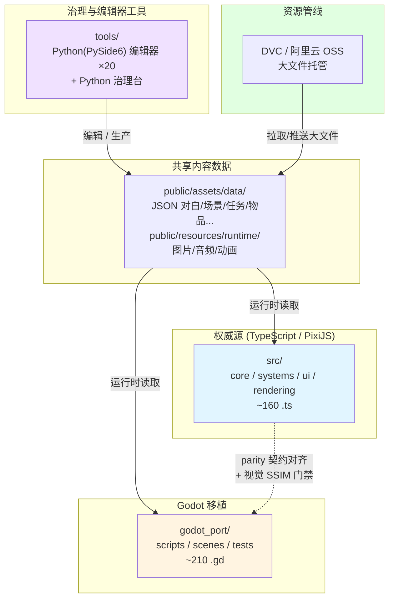

# 项目架构总览

GameDraft 是一个**双技术栈并行**的游戏移植项目，外加 Python 治理工具链与 DVC/OSS 资源管线。

---

## 双壳结构

| 壳 | 技术栈 | 代码位置 | 角色 |
|---|---|---|---|
| **权威源** | TypeScript + PixiJS | `src/`（~160 个 .ts） | 游戏运行的权威实现，功能首先在这里完成、在这里测 |
| **Godot 移植** | Godot 4 + GDScript | `godot_port/`（~210 个 .gd） | 移植壳，与权威源做 parity（行为一致性）对齐 |

**关键原则**：Godot 与 TypeScript **读取同一套 JSON 和媒体数据**，禁止维护第二份内容数据。内容（对白、场景、任务、物品……）只编辑一次，两壳共用。

两壳通过 **parity 契约**（`godot_port/compatibility/*.json`）对齐并验证行为一致。详见 [Godot 移植工作流](./godot-port)。

---

## C4 架构图



---

## 技术栈组合

| 层 | 技术 | 用途 |
|---|---|---|
| 权威游戏运行时 | TypeScript + PixiJS + Vite | 游戏逻辑的权威实现，开发时跑 Vite |
| 移植壳 | Godot 4 + GDScript | 原生导出（macOS universal / Windows），与权威源 parity 对齐 |
| 编辑器工具 | Python + PySide6 / Tkinter + Web | 20 个编辑器/工具，集中编辑内容 |
| 资源管线 | DVC + 阿里云 OSS | 大文件（图片/音频/视频）版本管理与托管 |
| 测试 | Vitest（TS）+ Godot 测试 + 视觉 parity（Node mjs, SSIM） | 双壳行为一致性验证 |

---

## 目录结构速览

```
GameDraft/
├── src/                    # 权威源(TypeScript/Pixi)
├── godot_port/             # Godot 移植壳
├── tools/                  # 20 个编辑器/工具(Python)
├── public/assets/data/     # 内容数据(JSON)——两壳共用
├── public/resources/runtime/# 运行时媒体(图片/音频/动画)
├── docs/                   # 设计文档(偏旧)
├── artifact/               # 审查/计划归档
├── agent_docs/             # AI agent 知识库
├── dev.sh                  # 统一任务入口
└── bootstrap.sh            # 环境初始化
```

---

## 接下来

- [命令清单](./commands) —— 全部 `./dev.sh` 子命令与 npm scripts
- [Godot 移植工作流](./godot-port) —— parity 对齐、视觉门禁、导出
- [资源管线](./resources) —— DVC/OSS 大文件管理
- [启动架构](../editors/launch-architecture) —— dev.sh → tools.dev → 工具的三层链
