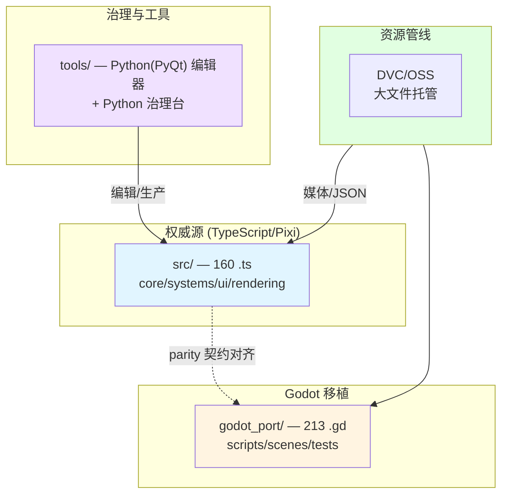

# 项目架构总览

GameDraft 是一个**双技术栈并行**的游戏移植项目，外加 Python 治理工具链与 DVC/OSS 资源管线。

:::note[文档建设状态]
本页是开发文档的**占位入口**（第 4 阶段内容）。双壳结构的 C4 架构图、Godot 移植工作流、数据流详解将在第 4 阶段补充。下面先给概览。
:::

## 双壳结构

| 壳 | 技术栈 | 角色 |
|---|---|---|
| **权威源** | TypeScript + PixiJS（`src/`，160 个 .ts） | 游戏运行的权威实现，功能首先在这里完成 |
| **Godot 移植** | Godot 4 + GDScript（`godot_port/`，213 个 .gd） | 移植壳，与权威源做 parity（一致性）对齐 |

两壳通过 **parity 契约**（`godot_port/compatibility/*.json`）保持行为一致。Godot 移植工作流文档待补充。

## C4 架构图（待补充）

## 技术栈组合

**Godot 4 + TypeScript/Pixi（权威源）+ Python/PyQt（治理/编辑器）+ Node（工具/测试）+ DVC/OSS（资源）。**

---

## 常用命令速查

所有命令在游戏仓库根目录（`~/AIWork/GameDraft/`）执行。

| 目的 | 命令 |
|---|---|
| 初始化环境（只做一次） | `./bootstrap.sh` |
| 起游戏（Vite 开发服） | `./dev.sh dev` |
| 构建游戏 | `npm run build` |
| 跑测试 | `npm test` |
| 主编辑器 | `./dev.sh editor` |
| Web 控制台（启动器） | `./dev.sh console` |
| 生产工作台 | `./dev.sh workbench` |
| 数据校验 | `./dev.sh validate-data` |
| 构建 json_lang schema | `./dev.sh json-lang` |
| 列出全部 task | `./dev.sh --help` |

> 完整的"task 名 → 模块"映射见 [启动架构 · TOOL_MODULES](../editors/launch-architecture)；全部编辑器/工具见 [工具速查表](../editors/tool-matrix)。

---

> 🚧 C4 完整图、Godot 移植工作流、数据流详解将在**第 4 阶段**补充。
