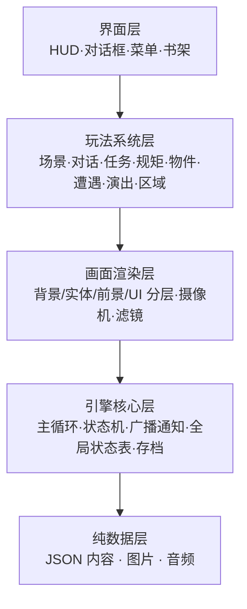
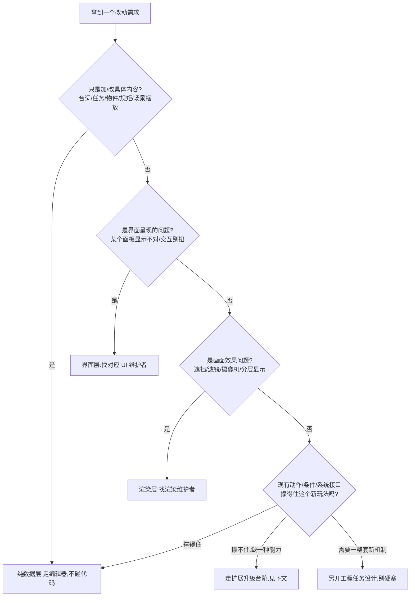

# 项目架构总览

这页讲**GameDraft 这套系统为什么这样搭、各部分怎么协作、想加一种新能力该走哪条路**。它面向想**改工具、加新玩法能力、参与 Godot 移植**的人;如果你只是改改台词、加个任务,不需要读这页,直接看 [项目总览](./overview) 找入口就够。

---

## 这是什么(30 秒看懂)

打个比方:雾津折子铺里,**说书人(界面)只管开口说给客人听,不管账本怎么记**;**跑堂的(玩法系统)负责按规矩张罗一桩桩事——该给谁上茶、该记谁的账**;**画师(渲染)负责把场景画得像不像雾津;**柜台后头的**掌柜(引擎核心)管着总账本、钥匙串和开门关门这些底层规矩**;而**账本本身(数据)**记的是具体内容——谁说了什么、什么东西值多少钱。跑堂的之间不能互相翻对方兜里的账,只能靠**一块公共的告示牌**(广播通知)和**一张公共的状态表**(全局状态记录)来知道彼此发生了什么。这套规矩的目的很简单:改一处不至于牵连一大片,谁负责哪一块也一目了然。

**分层的铁律很简单**:上层可以找下层办事,下层不知道上层的存在,也不会反过来依赖上层。唯一的例外是游戏启动时那个"搭台子的人"——它在开局时把各层零件拼装到一起、把公共设施塞给每个玩法系统,这属于允许的组装职责,不算破坏分层。

---

## 快速上手:我要改的东西在哪一层

拿到一个改动需求,先按下面这个顺序判断落在哪一层、该怎么走:

多数人日常打交道的都是最左边这条路——纯数据层,走编辑器就够。只有当你发现"编辑器里压根没有能表达这个新玩法的地方"时,才需要往下看"扩展升级台阶"这一节。

---

## 深入:每条设计原则讲透

### 分层依赖:谁能找谁办事

五层职责划分是:**界面层**(玩家看到、点到的所有面板)、**玩法系统层**(场景、对话、任务、规矩、物件、遭遇、演出、区域这些"发生什么事"的逻辑)、**画面渲染层**(把游戏世界画出来,管镜头、分层、滤镜)、**引擎核心层**(主循环、游戏状态机、公共广播、全局状态表、存档这些底层设施)、**纯数据层**(具体内容:JSON、图片、音频)。规则是**上层依赖下层,下层对上层一无所知**——界面层可以调用玩法系统,玩法系统不会反过来直接摆弄界面。这样做的好处是:改界面呈现,不会不小心带崩玩法逻辑;改玩法逻辑,也不用担心哪个界面偷偷绕过正常渠道直接改了状态。

### 系统解耦:靠告示牌和状态表说话,不揣着对方的钥匙

同一层的玩法系统(比如任务系统和对话系统)**不会互相持有对方的引用**,不能"我直接拿到你,叫你干活"。它们之间只有两条沟通渠道:一条是"公共告示牌"——一个系统发生了什么事就贴出来广播,谁关心谁就去看;另一条是"公共状态表"——所有可以拿来判断条件的运行时状态,都汇总记在这张表上,谁都能读,但写入有规矩。这样任何一个系统被替换、被修好或者被临时禁用,都不会直接拖垮其它系统——顶多是"没收到告示"或者"状态表上少了一条",而不是直接报错崩掉。

### 依赖注入:公共设施是"造的时候塞给你",不是自己到处伸手拿

每个玩法系统需要用到的公共设施(比如公共告示牌、公共状态表),是在系统被创建出来的那一刻就交给它的,而不是系统自己在代码里到处找"全局唯一的那个东西"直接拿来用。好处是每个系统的依赖关系写在明面上,想单独测试、单独替换某个系统时,不用担心它偷偷依赖了别处一个隐藏的全局对象。

### 数据驱动:具体内容一律在数据里,代码只写通用逻辑

雾津所有具体内容——某句台词、某个 NPC 叫什么、某条规矩的名字、某个任务的 ID——**一律放在数据文件里**,代码里不允许出现这些具体名字或数值。代码只负责"怎么处理一类动作""怎么判断一类条件"这种通用逻辑。这也是为什么策划改内容几乎不需要碰代码:只要现有的动作类型、条件类型、图节点类型够用,新增一个 NPC、一条规矩、一场遭遇,理论上**零代码改动**就能做出来,全靠往数据文件里加东西。

### 统一条件源:判断"什么情况下发生"只有一套逻辑

"这段台词要不要出现""这个遭遇选项能不能选""这片区域的规矩现在能不能用"——所有这类"满足什么条件才怎样"的判断,**全项目共用同一套判断逻辑**,不管这个判断是出现在图对话、地图解锁、区域触发、还是遭遇选项里。好处很直接:条件写法只用学一套;哪天这套判断逻辑本身要修 bug 或加能力,一次修改全项目受益,不用挨个系统各修一遍。

### 统一动作执行:发生什么事只有一个分发口

对话触发"给一件物品"、遭遇结果触发"扣一笔钱"、演出播放"切换场景"——这些"发生了什么"的具体游戏行为,**全部经过同一个执行入口分发**,不允许某个系统自己在内部关起门来处理。这样做的好处是:新增一种动作类型时,所有已有的触发来源(对话、区域、遭遇、任务奖励……)自动就能用上,不用每个来源都单独接一遍。

### 统一接口与完整生命周期:启动-更新-存档-销毁,节奏一致

每个玩法系统都要遵循同一套"生命周期"节奏:启动时初始化、每帧按需更新、需要时把自己的状态存进存档、需要时从存档恢复、销毁时**必须干净**——不能留下任何监听、定时器、渲染对象或缓存的残留。而且"销毁后重新启动"的行为要和"第一次启动"完全一致,不能因为是重启就表现得不一样。这条规矩对场景切换尤其重要:玩家来回进出同一个场景,不应该因为系统内部残留了上一次的状态而出现奇怪的行为。

### 扩展升级台阶:新想法怎么落地

想加一种新玩法能力时,按下面三级判断该走哪条路,这也是日常"内容 vs 代码"怎么分工的核心依据:

| 级别 | 情况 | 怎么走 |
|---|---|---|
| **能靠数据做出来** | 现有的动作类型、条件类型、图节点类型已经够表达这个新玩法 | 直接在编辑器里组合数据,零代码改动 |
| **缺一种能力原语** | 现有类型撑不住——需要一种新的动作类型、一种新的条件判断方式、一种新的图节点 | 走一次最小必要的代码升级:加这一种新原语,编辑器和运行时都要认得它,并且要过数据校验;改完照例告知改了哪个原语、哪些地方 |
| **需要一整套新机制** | 连加一种新原语都撑不住——比如要引入一个全新的子系统,或者需要运行时做复杂运算 | 不要硬塞硬凑出一个别扭但能跑的实现,应该单独当作一个工程任务好好设计 |

这套台阶的意义在于:**多数新点子不需要惊动程序**,少数确实缺能力的情况,升级也应该是"最小必要"的一小步,而不是每次都顺手改一大片。

### 和双壳、Godot 移植的关系

这套分层与协作原则不是只为浏览器版摆的样子——**Godot 移植同样要照着这几条铁律来实现**:场景、对话、任务这些玩法系统要保持同样的层次划分,"发生什么条件、触发什么动作"的判断结果要和权威源一致。这也是为什么 [Godot 移植工作流](./godot-port) 里 parity 门禁分"逻辑/数据一致"和"画面一致"两层去卡——本质上就是在检验:移植那一侧,是不是真的遵照了同一套设计原则在运作,而不是另起了一套自己的判断规则。

---

## 常见问题

**Q:我只是想改一句台词/加一个任务,需要看懂这整页吗?**
A:不需要。这页是给想加新能力原语、改工具、做移植对齐的人看的;纯内容改动只走编辑器,参考 [项目总览](./overview) 就够。

**Q:为什么玩法系统之间不能互相直接引用,非要绕一圈广播和状态表?**
A:直接引用会让系统之间越绑越死,一个系统的小改动可能牵连一串;绕一圈之后,任何系统坏了、被替换了,影响面都局限在"没收到广播"或者"状态表少一条",不会直接拖垮别人,也更方便单独测试。

**Q:这页和"项目总览"有什么区别?**
A:总览讲"日常协作分工、平时用哪个入口";这页讲"为什么这么设计、想加新能力要走哪条台阶"——一个是操作手册,一个是设计说明书。

**Q:我发现某处好像没完全遵守这些原则,是不是 bug?**
A:项目里确实存在少数经过评估、刻意保留的例外(比如某些查询型的直接调用),但**例外应该越用越少,不应该再新增**。如果你不确定这是已知例外还是新问题,提给维护者判断,不要自己"顺手"再叠加一个新例外。

**Q:Godot 移植是不是要把这套分层原样照抄一遍代码?**
A:抄的是**设计意图和行为结果**,不是具体写法——两边引擎、语言都不一样,但都要遵照同一套"谁能找谁办事""条件判断走同一套逻辑""动作执行走同一个入口"的原则,这样两壳的运行结果才能对得上。

**Q:想加一种全新的动作类型,大概要经过哪些人手?**
A:一般是先确认现有类型确实不够用,再由熟悉这套执行入口的程序按"最小必要"加一种新类型,编辑器那边同步认得这个新类型并加上校验,最后当作一次小版本的能力扩展登记下来,而不是散落在某次内容提交里悄悄带过。

---

## 相关

- [项目总览](./overview)
- [Godot 移植工作流](./godot-port)
- [参与与提交流程](./contributing)
- [危险区](../editors/concepts/danger-zone)(内容改动的用户后果视角)
- [延伸阅读](./resources)
