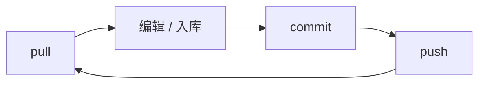

# 资源管线

图片、音频、动画、视频等大文件**不进 Git 本体**，由 **DVC** 管版本，远程在**阿里云 OSS**。Git 只跟踪代码、JSON 与小文本；媒体走 DVC 指针，多人协作靠 **pull / commit / push** 三板斧。

---

## 为什么需要它

| 问题 | 管线做法 |
|---|---|
| 仓库克隆慢、历史膨胀 | 大文件放 OSS，Git 里只有指针 |
| 多人要同一份雾津美术/配音 | 统一远程，按 hash 校验 |
| 要回到某次提交的媒体状态 | 指针随 Git 走，checkout 对应版本再 pull |

---

## 三类资源（协作时怎么记）

| 类别 | 用途 | 谁常改 |
|---|---|---|
| **运行时资源** | 游戏两壳直接读的图/音/动画 | 美术、音频、策划验收 |
| **编辑器工程数据** | 编辑器侧工程/缓存类数据 | 工具维护、本地同步 |
| **第三方素材归档** | 外部原始包归档 | 美术入库前 |

运行时资源占协作 90% 精力：**改图 → commit → push**，别人 **pull** 即对齐。

---

## 日常闭环



| 步骤 | 命令 | 说明 |
|---|---|---|
| 1. 同步 | `./dev.sh pull` | git pull + DVC pull，上班第一件事 |
| 2. 改文件 | 编辑器入库或直改 runtime 目录 | 见 asset-ingest 等工具 |
| 3. 提交 | `./dev.sh commit` | 媒体进 DVC，指针进 Git |
| 4. 推送 | `./dev.sh push` | 媒体上 OSS，代码上远程 |

三条命令都是 **all** 语义：同时处理 Git 与 DVC，不必分开记 `dvc pull` 与 `git pull`。

---

## 首次配置 OSS

1. 向维护者索取 OSS 访问方式（或已有 bootstrap 配置模板）。
2. 在仓库根目录执行：

```bash
./dev.sh configure-oss --prefix gamedraft/dvc --endpoint https://oss-cn-hangzhou.aliyuncs.com
```

3. 凭据写在本地 bootstrap 配置里，**已被 gitignore，勿提交仓库**。

远程 bucket 与 endpoint 以项目当前配置为准；换机器先 `configure-oss` 再 `pull`。

---

## 与 asset-ingest 的分工

| 环节 | 谁管 |
|---|---|
| **asset-ingest** | 外部素材切片、命名、放进运行时目录树 |
| **DVC** | 进目录后的版本化、远程同步 |

流程：**入库工具落盘 → 游戏里看一眼 → `./dev.sh commit` → `./dev.sh push`**。

---

## 协作守则

| 守则 | 原因 |
|---|---|
| 改大文件前 pull | 减少指针冲突 |
| 不手改 `.dvc` 指针糊弄 | hash 不对全员拉不到 |
| 不把 OSS 凭据提交 Git | 安全 |
| 小 JSON 走 Git 正常提交 | 与 DVC commit 可同一次 push |

冲突时：先 pull，再按提示处理指针/缓存，必要时找维护者清 OSS 侧孤儿。

---

## 接下来

- [常用工作流命令](./commands)
- [项目总览](./overview)
- [资源入库](../editors/asset-domain/asset-ingest)（编辑器侧）

旧书签 [资源管线（旧页）](./resources) 跳转本页。
