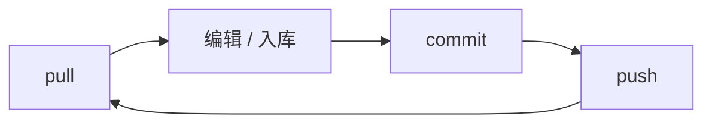

# 资源管线

这页讲**大文件(图片、音频、动画、视频)怎么在团队里同步**。读完你能自己完成一次"拉资源→改/入库→提交→推送"的完整闭环,也能看懂冲突时该怎么处理。

---

## 这是什么(30 秒看懂)

图片、音频、动画、视频这些大文件**不进 Git 本体**,由 **DVC** 管版本,远程存在**阿里云 OSS**。Git 里只放代码、JSON 和小文本;媒体走的是 DVC 指针,多人协作靠 **pull / commit / push** 三板斧。

打个比方:Git 仓库像雾津折子铺的**账本柜台**,只放得下文字账目;真正的画卷、录音这些"大件"存在**后仓库**(OSS)里,账本上只记一张"提货单"(DVC 指针)。你要看画卷,先按提货单去后仓库取(pull);你换了一幅画,先把新画放进后仓库、账本上更新提货单(commit),再让所有人知道账本变了(push)。



| 问题 | 管线做法 |
|---|---|
| 仓库克隆慢、历史膨胀 | 大文件放 OSS,Git 里只有指针 |
| 多人要同一份雾津美术/配音 | 统一远程,按 hash 校验一致性 |
| 要回到某次提交时的媒体状态 | 指针随 Git 走,checkout 对应版本再 pull |

---

## 快速上手:走一遍完整闭环

1. **同步**:`./dev.sh pull` ——这是上班第一件事,把 git 和运行时大文件一起拉到最新。第一次拉全量媒体会比较慢,后续只拉增量。若你还要动编辑器工程资源,用 `./dev.sh pull --editor`(或 `./scripts/pull-all.sh`)。
2. **改文件**:用编辑器的入库工具(比如资源入库)把新素材放进对应目录,或者美术/音频直接改运行时目录里的文件。
3. **提交**:`./dev.sh commit -m "说明"` ——把改动的媒体记进 DVC、指针和其它小改动一起进 Git(**必须带提交说明**)。
4. **推送**:`./dev.sh push` ——把媒体推到 OSS、代码推到远程仓库。
5. 通知协作者(或者他们自己下次 `pull` 时)就能拿到你改的素材。

这几条命令都是"**Git + DVC** 语义"——你不需要分开记 `dvc pull` 和 `git pull`。注意:`./dev.sh pull` 默认拉运行时资源;`pull --editor` 才额外拉编辑器工程资源。

雾津小例子:美术给关二狗新画了一版立绘,流程就是——先 `./dev.sh pull` 确保没有别人先改过这份立绘,把新图放进对应目录(或用入库工具切图命名),进游戏里看一眼效果对不对,然后 `./dev.sh commit -m "更新关二狗立绘"` 提交、`./dev.sh push` 推送,其他人下次 `pull` 就能看到新立绘。

---

## 深入:每个环节讲透

### 三类资源,协作时怎么记

| 类别 | 用途 | 谁常改 |
|---|---|---|
| **运行时资源** | 游戏两壳直接读的图/音/动画 | 美术、音频、策划验收 |
| **编辑器工程数据** | 编辑器侧工程/缓存类数据 | 工具维护、本地同步 |
| **第三方素材归档** | 外部原始素材包的归档 | 美术入库前保留原始文件 |

运行时资源占了协作里 90% 的精力——日常打交道基本就是"改图→commit→push",别人 pull 一下就同步上了。编辑器工程数据和第三方归档更偏工具维护向,平时按需同步即可,不用天天惦记。

### 首次配置 OSS

新机器或者新协作者第一次接入远程时:

1. 向维护者索取 OSS 访问方式(或者已有 bootstrap 提供的配置模板)。
2. 在仓库根目录执行:

```bash
./dev.sh configure-oss --bucket <你的桶名> --prefix gamedraft/dvc --endpoint https://oss-cn-hangzhou.aliyuncs.com
```

3. 凭据会写在本地配置里,已经被 gitignore,**千万别把它提交进仓库**。

`--bucket` 必填;远程 bucket / endpoint / prefix 以项目当前实际配置为准。换了台机器,要先 `configure-oss` 再 `pull`,不然拉不到东西。

### 和 asset-ingest(资源入库)怎么分工

| 环节 | 谁管 |
|---|---|
| **资源入库(asset-ingest)** | 外部素材的切片、命名、放进运行时目录树 |
| **DVC** | 进目录之后的版本化、远程同步 |

流程顺序是:**入库工具把素材落盘 → 进游戏里看一眼效果 → `./dev.sh commit -m "说明"` → `./dev.sh push`**。入库工具解决的是"这张图/这段音怎么变成游戏能用的格式、放在哪",DVC 解决的是"放好之后怎么让所有人同步到"。两者不是一回事,别把入库这一步跳过直接扔文件进目录。

### 协作守则

| 守则 | 原因 |
|---|---|
| 改大文件前先 `pull` | 减少指针冲突 |
| 不手改 `.dvc` 指针文件糊弄 | hash 一旦对不上,全员都拉不到正确的文件 |
| 不把 OSS 凭据提交进 Git | 安全考虑,凭据只留在本地 |
| 小 JSON 照常走 Git 提交 | 可以和 DVC 的 commit 放在同一次 push 里 |

多人协作时尽量避免同时改同一个大文件——大文件的合并成本比文本文件高得多,冲突了往往只能取舍一方重做,而不是像文本那样逐行合并。

### 冲突和异常怎么处理

遇到 pull 失败、指针对不上、或者本地缓存和远程状态不一致,第一反应是**先 pull 一次**,大部分情况下工具会提示你接下来怎么处理指针或者清理本地缓存。如果提示里出现"远程孤儿文件"这类字眼,或者你怀疑 OSS 侧有历史遗留的垃圾数据,不要自己动手清,找维护者处理——误删可能影响到别人还在用的版本。

---

## 常见问题

**Q:为什么我 commit 完之后,别人 pull 还是看不到新素材?**
A:先确认你自己有没有紧接着 `push`——`commit` 只是把变更记进本地 DVC 和 Git,真正让别人拿到还得 `push` 到远程。

**Q:两个人同时改了同一张图,冲突了怎么办?**
A:大文件冲突通常没法像文本那样自动合并,一般是先 pull 看清楚谁的版本是最新的,协商好之后由一方重新提交,另一方放弃自己的改动。

**Q:第一次克隆仓库,`pull` 特别慢正常吗?**
A:正常,第一次要把全部运行时资源拉下来,量比较大。之后每次 `pull` 只拉增量,会快很多。

**Q:能不能先把大文件塞进 Git 再说,以后再挪到 DVC?**
A:不建议。塞进 Git 历史之后很难干净地清出去,仓库体积会一直背着这个包袱,该用 DVC 的从一开始就走 DVC。

**Q:换了台新电脑,东西一个都没有,先做什么?**
A:先 `./bootstrap.sh`,再 `./dev.sh configure-oss` 配好远程凭据,最后 `./dev.sh pull` 把代码和资源都拉齐。

---

## 相关

- [常用工作流命令](./commands)
- [项目总览](./overview)
- [资源入库](../editors/asset-domain/asset-ingest)(编辑器侧,怎么把外部素材切好放进去)
- [延伸阅读](./resources)
