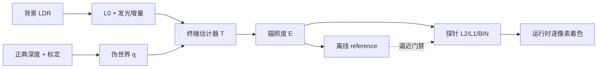
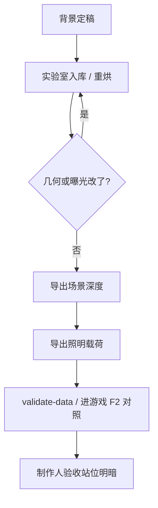

# 伪世界角色照明

这页把 GameDraft **角色照明 v2** 从问题边界、数学定义，一路归纳到实验室烘焙与游戏运行时消费。读完你应能回答：为什么不是「从一张图恢复真实三维光照」，运行时为何等于同一估计器的压缩版，以及改深度 / 曝光 / 折叠 / NEE 分别动到账本哪一格。

工具怎么点按钮 → [角色照明实验室](../editors/render-domain/character-lighting-lab)。  
权威推导原稿在游戏仓库 `artifact/Design/伪世界角色照明-修正版完整推导-2026-07-21.md`；接入进展见同目录规划稿。本页是文档站侧的定稿归纳。

---

## 0. 先给结论

本项目**不能**、也**不追求**从单张二维背景恢复唯一真实三维世界与绝对物理光照——信息不足，不可辨识。

真正求解、且已落地的目标是：

> 在正典深度、遮挡边界、伪世界标定与 HDR 标定共同定义的**可控伪世界**里，估计纸片角色每个着色点从场景可见表面接收到的条件辐照度；对单张图未提供的方向域，用显式先验分段补全。

由此直接得到的工程后果：

| 后果 | 含义 |
|---|---|
| 立绘 = albedo | 角色素材不再当最终自发光；无光则暗，有暖光则暖，背光只失去直接项，仍可吃画面里已有的间接光 |
| 深度分离 | 屏幕重合但伪世界深度相距很远的像素不得互相照明 |
| 显示 / 着色解耦 | 显示 quad 仍可朝相机；着色主法线可独立转向，隆起法线绕主法线生成 |
| terminal radiance | 可见命中读取背景线性 HDR 出射后停止；对背景再递归会双算 |
| 补全互斥 | 原射线命中 → 折叠命中 → 低频闭包，三分支互斥，不叠加 |
| reference = 缓存真值 | 离线逐像素 final gather 是项目 reference；运行时 L2 / L1 / BIN 是同一估计器的压缩，不是另一套光照逻辑 |

「正确」的含义：在已声明的伪世界几何与补全先验下，积分、坐标、能量记账与压缩彼此一致——不是声称恢复了客观真实世界。



---

## 1. 问题边界

### 1.1 正典输入（唯一允许进烘焙的）

- 背景图 `C_ldr(s)`
- **场景深度工具链产出的正典深度** `D(s)`（照明侧不得私养第二份深度）
- 伪投影标定 `K_pseudo`（`p_pu`、中心、俯角 / 起伏等）
- 遮挡 / 碰撞重建参数（断边、厚度、地面延拓）
- 场景曝光 `EV_scene`、局部增益图 `g(s)=gainEV(s)`
- 角色反照率贴图、透明度、位置 / 尺寸、着色法线参数

深度与 HDR 缓存必须带**内容哈希 + 算法 / 参数版本**。上游一变，旧缓存只能标过期，禁止静默继续用。

### 1.2 永远推不出的量

背面几何与辐射、真实相机焦距 / 姿态 / 绝对尺度、像素级真实 albedo / BRDF、LDR 截断前的绝对 nit、画外天空与墙后光源……

用语纪律：

| 词 | 含义 |
|---|---|
| **恢复** | 由已有数据与确定坐标变换唯一算出 |
| **标定** | 在等价类里选尺度或曝光基准 |
| **补全** | 对不可观测域施加明确先验 |

补全必须写进公式、能关闭、能对比、能报置信度；把它说成「真实恢复」会使验收失效。

---

## 2. 伪世界坐标

正交伪投影约定（当前工具）：

```text
q(s) = [ (s_x - c_x)/p_pu , (c_y - s_y)/p_pu , D(s) ]
```

更一般地写成正典反投影 `q = Pi_pseudo^{-1}(s, D(s); K_pseudo)`。照明代码只许调用这一正典函数，禁止各自重新解释深度。

从角色点 `q0` 沿伪世界方向 `ω` 步进：

```text
r(t) = q0 + t · ω ,   t > ε
s(t) = Pi_pseudo(r(t))
g(t) = r_z(t) - D(s(t))   # 符号跨越后细化交点
```

步长必须以伪世界距离 `t` 定义；屏幕直线 raymarch 不能替代伪世界距离步进——那是「射线很多却打不中街道」的经典坑。

展示用世界坐标若再乘正交矩阵 `R`：`x = R q + t`，则距离与夹角在 `q` 与 `x` 间保持。RT 可在 `q` 空间做；展示相机只是观察工具，不参与光照定义。

**关键：** `p_pu` 与深度尺度共同选定伪度量后，几何、面元面积与 `1/r^2` 必须同尺度。

---

## 3. 从深度到可遮挡伪几何

优先级：

```text
遮挡边界正确 > 结构切变正确 > 低频深度合理 > 像素级细节
```

三类对象不要混为一谈：

| 对象 | 用途 |
|---|---|
| `S_vis` | 可见前表面网格 |
| `O_light` | 光线传播占据体（有限厚度 + 受约束地面延拓） |
| `O_sprite` | 游戏角色前后遮挡用的正典深度 / 碰撞 |

地面延拓只对有地面证据且与可达区连通的部分生效；其余空洞留给方向补全，禁止「整图下方都是地面」。

实验室侧另有：**起伏增益**放大相对地面的深度残差；**世界空间碰撞**与屏幕遮挡解耦（可走进建筑背后被正确遮挡，但不被禁止移动）；导出场景深度时把标定 + 编辑写回场景正典深度配置。

---

## 4. 角色：显示几何与着色法线解耦

### 4.1 albedo

角色贴图 RGB 经 EOTF 后当作漫反射反照率 `ρ`；默认自身不发光。零入射时线性输出为黑，但室内 `L_0` 非零的墙地仍会经 gather 照到角色。

### 4.2 显示平面保持朝相机

显示顶点仍在面向伪相机的 billboard 上，避免轮廓因光照法线改变而透视走样。

### 4.3 可调主法线 + 隆起

主法线 `m_q` 与显示法线 `n_0` 独立；隆起函数绕 `n_0` 求导后，用最短弧旋转把隆起梯度对齐到 `m_q`，得到逐像素着色法线 `n_s`。中心接近 `m_q`，轮廓向切向倾斜。

**实现约束：** 法线必须由当前角色宽高、透明轮廓、隆起量与主法线实时（或同次烘焙）导出；禁止读取一张按固定隆起烘死、运行时又允许改 bulge 的法线图。游戏侧对动画图集按 EDT→高斯→梯度**逐格现算法线**，零法线贴图。

遮挡代理与着色代理可以拆开：遮挡用脚点深度比较的 billboard；着色用世界直立 quad（受光位置正确）。直立 quad 参与深度测试会让上半身穿前景——双代理后消失。

---

## 5. LDR → HDR：相对场景辐射，不是绝对 nit

```text
C_lin = EOTF_sRGB(C_ldr)
L_0   = 100 · C_lin · 2^EV_scene
L_hdr = L_0 · 2^g(s)          其中 g(s) = gainEV(s)
```

拆账防双算：

```text
ΔLe = L_0 · (2^g(s) - 1)
L_hdr = L_0 + ΔLe
```

- `L_0`：原画面已表达的基础出射（含画里直接 / 间接）
- `ΔLe`：为恢复 LDR 压掉的发光核心而追加的能量

语义模型（SAM 门控）只产**发光候选**；局部对比 / 亮核 / 溢光 / 环境能量决定增益。曝光 `EV_scene` 必须真正乘进 `L_0`；背景与角色共用同一展示曝光与 tone mapper。

---

## 6. 渲染方程与 terminal radiance

Lambert：`f_r = ρ/π`。辐照度与角色出射：

```text
E(q, n) = ∫ over Ω+(n) of  L_i(q, ω) · (n·ω) dω
L_o^char = (ρ / π) · E
```

伪世界首次命中背景可见面 `x` 后，采用漫反射终端先验：

```text
L_i(q, ω) ≈ L_hdr(s_x)     # 诊断：整图 HDR
L_i(q, ω) ≈ L_0(s_x)       # 生产 + NEE：普通命中只读 L_0
```

这是 **one-bounce final gather with terminal scene radiance**：背景照亮角色，角色不反向改背景。对同一可见命中继续向场景递归 = 双算。

背对蜡烛仍应吃到墙地 `L_0`；若接近纯黑，先查射线 / 法线 / 相交 / miss，不要用常量环境掩盖坐标错误。

---

## 7. NEE 与唯一记账

生产模式开 NEE 时：

1. 普通 gather 命中只读 `L_0`
2. `ΔLe` **只**经显式发光面元（NEE）加入
3. 同一增量不得既在射线命中又在 NEE
4. 手工太阳同理，只能有一个入口

面元增量直接辐照度（示意）：

```text
E_emit^dir(q,n) ≈ Σ_j ΔLe_j · A_j · V(q,x_j)
                  · max(n·ℓ_j, 0) · max(n_j·(-ℓ_j), 0) / max(r_j², r_min²)
```

火苗 / 窗洞等法线不可靠时，可显式用双面发射（第二余弦换 1）。发光体按各向同性 surfel 处理更稳。期望守恒：开关 NEE 时均值几乎不变是分账正确的信号；NEE 买的是低方差与贴近光源的确定性亮斑。

探针 atlas 四分账列布局：`[base+cov | amb | emitray | nee]`。运行时「NEE 直接光」可开关，无需 rebake。

---

## 8. 缺失方向的分段补全

miss 原因：穿出画界、朝向相机侧无可见壳、进入未知空间……

相机侧折叠（伪相机平面法线 `v_cam`）：

```text
F(ω) = ω - 2 (ω · v_cam) v_cam
```

生产终端估计器 `T(q,ω)`（三分支**互斥**）：

```text
1. 原射线命中            → L_base(Hit(q, ω))
2. miss 且相机侧折叠命中 → L_base(Hit(q, F(ω)))
3. 其余 miss              → J̄(q, ψ(ω))
   # ψ：相机侧用 F(ω)，否则用 ω
```

NEE 开时 `L_base = L_0`；NEE 关的诊断模式才允许 `L_base = L_hdr`。

- **折叠** `F`：在伪相机平面法线反射方向，再真追局部几何
- **`J̄`**：稀疏闭包探针上、只用真实命中拟合的 L2 低频辐射场；同连通分量插值

旧说法「完全不能开折叠」过强；真正禁止的是**已命中样本上再叠加**折叠 / 闭包。折叠开着时 miss 集合≈空，miss 强度旋钮会「看起来无效」——是特性。

运行时 miss 策略旋钮（无需 rebake）：

| 策略 | 合成 |
|---|---|
| miss 环境强度 `s` | `E = E_hit + s · E_amb`（`s=0` 严格黑） |
| miss 不计入 | `E = E_hit / cov`（hit 归一） |

---

## 9. Reference final gather → 探针缓存

余弦重要性采样 `p(ω)=(n·ω)/π`，无偏估计：

```text
Ê_base+closure(q,n) = (π / N) · Σ_i T(q, ω_i)
Ê(q,n) = Ê_base+closure + E_emit^dir + E_sun^dir
L_char^ref(u,v) = β · (ρ(u,v)/π) ⊙ max(Ê(q, n_s), 0)
```

`β` 是素材与场景辐射单位之间的显示 / 材质标定，不是再改场景曝光。中性参考位可取 `β = π / Y(E(q_ref, m_q))`。

### 9.1 L2 球谐

先缓存方向辐射的 SH，再对 Lambert 做 zonal 卷积（`A0=π`, `A1=2π/3`, `A2=π/4`）。常量环境必须满足 `E = π L_c`——这条解析测试能抓归一化错误。

离线保存**预卷积 irradiance 系数** `G_lm = A_l · L_lm`；运行时只做 `Σ G_lm Y_lm(n)`，禁止再乘一次 `A_l`。

### 9.2 空间插值

对查询点所在单元 8 角点，先插值带符号的 SH 系数（带有效性 / 同连通掩码），**最后**才对总辐照度 clamp。禁止先对每个 probe 的 lobe clamp 再三线性。

实体内网格点不得「吸附到最近自由点却仍占原坐标」——墙对侧光照会漏进当前单元。正确做法：只在真实自由位置建探针 + 有效角点掩码 + 跨墙拒绝插值。

v2 探针网格为**世界空间体积**（轴向对齐 x × 高度带 × 深度，覆盖地面到地面+`band` 可达带），着色时先把 `q` 变到世界再三线性——否则探针能量空间方差≈0，移动角色光照不变化。

---

## 10. 实验室管线（离线）

打开：`./dev.sh char-lighting`。烘焙在软件内异步完成。

| 阶段 | 做什么 |
|---|---|
| 深度 | 单目深度（按图哈希缓存）；几何编辑笔刷 / 多边形选区可持久 |
| 标定 | 免平面 / 免锚点：视差仿射使地面掩码上 `Y^2` 鲁棒最小 |
| 地面场 | Laplace 延拓 → 非平面行走面 `d_walk` |
| 补全 | 凸出物充气 + 背景 inpaint + 行走面后填实 → 占据 / 辐射体素 |
| 辐射 | HDR 统一模型 + SAM 语义门控发光候选 |
| `J̄` | 自由点球面 gather → radiance SH L2 |
| 探针 | 世界空间网格 + Fibonacci 方向 gather → L1 / L2 / BIN 四分账 |
| 碰撞 / 可走 | 世界 XZ 占据柱 + 可见壳高出地面差值（与屏幕遮挡解耦） |

四个照明模式（验收应收敛到接近）：

| 模式 | 角色 |
|---|---|
| RT | 逐片元 cosine 半球，体素步进，miss→折叠 / `J̄`（reference） |
| L1 | 探针三线性 + 4 系数 SH |
| L2 | 探针三线性 + 9 系数 SH（生产默认） |
| BIN | 探针三线性 + octahedral bin（无 SH 截断） |

几何签名过期时：查看器红条提示，导出深度 / 照明一律拒绝，直到重烘。

---

## 11. 运行时 v2：载荷与着色

### 11.1 载荷位置与内容

`public/resources/runtime/scenes/<场景>/lighting/`（随场景媒体 / DVC）：

| 产物 | 作用 |
|---|---|
| `lighting.json` | 版本、背景 SHA-1、标定、世界盒、探针网格、体素布局、光源列表、地面深度范围、`shading` 场景配置 |
| `atlas_l1\|l2\|bin.bin` | 探针 atlas 四分账（f16） |
| `probes_valid.bin` | 有效掩码 |
| `vol_rad.bin` / `vol_emit.bin` | 体素卷 Z 切片平铺图集（shader 手写三线性，等价 sampler3D） |
| `ground_d.png` | 行走面深度 RG16 |

旧 v1 三分账 bin 在导出时清除。校验器做结构 / 尺寸 / **游戏侧背景哈希**门禁；哈希失配 → 禁用烘焙并告警。

`shading` 块写入非 bake 运行时参数（模式、SPP、步长、折叠、miss、NEE、β、增益、隆起……）。游戏加载即用之初始化；F2 改动只是运行时测试，重载场景回配置。太阳为游戏侧参数，不入载荷。

### 11.2 着色式（与实验室 CHAR_FS 同式）

```text
L_char(u,v) = β · (ρ/π) ⊙ max(E_base + E_closure + E_emit^dir + E_sun^dir, 0)
```

- 角色 / NPC 挂片元滤镜，逐像素求 `E`
- 法线图集按舞台角色同数学现算
- 脚点 `q`：场景世界坐标 → 背景像素 → 地面深度双线性 → 伪世界
- 有合法载荷且开关开 → 走烘焙着色；无载荷 / 哈希过期 / 总开关关 → **回落光环境曲线**（旧 tone）
- **禁止**烘焙 tint / 曲线与烘焙着色同时相乘

实现落点（游戏仓库）：`CharacterLightingSystem` 装载与校验载荷；`CharacterShadingFilter` 片元着色；`spriteNormalAtlas` 逐格现算法线。

### 11.3 与阴影 / AO / 深度遮挡的关系

正交、不互相接管：

- 投影阴影、接触 AO、深度遮挡滤镜继续走既有系统
- 实验室接触阴影**禁止**进游戏
- 太阳方向与投影阴影方位角**互不耦合**（F2 可独立调）

---

## 12. 内容工作流（红线）



1. `./dev.sh char-lighting` 打开实验室  
2. 新场景入库或重烘当前（深度→标定→体素→探针）  
3. 几何笔刷 / 多边形改完会标几何过期 → 必须再重烘  
4. **⇪ 导出场景深度**（写回场景正典深度配置）  
5. **⇪ 导出照明**（写 runtime lighting/ + 当前面板 `shading`）  
6. 游戏内看角色；F2「角色照明（烘焙）」可临时改参数对照 RT/L2  
7. 无烘焙场景自动回落曲线，玩家无感  

批量迁移建议：逐场景「重烘 → 导出深度 + 照明 → 游戏验收」。旧场景深度编辑器在照明管线打通后标 deprecated（遮挡专项仍可对照）。

---

## 13. 必须过的验证

### 解析

1. 常量辐射场：任意法线 `E = π L`  
2. 单方向光：背面直接项为零  
3. 坐标旋转不变性  
4. 深度分离：屏幕同位、深度不同不得互照  
5. 薄墙：两侧探针不得串光  
6. 折叠互斥：原命中时 fold / `J̄` 贡献为零  
7. NEE 记账：on = `L_0` + 直接增量；off 诊断才允许射线吃 `L_hdr`  
8. 法线一致性：改宽高 / bulge 后中心仍≈`m_q`

### 项目场景

室内烛火（前 / 侧 / 后）、街道、门洞墙角、起伏野外、强发光窗。至少输出：原贴图 / 仅 `L_0` / +`closure` / +NEE / reference↔L2 误差热图 / 主法线三方向 / 射线分类图。

---

## 14. 表达能力上限

**能稳定表达：** 随位置进入明暗与环境色；可见几何遮挡；主法线转向的正侧背；画面已表达的直接 / 间接；LDR 压掉的局部发光直接项；Lambert 隆起低频体积感。

**不能：** 画面无线索的背后光源；镜面 / 头发高光；完整背面三维；角色对背景动态反弹与互反射；绝对物理 nit。

这些不是继续拧旋钮就能突破的——要加输入（法线材质、多视图、人工光源或真三维）至少一种。

---

## 15. 最终理论链（压缩）

```text
C_ldr  --EOTF+EV-->  L_0  --gain-->  (L_0, ΔLe)
(s, D, K)  --Pi^{-1}-->  S_vis, O_light, q
(q, ω)  --pseudo RT-->  original hit | fold hit | J̄
T + ΔLe^NEE  --∫ cos θ dω-->  E(q,n)  --ρ/π-->  L_char  --shared tonemap-->  C_display
```

离线算到最后一步；运行时只在 `E(q,n)` 层用探针压缩。物理假设与能量账本必须完全相同——否则「和实验室对不上」没有验收意义。

---

## 相关

- [角色照明实验室（操作）](../editors/render-domain/character-lighting-lab)
- [场景深度重建](../editors/render-domain/scene-depth-editor)
- [项目架构总览](./architecture)
- [常用工作流命令](./commands)（`char-lighting`）
- [危险区](../editors/concepts/danger-zone)
