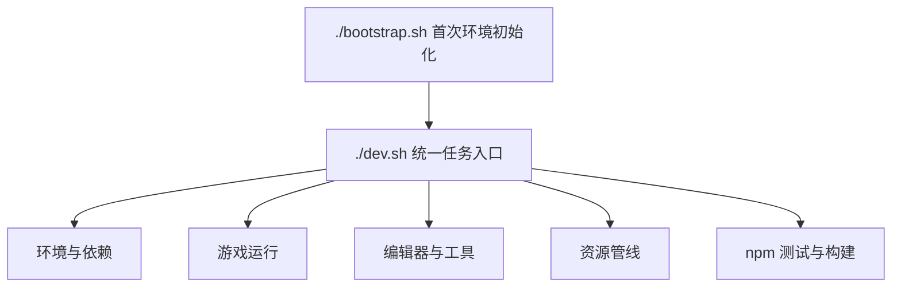

# 常用工作流命令

这页把**日常会用到的命令按用途分类列全**,每条都写清楚"敲了它会发生什么"。读完你不需要背命令,查这张表就够。

:::note
所有命令在**游戏仓库根目录**执行(不是文档站目录)。完整列表以 `./dev.sh --help` 为准,本页覆盖日常最常用的那些。
:::

---

## 这是什么(30 秒看懂)

`./dev.sh` 是这个仓库的**统一任务入口**——环境搭建、拉资源、起游戏、开编辑器、同步远程,几乎所有日常操作都从这一个命令下面的子任务进去,不用分别记很多零散脚本。配套的还有几条独立的 `./scripts/*.sh` 快捷脚本,以及少量用 `npm run` 暴露的测试/构建命令。



---

## 快速上手:新人三连

新克隆仓库之后,最常用的顺序就三步:

```bash
./bootstrap.sh          # 首次:搭好环境
./dev.sh pull           # 拉代码 + 大文件
./dev.sh game start     # 起游戏,浏览器里玩
```

想改内容,再加一步:

```bash
./dev.sh editor          # 开主编辑器
```

日常收工前记得把改动同步出去:

```bash
./dev.sh commit -m "说明"
./dev.sh push
```

---

## 深入:全部命令按用途分类

### 环境与首次搭建

| 命令 | 干什么 |
|---|---|
| `./bootstrap.sh` | 首次初始化:用系统 Python 建项目内虚拟环境、装好 DVC、检查 Node 版本是否够(需要 20+)。可选带 `game`/`editor`/`clean` 参数只处理某一部分或清理重来 |
| `./dev.sh bootstrap` | 初始化或清理 game/editor 的本地环境 |
| `./dev.sh install-deps` | 安装第三方依赖;默认走临时代理,不想走代理时加 `--no-proxy` |
| `./dev.sh init-runtime` | 单独同步游戏运行时资源到本地 |
| `./dev.sh init-editor` | 单独同步编辑器工程资源到本地 |

新人顺序建议:`./bootstrap.sh` → `./dev.sh pull` → `./dev.sh game start`。首次在干净克隆上**务必先跑 bootstrap**,其它命令都依赖它准备好的运行环境。

### 游戏运行

| 命令 | 干什么 |
|---|---|
| `./dev.sh game start` | 启动开发服务器,在浏览器里玩权威源版本 |
| `./dev.sh game stop` | 停止开发服务器 |

等价的还有 `npm run dev`,但协作文档里建议统一写 `./dev.sh game start`,避免两套说法混着用。

### 编辑器与专项工具

| 命令 | 干什么 |
|---|---|
| `./dev.sh editor` | 打开主编辑器——改场景、对话、任务、规矩等绝大多数内容 |
| `./dev.sh console` | 打开 Web 控制台——仪表盘式一键起游戏/构建/测试 |
| `./dev.sh workbench` | 打开生产工作台——验收、质检、素材任务的十个 Tab |
| `./dev.sh asset-browser` | 打开资源浏览器 |
| `./dev.sh asset-ingest` | 打开资源入库工具 |
| `./dev.sh image-resizer` | 打开图片缩放工具 |
| `./dev.sh dialogue-graph` | 单独打开图对话编辑器(不经主编辑器入口时使用) |
| `./dev.sh anim-preview` | 打开动画预览工具 |
| `./dev.sh parallax-editor` | 打开视差编辑器 |
| `./dev.sh filter-tool` | 打开画面滤镜工具 |
| `./dev.sh lightvol` | 打开光照体积工具 |
| `./dev.sh chronicle-sim-v2` | 编年史模拟 v2 |
| `./dev.sh chronicle-sim` | 编年史模拟(v3) |
| `./dev.sh chronicle-week <run_dir> --week 1` | 编年史周报类工具,按周查看模拟结果 |
| `./dev.sh validate-data` | 跑一次全量数据校验;加 `-- --strict` 能让 warning 也算失败 |
| `./dev.sh json-lang` | 启动 JSON 语言服务,给编辑相关文件时提供自动补全和报错提示 |
| `./dev.sh skill-governance` | 打开治理台 |
| `./dev.sh agent-canvas-os` | 打开 Agent Canvas OS(独立子项目) |
| `./dev.sh acos-agent` | Agent Canvas OS 的代理入口 |

各工具具体"点哪里、改什么"见 [编辑器手册](../editors/overview) 与 [工具速查表](../editors/tool-matrix);这里只列"敲什么命令能把它打开"。

### 资源管线

| 命令 | 干什么 |
|---|---|
| `./dev.sh configure-oss --bucket B` | 首次配置 DVC 远程 OSS(bucket/endpoint 以项目当前配置为准) |
| `./dev.sh pull` | git pull + DVC pull,代码和大文件一起同步,上班第一件事 |
| `./dev.sh pull --editor` | 在同步代码+运行时资源的基础上,额外拉编辑器工程资源 |
| `./dev.sh commit -m "说明"` | 把改动的媒体 dvc add、连同其它改动一起 git commit |
| `./dev.sh push` | DVC push + git push,把媒体和代码一起推到远程 |

日常闭环就是:**pull → 改资源 → commit → push**。详细的 OSS 配置和冲突处理见 [资源管线](./asset-pipeline)。

也可以用几条封装脚本代替上面的组合:

| 命令 | 干什么 |
|---|---|
| `./scripts/pull-all.sh` | 等价于同步代码 + 大文件的一键脚本 |
| `./scripts/commit-all.sh "提交说明"` | 等价于把改动一起提交 |
| `./scripts/push-all.sh` | 等价于把改动一起推送 |
| `./scripts/console.sh` | 等价于打开 Web 控制台 |

### 测试与构建(npm 封装)

开发向的测试仍然通过 npm 暴露,在仓库根目录执行:

| 命令 | 干什么 |
|---|---|
| `npm test` | 跑 TypeScript 权威逻辑的单元测试 |
| `npm run build` | 跑一次生产构建,确认能正常打包 |
| `npm run test:godot-visual-parity` | Godot 视觉 parity 全量门禁(截图相似度比对) |
| `npm run test:godot-scene-visuals` | 只扫场景相关的视觉门禁 |
| `npm run test:godot-dialogue-visuals` | 只扫对话推进相关的视觉门禁 |
| `npm run test:godot-minigame-visuals` | 只扫小游戏相关的视觉门禁 |

Godot 侧的无界面回归测试和导出打包流程,见 [Godot 移植工作流](./godot-port)。

---

## 常见问题

**Q:命令跑了没反应/报错,先查什么?**
A:先确认是不是漏跑了 `./bootstrap.sh`——很多命令依赖它准备好的虚拟环境和依赖;其次确认自己在**游戏仓库根目录**执行,而不是文档站或者别的目录。

**Q:`./dev.sh pull` 和 `./scripts/pull-all.sh` 有什么区别?**
A:日常用法上等价,都是"代码+大文件一起同步"。协作文档里统一推荐写 `./dev.sh pull` 这一种说法,避免两套写法混用造成困惑。

**Q:装依赖或者 pull/push 很慢甚至失败,是不是网络问题?**
A:依赖安装和 git 推拉默认会走一个临时代理;如果这个代理当前不可用,依赖安装可以加 `--no-proxy`,git 推拉换代理要传对应参数或设置环境变量。具体值以项目当前配置为准,不确定就问维护者。

**Q:`./dev.sh --help` 和这页对不上怎么办?**
A:以 `--help` 的实时输出为准——这页覆盖的是日常最常用的一批,如果发现有新命令没收录,或者某条命令的行为变了,提个 PR 同步更新本页(见 [参与与提交流程](./contributing))。

**Q:OSS 凭据要填在哪,填错了会怎样?**
A:凭据保存在本地一个被 gitignore 的配置文件里,`bootstrap` 缺失时会提示你填;填错了通常表现为 `pull`/`push` 到 OSS 那一步失败,重新跑一次 `configure-oss` 更正即可,不影响 Git 那一侧的代码同步。

---

## 相关

- [项目总览](./overview)
- [项目架构总览](./architecture)
- [资源管线](./asset-pipeline)
- [Godot 移植工作流](./godot-port)
- [参与与提交流程](./contributing)
