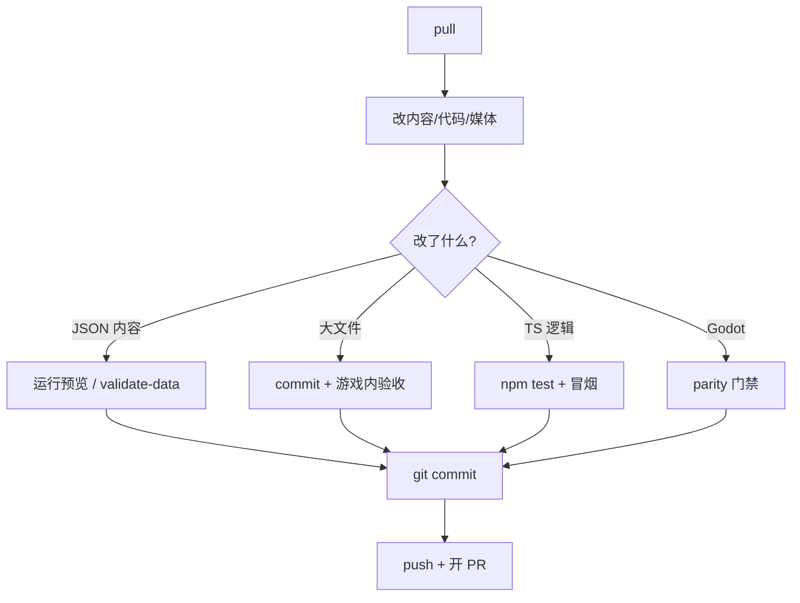

# 参与与提交流程

面向要改**游戏内容、工具、移植**的协作者。不讲实现细节，只讲**怎么接活、怎么交差、怎么不坑队友**。

---

## 你能改哪几类东西

| 类型 | 典型改动 | 主要验证 |
|---|---|---|
| **内容** | 对白、场景、任务、规矩 | 运行预览、数据校验 |
| **媒体** | 图、音、动画 | 游戏内眼看 + `./dev.sh commit` |
| **权威源逻辑** | 玩法、系统 | `npm test`、进游戏冒烟 |
| **Godot 移植** | 对齐权威源 | Godot 回归 + 视觉 parity |
| **编辑器工具** | 面板、工作台 | 起对应 `./dev.sh` 任务手测 |

内容改动**不要**绕过编辑器手写大段 JSON，除非你知道危险区后果（见 [危险区](../editors/concepts/danger-zone)）。

---

## 环境准备（一次性）

在**游戏仓库根目录**：

```bash
./bootstrap.sh
./dev.sh pull
```

缺 Python 环境、缺媒体，都先回到这两步。详见 [5 分钟跑起来](../tutorials/intro)。

---

## 分支与拉取

| 习惯 | 说明 |
|---|---|
| 从最新主分支拉功能分支 | 命名清晰，如 `content/miaojin-temple-call-soul` |
| 开工先 `pull` | `./dev.sh pull` 同步代码与大文件 |
| 小步提交 | 一个逻辑改动一批提交，方便回滚与评审 |

---

## 改动 → 验证 → 提交



### 内容向

1. `./dev.sh editor` 改完，**运行预览**走一遍任务线。
2. 可选：`./dev.sh validate-data` 跑数据校验。
3. 纯 JSON：`git add` + `git commit`。
4. 含媒体：`./dev.sh commit`（封装 dvc add + git commit）。

### 程序向

- 权威源：`npm test`，必要时 `npm run build`。
- 移植：[Godot 移植工作流](./godot-port) 全套回归与视觉门禁。
- 勿把临时 bypass 当正式提交；须登记或修掉。

### 推送

```bash
./dev.sh push
```

含大文件时务必用封装 push，保证 OSS 与 Git 同步。

---

## Pull Request 期望

| 项 | 评审看什么 |
|---|---|
| **范围** | PR 只做一件事或一条线，避免「顺便改」 |
| **说明** | 写了什么、怎么验的、有无 parity/视觉截图 |
| **数据** | 是否动危险区、是否需同步 pull 才能玩 |
| **移植** | 动权威源时 Godot 是否已对齐或注明跟进 issue |
| **秘密** | 无 OSS 凭据、无本地路径泄露 |

内容 PR 附：**场景名 / 任务 id / 复现步骤**（玩家视角即可）。程序 PR 附：**失败门禁的修复前后**。

---

## 文档站协作

本仓库（GameDraft-docs）与游戏仓库分离：

| 改动手册 | 在哪提 PR |
|---|---|
| 玩家手册、教程、编辑器说明 | GameDraft-docs |
| 工作流、dev.sh 行为变更 | 游戏仓库改代码 + 文档站同步改 dev 页 |

改 `./dev.sh` 子命令后，请同步更新 [常用工作流命令](./commands)。

---

## 出问题找谁

| 现象 | 先做 |
|---|---|
| pull 失败 / DVC 冲突 | 看 [资源管线](./asset-pipeline)，勿强行覆盖远程 |
| 改了没生效 | [出问题怎么办](../tutorials/troubleshooting) |
| parity 红 | [Godot 移植工作流](./godot-port) 查报告 |
| 编辑器起不来 | `./bootstrap.sh`，再 `./dev.sh install-deps` |

---

## 相关页面

- [项目总览](./overview)
- [常用工作流命令](./commands)
- [资源管线](./asset-pipeline)
- [Godot 移植工作流](./godot-port)
