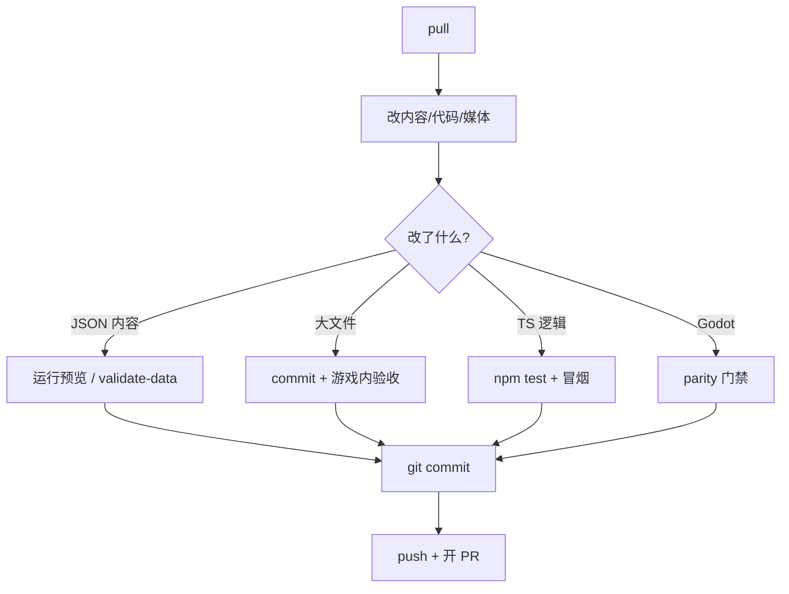

# 参与与提交流程

这页面向要改**游戏内容、工具、移植**的协作者,讲**怎么接活、怎么交差、怎么不坑队友**,不讲实现细节。读完你能自己走完一次"拉分支→改动→验证→提交→开 PR"的完整流程。

---

## 这是什么(30 秒看懂)

打个比方:这个仓库像一个共用的雾津工坊,大家都在同一张长案上做活。你进工坊第一件事是把台面收拾到和大家一致(`pull`),干完活要把工具放回原位、把东西摆整齐(验证),再把新做的东西登记到公共账上(提交),最后请师傅过目(PR 评审)——而不是做完直接把东西堆在案上就走人。

| 类型 | 典型改动 | 主要验证 |
|---|---|---|
| **内容** | 对白、场景、任务、规矩 | 运行预览、数据校验 |
| **媒体** | 图、音、动画 | 游戏内眼看 + `./dev.sh commit` |
| **权威源逻辑** | 玩法、系统 | `npm test`、进游戏冒烟 |
| **Godot 移植** | 对齐权威源 | Godot 回归 + 视觉 parity |
| **编辑器工具** | 面板、工作台 | 起对应 `./dev.sh` 任务手测 |

内容改动**不要**绕过编辑器手写大段 JSON,除非你很清楚自己在动的地方属于[危险区](../editors/concepts/danger-zone)的哪一类、改坏了会丢什么。

---

## 快速上手:走一遍第一次提交

在**游戏仓库根目录**:

1. **环境准备**(只需一次):

```bash
./bootstrap.sh
./dev.sh pull
```

缺 Python 环境、缺媒体资源,都先回到这两步。详细的第一次上手见 [5 分钟跑起来](../tutorials/intro)。

2. **拉分支**:从最新主分支拉一条功能分支,名字取得清楚点,比如 `content/miaojin-temple-call-soul`,一看就知道这条分支在做什么。
3. **开工前再 pull 一次**:`./dev.sh pull` 确保你手上是最新的代码和大文件,减少后面的冲突。
4. **改动**:比如在编辑器里改一句城隍庙门口的台词。
5. **验证**:回游戏里运行预览走一遍这句台词出现的路径,确认改动真的生效、没有把别的地方带坏。
6. **提交**:纯 JSON 改动 `git add` + `git commit`;含媒体的改动用 `./dev.sh commit`。
7. **推送并开 PR**:`./dev.sh push` 之后去开 Pull Request,附上你改了什么、怎么验的。

雾津小例子:你接到一个活——"给关二狗加一句吐槽城隍庙香火钱涨价的台词"。流程就是:拉一条 `content/guan-erdou-incense-joke` 分支→ `pull` →编辑器里在对应对话节点加一句→运行预览走到那句确认没问题→ `git commit` →`./dev.sh push` →开 PR 说明"加了哪句、在哪个场景哪次对话触发"。

---

## 深入:每一类改动怎么走

### 改动 → 验证 → 提交的完整分支



### 内容向改动

1. `./dev.sh editor` 改完之后,**一定要走一遍运行预览**,亲眼看到改动生效,不要只看编辑器里"保存成功"就当作完事。
2. 可选但推荐:`./dev.sh validate-data` 跑一次全量数据校验,尤其是你动了引用类字段(比如某个任务引用的物件 id、某段对话跳转的节点)时。
3. 纯 JSON 改动:`git add` + `git commit`。
4. 含媒体的改动:`./dev.sh commit`(它会把媒体和普通提交一起打包处理)。

### 程序向改动

- 权威源(TS)逻辑:跑 `npm test`,必要时 `npm run build` 确认能正常构建。
- 移植(Godot)相关:走 [Godot 移植工作流](./godot-port) 全套回归和视觉门禁,不能只凭肉眼看着像就交差。
- 不要把临时的绕行方案(为了快速验证而临时打的补丁)当正式提交交上去——要么正式修掉,要么明确登记成已知问题,不能悄悄留在代码里。

### 改编辑器/专项工具时多一层期望

编辑器和专项工具的改动除了功能本身要跑通,还有一层"别把别人的数据搞坏"的期望:改完之后,打开一个已有工程、什么都不动直接保存,存出来的内容应该和原来一样,不能悄悄丢字段或者打乱顺序;新加的字段如果是"引用别的东西的 id"(比如引用场景、物件、任务),尽量给一个可选的界面控件,而不是让人手打容易打错的自由文本框。这些细节没有覆盖到的,找工具维护者对齐,不要自己猜一套写法。

### 推送

```bash
./dev.sh push
```

含大文件的改动务必用这条封装过的命令,它会保证 OSS 和 Git 同步推送,不会出现"代码推上去了、媒体没跟上"的情况。

---

## Pull Request 期望

| 项 | 评审看什么 |
|---|---|
| **范围** | PR 只做一件事或一条线,避免"顺便改"了不相关的东西 |
| **说明** | 写清楚改了什么、怎么验的,有没有 parity/视觉截图 |
| **数据** | 是否动了危险区、别人是否需要重新 `pull` 才能玩到 |
| **移植** | 如果动了权威源,Godot 是否已经对齐,或者注明了跟进的 issue |
| **秘密** | 没有 OSS 凭据、没有本地路径这类信息泄露到 PR 里 |

内容类 PR 建议附:**场景名 / 任务 id / 复现步骤**(按玩家视角写就行,不用讲实现)。程序类 PR 建议附:**失败门禁的修复前后对比**,方便评审人一眼看出改动效果。

---

## 文档站协作

游戏仓库(GameDraft)和文档站(GameDraft-docs)是**两个独立仓库**:

| 改动手册 | 在哪提 PR |
|---|---|
| 玩家手册、教程、编辑器说明 | 在 GameDraft-docs 提 |
| 工作流、`dev.sh` 行为变更 | 先在游戏仓库改代码,再同步到文档站改对应的开发向页面 |

如果你改了 `./dev.sh` 的某个子命令(比如新加一个任务、改了参数),记得同步更新 [常用工作流命令](./commands),不然文档很快就会和实际行为对不上。

---

## 常见问题

**Q:我只改了一句台词,还需要走完整个 PR 流程吗?**
A:需要,但这个流程很轻——运行预览验一下、提交、开 PR 说清楚改了哪句在哪触发就行,不必小题大做但也别跳过验证这一步。

**Q:提交的时候要不要把 `commit` 和 `push` 分开跑?**
A:可以分开,`commit` 是先把改动记下来,`push` 才是真正推给别人。含大文件时两步都建议用 `./dev.sh` 封装的版本,不要绕开它直接用裸的 git/dvc 命令。

**Q:PR 被打回说"顺便改了不相关的东西",怎么避免?**
A:开分支前先想清楚这条分支只解决一件事;如果中途发现别的问题,单独开一条分支或者先记下来,不要混进当前这次改动里。

**Q:我改的是编辑器工具本身,要不要也走内容那套验证?**
A:不用走运行预览那套,但要用你改的这个工具去操作几个真实的已有工程,确认打开、编辑、保存这一圈行为都正常,原有数据没被悄悄改坏。

**Q:提交时发现 `validate-data` 报了一堆 warning,要不要都修完?**
A:warning 不代表提交会被拒,但值得看一眼是不是你这次改动引入的;如果是历史遗留的 warning,通常不需要你顺手清完,除非评审人特别要求。

---

## 相关页面

- [项目总览](./overview)
- [项目架构总览](./architecture)
- [常用工作流命令](./commands)
- [资源管线](./asset-pipeline)
- [Godot 移植工作流](./godot-port)
- [出问题怎么办](../tutorials/troubleshooting)
