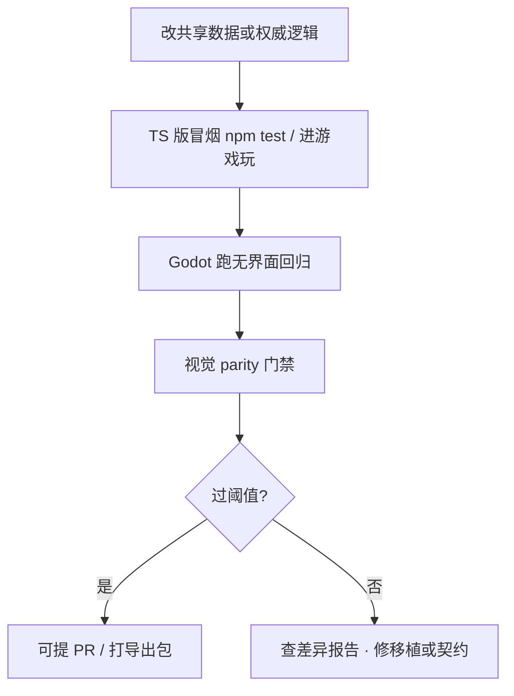

# Godot 移植工作流

GameDraft 除浏览器里的权威源版本外，还有 **Godot 移植壳**，用于 macOS / Windows **原生导出**。移植不是重写内容，而是**同一套数据、同一套行为**，在 Godot 里跑通并过门禁。

---

## 你要记住的三条

1. **内容只编一份**——对白、场景、任务、媒体两壳共用；禁止给 Godot 单独拷一份 JSON。
2. **权威源先改、移植后对齐**——新玩法先在 TS 版验证，再迁 Godot、跑 parity。
3. **对齐有两层**——逻辑/数据要一致；画面用视觉门禁（截图 SSIM）卡阈值。

---

## 日常：怎么跑 Godot

### 打开工程

- 用 Godot 4 **导入**游戏仓库里的 Godot 工程目录（项目根在仓库的 Godot 移植子树内）。
- 或在终端用本机 Godot 可执行文件加 `--editor --path <工程目录>` 打开编辑器。

### 编辑器里

| 操作 | 作用 |
|---|---|
| **F5** | 运行整个项目 |
| **F6** | 运行当前场景 |

### 游戏内操作（与玩家手册一致）

| 按键 | 作用 |
|---|---|
| WASD / 方向键 | 移动 |
| Shift | 奔跑 |
| E / 空格 | 互动 |
| F5 / F6 | 快速存读档 |

用于肉眼冒烟；**是否算对齐**以 parity 报告与测试为准，不以「我看着像」为准。

---

## 日常：怎么验证对齐

改完权威源或移植逻辑后，按顺序做：

| 步骤 | 命令 / 动作 | 目的 |
|---|---|---|
| TS 单测 | `npm test` | 权威逻辑没回归 |
| Godot 回归 | 仓库提供的 Python 测试运行器（见 Godot 工具目录说明） | 场景、存档、过场、小游戏等 |
| 视觉全量 | `npm run test:godot-visual-parity` | 截图 SSIM 对阈值 |
| 分域扫描 | `test:godot-scene-visuals` 等 | 改了一类内容时局部跑 |

**逻辑/数据 parity** 看契约审计与差异报告（零字段差异为目标）。**视觉 parity** 看场景装载、fade 关键帧、对话推进态、小游戏运行态等分组门禁。

改动权威源后**必须重跑**相关门禁，再认定移植完成。

---

## parity 产物与报告（工作流视角）

仓库内保留**契约**与**最近一次 parity 报告**（对齐登记、能力覆盖、快照差异）。协作者不用背文件名，只需知道：

| 看什么 | 何时看 |
|---|---|
| 能力覆盖表 | 新加 Action/Condition/对话节点后，是否登记全 |
| 差异报告 | 门禁失败时，差在数据字段还是画面 |
| 导出镜像 hash | 打包包前确认媒体与权威源一致 |

报告由工具链自动生成；修的是**行为和数据**，不是手改报告 JSON。

---

## 视觉门禁在卡什么

| 分组 | 内容 |
|---|---|
| 场景静态 | 各场景装载态截图对比 |
| 过场 fade | 黑场渐显关键帧 |
| 对话推进 | 多组真实推进态 |
| 小游戏 | 糖画、扎纸、水域等运行态 |

SSIM 低于阈值即失败——通常去查渲染顺序、字体、滤镜、坐标，而不是调低阈值糊弄。

---

## 原生导出

| 平台 | 状态（随项目推进更新） |
|---|---|
| macOS universal | 已能真实启动验证 |
| Windows x86_64 | 已做校验 |

导出前：**共享媒体 hash 一致**、parity 门禁过、无临时旁路未登记。导出脚本由仓库工具提供，在 [常用工作流命令](./commands) 与移植工具说明里调用。

---

## 与资源管线、编辑的关系

- 策划在编辑器改 JSON/媒体 → `./dev.sh pull` 后两壳同时读到。
- 大文件走 [资源管线](./asset-pipeline)；导出镜像按 hash 重建，避免 Godot 包缺图。

---

## 接下来

- [项目总览](./overview)
- [常用工作流命令](./commands)
- [参与与提交流程](./contributing)
