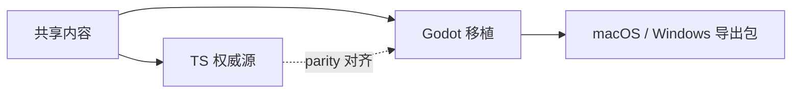
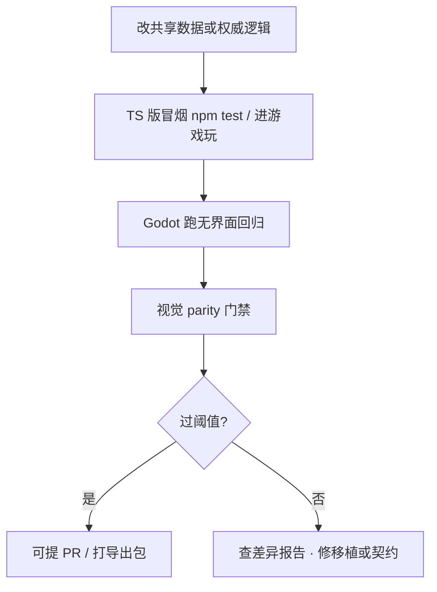

# Godot 移植工作流

这页讲**Godot 移植这一侧日常怎么跑、改完权威源之后怎么验证对齐、导出前要确认什么**。读完你能打开 Godot 工程冒烟一遍,也能看懂 parity 门禁失败时该往哪查。

---

## 这是什么(30 秒看懂)

GameDraft 除了浏览器里那个权威版本,还有一份 **Godot 移植壳**,专门用来打 macOS / Windows 的**原生安装包**。移植不是"重新做一遍游戏",而是拿**同一份共享内容、同一套行为规则**,在 Godot 引擎里重新跑通,并且要过一系列自动检查(门禁)才算数。

打个比方:权威源是雾津折子铺的**正本**,Godot 移植是**抄本**——字句(内容数据)必须和正本一模一样,读起来(运行行为)也得是一个味道,抄错了要修的是抄本,不是把正本也改成错的。

你要记住的三条:

1. **内容只编一份**——对白、场景、任务、媒体两壳共用;禁止给 Godot 单独拷一份 JSON。
2. **权威源先改、移植后对齐**——新玩法先在 TS 版验证,再迁 Godot、跑 parity。
3. **对齐有两层**——逻辑/数据要一致;画面用视觉门禁(截图比对)卡阈值。

---

## 快速上手:第一次跑起来

1. 确认本机已装好 Godot 4,并且游戏仓库已经 `./dev.sh pull` 过(移植工程本身在仓库里,但媒体资源要靠资源管线拉下来)。
2. 打开 Godot 工程有两种方式:
   - 在 Godot 编辑器里**导入**游戏仓库中 Godot 移植子树的工程目录;
   - 或者在终端里用本机 Godot 可执行文件,加 `--editor --path <工程目录>` 直接打开编辑器。
3. 工程打开后,在 Godot 编辑器里按 **F5** 跑整个项目,或者选中某个场景按 **F6** 只跑这一个场景。
4. 游戏内操作和玩家手册一致:WASD/方向键移动、Shift 奔跑、探索互动用 `E`、对话推进用空格/Enter、`Esc` 开暂停菜单三槽存读档。注意:Godot 编辑器自己的 `F5`/`F6` 是跑工程/跑场景,不是游戏内快速存读档。
5. 走一遍你改动涉及的场景或流程,肉眼确认没有明显问题——但记住,**这只是冒烟**,是否真的"对齐"要看下一节的门禁结果,不能只凭"我看着挺像"就下结论。

雾津小例子:你在权威源里给关二狗新加了一句台词分支,肉眼冒烟就是——打开 Godot 工程,跑到关二狗那个场景,走一遍对话,看看新分支是不是也出现了、文字有没有乱码或截断。

---

## 深入:每个环节讲透

### 日常怎么验证对齐

改完权威源或者移植侧逻辑之后,按顺序走一遍:

| 步骤 | 命令 / 动作 | 目的 |
|---|---|---|
| TS 单测 | `npm test` | 权威逻辑没回归 |
| Godot 回归 | 仓库提供的无界面测试运行器(见 Godot 工具目录说明) | 场景、存档、过场、小游戏等行为一致 |
| 视觉全量 | `npm run test:godot-visual-parity` | 截图与权威源做相似度比对,卡阈值 |
| 分域扫描 | `npm run test:godot-scene-visuals` · `test:godot-fade-visuals` · `test:godot-dialogue-visuals` · `test:godot-minigame-visuals` | 只改了一类内容时,局部快速跑一遍 |

**逻辑/数据 parity** 看的是契约审计和差异报告——目标是"零字段差异"。**视觉 parity** 看的是场景装载、过场淡入淡出关键帧、对话推进画面、小游戏运行画面这几组门禁分别过没过。改动权威源之后**必须重新跑一遍**相关门禁,才能认定这次移植改动完成,不能凭"上次跑过"就默认这次也没问题。

### parity 产物与报告怎么看

仓库里会留一份**契约**和**最近一次 parity 报告**(记录对齐情况、能力覆盖到哪、快照差异)。你不需要背文件名,只要知道遇到问题该看哪张表:

| 看什么 | 何时看 |
|---|---|
| 能力覆盖表 | 新加了一种动作/条件/对话节点后,检查移植侧是不是也登记全了 |
| 差异报告 | 门禁失败时,判断差在数据字段还是画面 |
| 导出镜像 hash | 打导出包前确认媒体和权威源一致,没有漏图 |

这些报告都是工具链**自动生成**的,你要修的是**行为和数据本身**,不是手改报告文件让它看起来"过了"——那样只会在下一次真实检查时被打回。

### 视觉门禁具体在卡什么

| 分组 | 内容 |
|---|---|
| 场景静态 | 各场景装载完成后的画面截图对比 |
| 过场 fade | 黑场淡入淡出的关键帧对比 |
| 对话推进 | 多组真实对话推进到不同位置的画面 |
| 小游戏 | 糖画转盘、扎纸、水域等运行中的画面 |

如果相似度低于阈值就算失败——遇到这种情况,通常该查的是渲染顺序、字体、滤镜、坐标这些具体环节,而不是把阈值悄悄调低"让它过"。调低阈值糊弄过关等于给移植埋雷,下次真出问题时反而发现不了。

### 原生导出前要确认什么

| 平台 | 状态(随项目推进更新) |
|---|---|
| macOS universal | 已能真实启动验证 |
| Windows x86_64 | 已做校验 |

打包前必须确认三件事:**共享媒体 hash 与权威源一致**(不然导出包里图片、音频可能是旧的或缺的)、**parity 门禁已经过**、**没有未登记的临时旁路**(比如为了跑通而临时改的东西没有回归正式流程)。具体导出用什么命令,和 [常用工作流命令](./commands) 与移植工具自带的说明保持一致。

### 和资源管线、编辑的关系

策划在编辑器里改了 JSON 或媒体之后,协作者 `./dev.sh pull` 一遍就能让两壳同时读到最新内容——不需要针对 Godot 侧再做额外同步。大文件走 [资源管线](./asset-pipeline);导出镜像是按 hash 重建的,如果本地媒体没拉全,打出来的 Godot 包就可能缺图缺音。

---

## 常见问题

**Q:我只改了权威源的一处小逻辑,还要跑全套视觉门禁吗?**
A:至少要跑一遍和这处改动相关的分域扫描;如果不确定影响范围,建议跑一次全量,避免遗漏。

**Q:视觉门禁老是差那么一点点,能不能调低阈值?**
A:不建议。先查是不是渲染顺序、字体、滤镜或坐标的问题,阈值是用来发现真实差异的,调低等于把问题藏起来。

**Q:Godot 那边能不能自己临时改一版内容试试效果?**
A:不行,内容改动必须回到共享数据这一份,通过编辑器改。Godot 侧单独改的内容,一旦被真实数据覆盖就会消失,而且会让两壳产生分叉。

**Q:导出包做出来但打不开/闪退,先查什么?**
A:先确认共享媒体 hash 是否一致(有没有漏拉资源)、parity 门禁是不是真的全过了,再看是不是有未登记的临时改动混进了这次构建。

**Q:我不是专门做移植的,要不要天天开 Godot 工程?**
A:不需要。多数协作者只在权威源和编辑器里工作;只有你的改动明显影响玩家可见内容,或者你就是负责移植对齐的人,才需要常态化跑这一套。

---

## 相关

- [项目总览](./overview)
- [项目架构总览](./architecture)
- [常用工作流命令](./commands)
- [参与与提交流程](./contributing)
