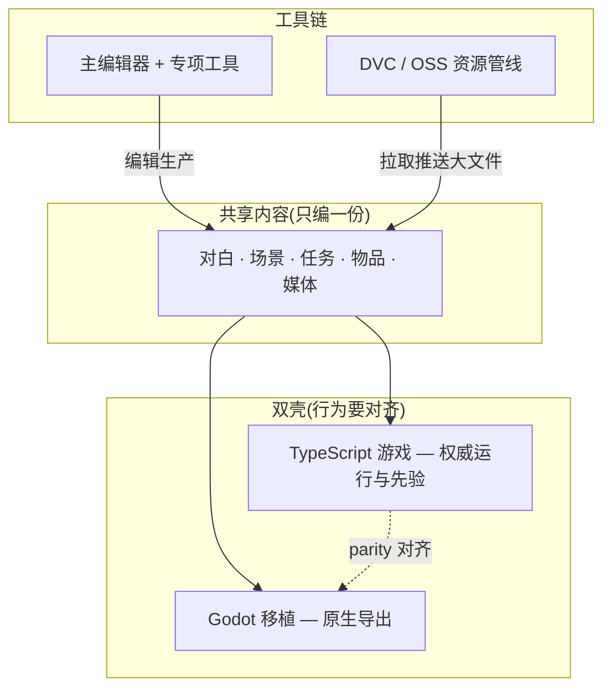
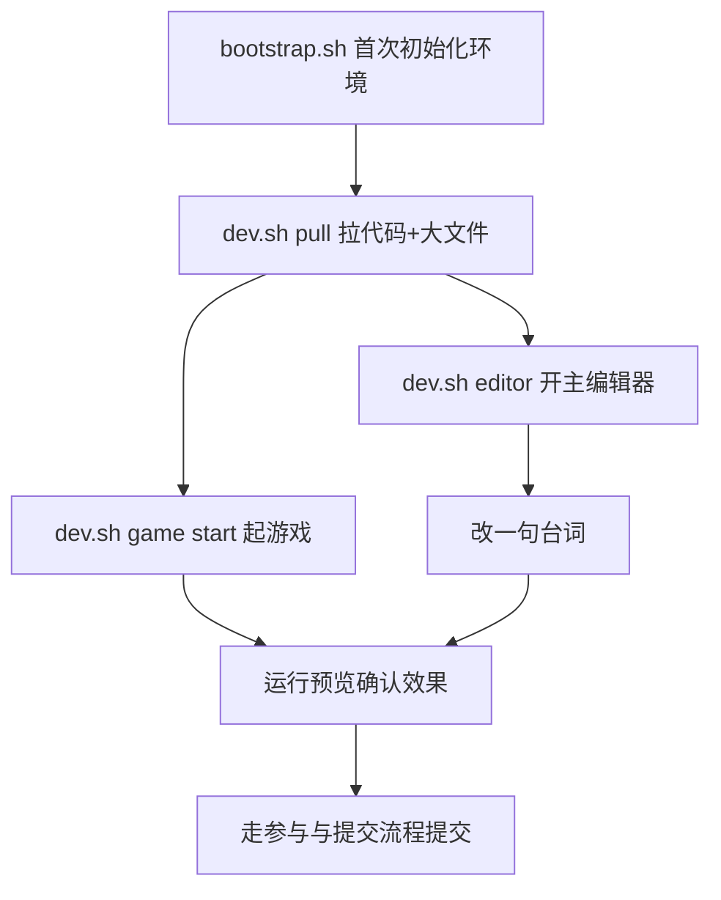

import PageBanner from '@site/src/components/PageBanner';

<PageBanner
  img="/img/banner-dev.jpg"
  title="开发文档"
  subtitle="机关与榫卯:GameDraft 是怎么搭起来的、怎么协作。" />

# 项目总览

这页讲**GameDraft 这个工程是怎么组织的、你每天打交道的是哪几块东西、该找谁**。读完你能分清"共享内容""双壳""工具链"这三块分别是什么,以及新人第一天该按什么顺序把环境跑起来。

:::note[文档站与游戏仓库是两回事]
本页描述的是**游戏仓库**(含游戏本体、编辑器、Godot 移植)。你现在看的文档站是另一个独立项目,只负责"写文档"。下文所有 `./dev.sh` 命令都要在**游戏仓库根目录**执行,不是在文档站里执行。
:::

---

## 这是什么(30 秒看懂)

打个比方:GameDraft 像雾津街上一间**折子铺**。铺子里只有**一本账本**(共享内容——所有台词、场景、任务、物件的数据),但有**两位说书人**同时照着这本账本说书:一位在浏览器里说(TypeScript 权威源),一位在 Godot 里说(原生导出移植)。账本不会抄两份,谁改了账本,两位说书人下次开口都要照着改后的内容说。铺子后头还有一间**工具房**,放着编辑器、生产工作台、资源管线这些家伙事,专门用来**修账本、进新货(素材)**。

| 块 | 角色 | 你什么时候碰它 |
|---|---|---|
| **共享内容** | 雾津全部可玩数据与媒体;两壳只读这一份 | 策划/美术/叙事日常改内容 |
| **TypeScript 壳** | 功能先在浏览器里跑通、测通 | 玩法/系统改动、快速验证 |
| **Godot 壳** | macOS / Windows 原生包 | 导出、性能、移植对齐 |
| **工具链** | 二十来块编辑面板 + 工作台 + Web 控制台 | 不手写 JSON,批量改内容 |
| **资源管线** | 大文件版本化,远程在阿里云 OSS | 拉图、配音、动画包协作 |

**记住一条铁律**:内容数据**禁止**为 Godot 单独维护第二份。改对白、改场景、改任务,只通过编辑器动共享数据,两壳一起受益——这也是为什么这个工程叫"双壳一本账",而不是"两个游戏"。

---

## 快速上手:新人第一天

在**游戏仓库根目录**(不是文档站目录),从头把环境跑起来:

1. `./bootstrap.sh` ——只在第一次、干净克隆时跑。它会用系统 Python 建一个项目内的虚拟环境,顺手把 DVC 装好,并检查 Node 版本够不够。
2. `./dev.sh pull` ——把代码和大文件(图、音、动画)一起同步到本地。第一次会拉得比较久,耐心等。
3. `./dev.sh game start` ——起一个开发服务器,在浏览器里打开就能玩到权威源版本。
4. `./dev.sh editor` ——开主编辑器,随便挑一句台词改一下(比如把关二狗某句对白里的"晓得没"改成"晓不晓得")。
5. 保存后回到浏览器里的游戏,走一遍触发那句台词的路径,确认改动生效。
6. 改完想提交,就走 [参与与提交流程](./contributing)。

雾津小例子:你想把城隍庙门口那句"莫在此地喧哗"改成"莫在庙前喧哗",流程就是——开编辑器→找到对应场景或对话节点→改文本→保存→回游戏里走到那句台词出现的地方确认→提交。全程不用碰任何代码。

第一次上手更细的步骤(带截图)见教程区的 [5 分钟跑起来](../tutorials/intro)。

---

## 深入:三块具体怎么协作

### 共享内容层:一本账本,谁都不能私藏一份

共享内容包括场景、对话、任务、规矩、物件、商店、演出、地图、档案文本,以及配套的图片、音频、动画等媒体。它的唯一"官方修改入口"是编辑器与专项工具——不是让人手改 JSON 文件。原因很直接:编辑器保证内容**保存后还能被编辑器和两壳正常读回**;手改容易把某个字段写歪,轻则某句台词显示不出来,重则整个工程存不了、两壳都读不动。

如果你发现编辑器某个角落"点了没反应"或者"这个字段编辑器压根没有",别自己脑补着去改 JSON——那大概率是编辑器的**盲区**(运行时支持、但编辑器还没做对应控件),应该先去看 [危险区](../editors/concepts/danger-zone) 里怎么描述这块,拿不准就找工具维护者。

### 双壳:一个权威源,一个跟着对齐

| 壳 | 定位 | 典型日常 |
|---|---|---|
| **权威源(TS)** | 新玩法、新系统**先在这里完成** | `./dev.sh game start` 浏览器里玩;`npm test` 跑逻辑测试 |
| **Godot 移植** | 与权威源**parity(行为一致)** | 打开 Godot 工程跑一遍;跑 parity 与视觉门禁;打导出包 |

这不是"两个游戏各自发展",而是**一个游戏、两套运行时**。新点子、新系统永远先在浏览器版里做完、测过,再迁移到 Godot 侧对齐。移植对齐分两层:**逻辑/数据要一致**(同样的条件、同样的动作产生同样的结果)、**画面要过视觉门禁**(截图比对不能差太多)。权威源改完不代表任务结束,移植侧跟着对齐、过了门禁才算真正交付。完整流程见 [Godot 移植工作流](./godot-port)。

日常怎么分工:多数协作者只碰权威源和编辑器,极少数专门做移植对齐的人才天天开 Godot 工程。如果你不确定自己改的东西要不要管 Godot 那一侧,一个简单判断:**改了会影响玩家看到/玩到的东西吗?** 是的话迟早要过一遍移植门禁,只是不一定是你来跑。

### 工具链:谁用哪扇门

| 角色 | 常用入口 | 干什么 |
|---|---|---|
| 策划 / 叙事 | `./dev.sh editor` | 场景、对话、任务、规矩、遭遇、小游戏 |
| 美术 / 音频 | `./dev.sh editor` + 资源工具 | 入库、缩放、动画预览、滤镜 |
| 多人协作 | `./dev.sh pull` / `push` | 同步代码 + 大文件 |
| 改工具本身 | 游戏仓库 + [参与与提交流程](./contributing) | 分支、评审、测试 |

Web 控制台 `./dev.sh console` 适合当**一键起游戏、构建、测试**的仪表盘——你不想记那么多命令时就打开它点按钮;真要细改内容,还是回到主编辑器。编辑器具体怎么用见 [编辑器手册](../editors/overview),这里不重复讲面板细节。

### 目录心智模型:记类别,不用背路径

打开这个仓库,文件夹一大堆,不用一个个背,记住四类东西对应"谁在改"就够用:

| 类别 | 心智 | 谁改 |
|---|---|---|
| 游戏逻辑(TS) | 权威玩法实现 | 程序 |
| 移植工程(Godot) | 对齐权威源 | 程序(移植) |
| 共享 JSON + 运行时媒体 | 雾津内容本体 | 策划/美术经编辑器 |
| 编辑器与治理工具 | 生产内容 | 工具维护者 |

大文件(图、音、动画)一律走 [资源管线](./asset-pipeline),不进 Git 本体——这也是为什么克隆仓库时代码很快、但第一次拉资源要等一会儿。

### 日常协作节奏

一个比较顺的节奏是:早上先 `./dev.sh pull` 同步一遍(代码+大文件),改完内容用运行预览验一遍,收工前该 `commit` 的 `commit`(内容/媒体分别走各自的收尾),该推的推。多人同时改内容时,尽量各自认领不同场景/任务,减少同一个文件被两人同时改的冲突。改工具本身(编辑器、专项工具)相对独立,一般走单独分支评审,不和内容改动混在一次提交里。

---

## 常见问题

**Q:我在编辑器里改了对白,为什么 Godot 版里没看到?**
A:两壳共用同一份数据,但 Godot 侧不会"实时"感知改动。先确认改动已经保存,再确认 Godot 那边是不是也 `pull` 了最新数据;如果 Godot 是移植维护者独立跑的,可能还没来得及做一轮 parity 同步。

**Q:是不是要给 Godot 单独维护一份 JSON?**
A:不需要,也**禁止**这么做。两壳读的是同一份共享内容,Godot 侧要做的是"对齐运行时行为",不是"复制一份数据自己改"。

**Q:新人要不要先学 Godot?**
A:不需要。新玩法和内容改动都先在 TypeScript 权威源里跑通,Godot 移植是后续对齐的事,通常由专门做移植的人负责。

**Q:Web 控制台和主编辑器该用哪个?**
A:控制台适合"一键起游戏/构建/测试"这类仪表盘式操作;真正精细地改场景、对话、任务这些内容,还是用主编辑器的对应面板。

**Q:仓库目录那么多,不知道该找谁问?**
A:先按上面"目录心智模型"判断这是内容、逻辑、移植还是工具类改动,再对照"工具链怎么协作"里的角色分工去找对应的人;实在拿不准,先在 [出问题怎么办](../tutorials/troubleshooting) 里查一遍常见坑。

---

## 本区文档地图

| 页面 | 内容 |
|---|---|
| [项目架构总览](./architecture) | 为什么这样分层、系统怎么解耦协作 |
| [常用工作流命令](./commands) | `./dev.sh` 任务名与用途 |
| [Godot 移植工作流](./godot-port) | 怎么跑、怎么对齐 |
| [资源管线](./asset-pipeline) | DVC/OSS pull/push/commit |
| [参与与提交流程](./contributing) | 分支、评审、提交流程 |
| [延伸阅读](./resources) | 仓库里还有哪些文档值得看 |
