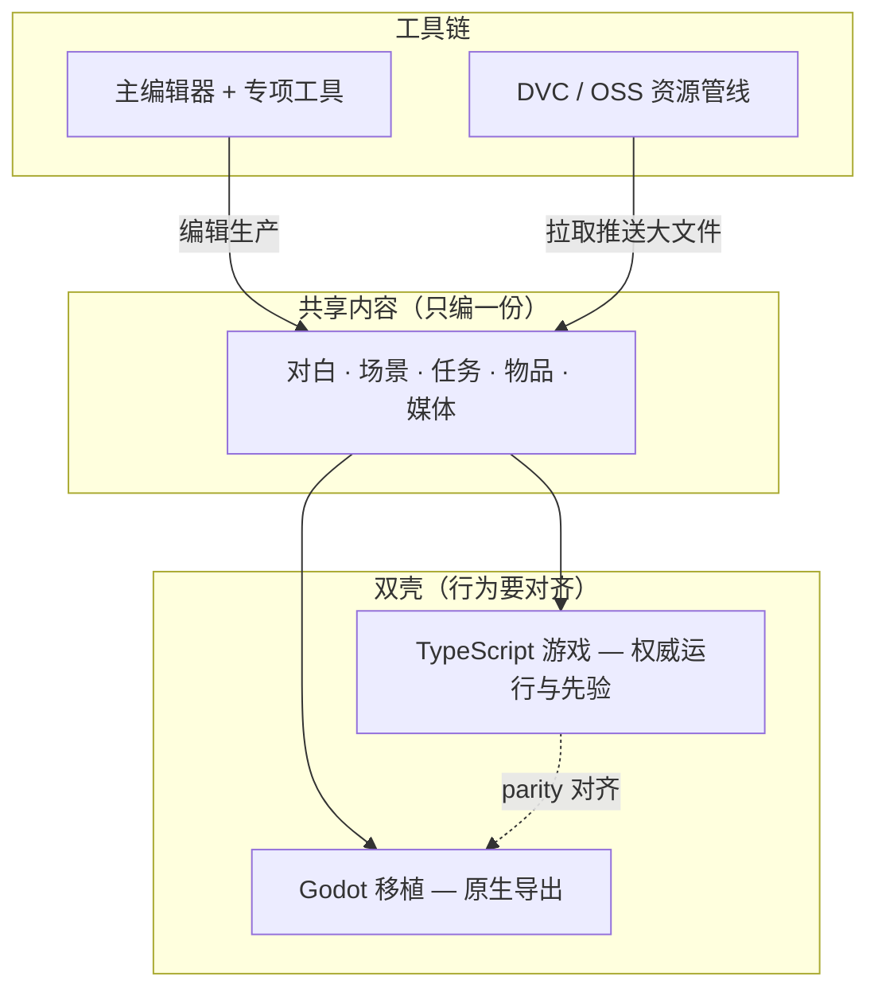

import PageBanner from '@site/src/components/PageBanner';

<PageBanner
  img="/img/banner-dev.jpg"
  title="开发文档"
  subtitle="机关与榫卯：GameDraft 是怎么搭起来的、怎么协作。" />

# 项目总览

GameDraft 是《寻狗记》的游戏工程：**一套共享内容数据**，两套可运行外壳，外加 Python 编辑器与资源管线。本文讲**项目怎么组织、谁改什么、日常怎么协作**——不讲类名、不贴源码。

:::note[文档站与游戏仓库]
本页描述的是 **GameDraft 游戏仓库**（含游戏本体、编辑器、Godot 移植）。文档站是独立项目；下文所有 `./dev.sh` 命令都在**游戏仓库根目录**执行。
:::

---

## 三块你在协作什么



| 块 | 角色 | 你什么时候碰它 |
|---|---|---|
| **共享内容** | 雾津全部可玩数据与媒体；两壳只读这一份 | 策划/美术/叙事日常改内容 |
| **TypeScript 壳** | 功能先在浏览器里跑通、测通 | 玩法/系统改动、快速验证 |
| **Godot 壳** | macOS / Windows 原生包 | 导出、性能、移植对齐 |
| **工具链** | 二十来块编辑面板 + 工作台 + Web 控制台 | 不手写 JSON _bulk 改内容 |
| **资源管线** | 大文件版本化，远程 OSS | 拉图、配音、动画包协作 |

**铁律**：内容数据**禁止**为 Godot 单独维护第二份。改对白、改场景、改任务，只通过编辑器动共享数据，两壳一起受益。

---

## 双壳怎么分工

| 壳 | 定位 | 典型日常 |
|---|---|---|
| **权威源（TS）** | 新玩法、新系统**先在这里完成** | `./dev.sh game start` 浏览器里玩；`npm test` 跑逻辑测试 |
| **Godot 移植** | 与权威源 **parity（行为一致）** | 打开 Godot 工程跑一遍；跑 parity 与视觉门禁；打导出包 |

不是「两个游戏」，是**一个游戏两种运行时**。权威源改完，移植侧要对齐并过门禁，才算交付完成。详见 [Godot 移植工作流](./godot-port)。

---

## 工具链怎么协作

| 角色 | 常用入口 | 干什么 |
|---|---|---|
| 策划 / 叙事 | `./dev.sh editor` | 场景、对话、任务、规矩、遭遇、小游戏 |
| 美术 / 音频 | `./dev.sh editor` + 资源工具 | 入库、缩放、动画预览、滤镜 |
| 多人协作 | `./dev.sh pull` / `push` | 同步代码 + 大文件 |
| 改工具本身 | 游戏仓库 + [参与与提交流程](./contributing) | 分支、评审、测试 |

Web 控制台 `./dev.sh console` 适合**一键起游戏、构建、测试**的仪表盘；细编辑仍以主编辑器为主。编辑器用法见 [编辑器手册](../editors/overview)，不在开发区重复。

---

## 目录心智模型（工作流视角）

不必背路径，记住**四类东西**即可：

| 类别 | 心智 | 谁改 |
|---|---|---|
| 游戏逻辑（TS） | 权威玩法实现 | 程序 |
| 移植工程（Godot） | 对齐权威源 | 程序（移植） |
| 共享 JSON + 运行时媒体 | 雾津内容本体 | 策划/美术经编辑器 |
| 编辑器与治理工具 | 生产内容 | 工具维护者 |

大文件（图、音、动画）走 [资源管线](./asset-pipeline)，不进 Git 本体。

---

## 新人第一天

在**游戏仓库根目录**：

```bash
./bootstrap.sh          # 首次：环境
./dev.sh pull           # 拉代码 + 大文件
./dev.sh game start     # 起游戏
./dev.sh editor         # 开主编辑器
```

改一句对白 → 运行预览确认 → 走 [参与与提交流程](./contributing) 提交。教程逐步见 [5 分钟跑起来](../tutorials/intro)。

---

## 本区文档地图

| 页面 | 内容 |
|---|---|
| [常用工作流命令](./commands) | `./dev.sh` 任务名与用途 |
| [Godot 移植工作流](./godot-port) | 怎么跑、怎么对齐 |
| [资源管线](./asset-pipeline) | DVC/OSS pull/push/commit |
| [参与与提交流程](./contributing) | 分支、评审、提交流程 |

旧链 [项目架构总览](./architecture)、[资源管线（旧）](./resources) 已并入上表，保留跳转页兼容书签。
