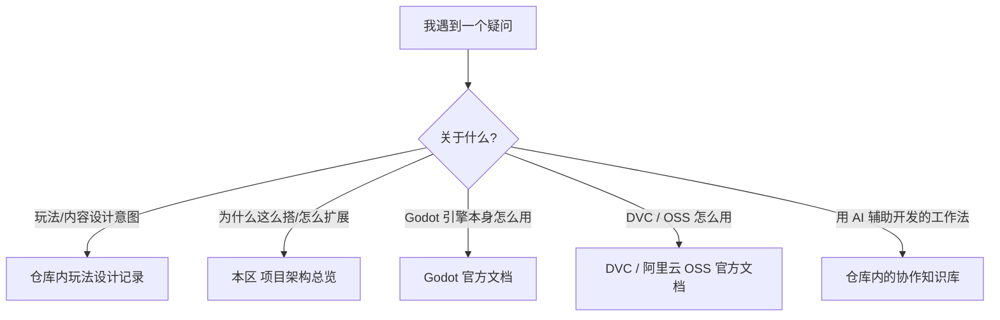

# 延伸阅读

这页是一张**"还能去哪儿看更多资料"的地图**,不要和 [资源管线](./asset-pipeline)(讲 DVC/OSS 大文件同步)搞混。读完你能知道:遇到不同类型的疑问该翻仓库里哪份记录,或者该去查哪个外部工具的官方文档。

---

## 这是什么(30 秒看懂)

打个比方:这个开发文档区就像折子铺账房的**索引柜**——柜子本身不记具体账目,只告诉你"想查雾津设定去哪个抽屉、想查工具用法去哪本手册"。GameDraft 游戏仓库里其实沉淀了不少设计与工程记录,只是它们不适合直接搬进使用手册(会混进实现细节),这页帮你按主题分个类,知道遇到问题该往哪儿翻。

---

## 快速上手:先查哪张表

1. 先看你的疑问属于"怎么用"还是"为什么这么设计"——前者多半在这个开发文档区里已经有对应页,回去翻 [项目总览](./overview) 的文档地图。
2. 如果是"这套系统为什么要这样分层/新能力该怎么加",看 [项目架构总览](./architecture)。
3. 如果疑问其实是**关于某个外部工具本身**(比如 Godot 编辑器某个功能怎么用、DVC 命令行还能干什么),不用等项目文档补充,直接查对应工具的官方文档最快。
4. 如果是**玩法设计取舍的来龙去脉**(为什么某个规矩这么设计、某条主线为什么这么安排),这类记录在游戏仓库里由策划/叙事维护,不进这个使用手册站——找项目维护者要访问方式。

---

## 深入:分类导览

### 仓库内还有哪些记录

游戏仓库里除了代码和内容数据,还保留着几类文字记录,不直接搬进文档站,但值得知道它们存在:

| 类型 | 大概讲什么 | 谁常翻 |
|---|---|---|
| 玩法与内容设计记录 | 当前设计意图、取舍理由、待办与缺口清单 | 策划、叙事 |
| 架构与技术选型说明 | 为什么这么分层、技术方案选型的背景 | 程序、想做移植的人 |
| 面向协作 Agent 的知识库 | 项目里沉淀的工作法、机制说明,主要给 AI 辅助开发用 | 用 AI 工具协作开发的人 |

这些记录会随项目推进持续更新,内容比较细,也偶尔会和现实产生偏差——遇到对不上的地方,正常现象,找维护者确认最准。

### 外部工具官方文档

GameDraft 用到了几个成熟的外部工具/引擎,这些工具本身的用法不需要本项目重新写一遍,直接查官方文档最权威、更新最及时:

| 工具 | 用在哪 | 官方文档 |
|---|---|---|
| Godot 引擎 | 原生移植壳、导出打包 | https://docs.godotengine.org/ |
| DVC | 大文件版本化 | https://dvc.org/doc |
| 阿里云 OSS | 大文件远程存储 | https://www.alibabacloud.com/help/zh/oss/ |

想深入了解 Godot 编辑器怎么用、DVC 命令行还有哪些高级用法,直接去查上面这些官方资料,比在本项目文档里找二手说明更快也更准。项目这边的页面([Godot 移植工作流](./godot-port)、[资源管线](./asset-pipeline))只讲"在这个项目里怎么用",不重复讲工具本身的通用能力。

### 如果你在用 AI 辅助开发

游戏仓库里有一套专门给协作 Agent(比如 Claude Code 这类工具)用的知识库,沉淀了不少工作法、机制说明和历史决策记录。如果你是用 AI 工具协助开发的协作者,可以向项目维护者了解怎么接入;这套知识库本身不是给人类逐篇通读的,更像是"给 AI 用的说明书",一般不需要普通协作者手动翻阅。

### 文档站内部还能看什么

| 想知道 | 去哪看 |
|---|---|
| 双壳、工具链、日常分工 | [项目总览](./overview) |
| 为什么这么设计、怎么扩展新能力 | [项目架构总览](./architecture) |
| 角色照明 v2 原理与运行时 | [伪世界角色照明](./character-lighting) |
| 大文件怎么同步 | [资源管线](./asset-pipeline) |
| Godot 移植怎么跑、怎么验证 | [Godot 移植工作流](./godot-port) |
| 怎么提交改动 | [参与与提交流程](./contributing) |
| `./dev.sh` 命令查什么 | [常用工作流命令](./commands) |
| 编辑器面板怎么用(用户视角) | [编辑器手册](../editors/overview) |

---

## 常见问题

**Q:这页是不是资源管线的另一个版本?**
A:不是。资源管线讲的是"大文件(图/音/动画)怎么用 DVC/OSS 同步";这页讲的是"想深挖某个话题该去查哪份资料",两码事,名字容易混淆但内容完全不同。

**Q:仓库里那些设计记录,我一个普通协作者能不能直接看?**
A:一般可以,具体访问方式(权限、放在哪)找项目维护者确认;这个文档站不重复搬运这些内容,是因为它们偏设计过程记录,和面向使用者的手册定位不一样。

**Q:外部文档链接过期了/打不开怎么办?**
A:官方文档地址偶尔会调整,搜索引擎搜工具名+官方文档通常能很快找到新地址;发现本页链接失效,欢迎按 [参与与提交流程](./contributing) 提个修正。

**Q:我该先读这页还是先读"参与与提交流程"?**
A:如果你已经准备好动手改东西,先读 [参与与提交流程](./contributing);这页是"卡住了不知道去哪查"时候再回来翻的索引,不需要正式上手前通读一遍。

---

## 相关

- [项目总览](./overview)
- [项目架构总览](./architecture)
- [资源管线](./asset-pipeline)
- [参与与提交流程](./contributing)
