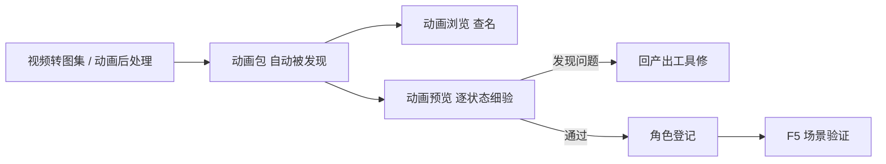

# 动画预览

主编辑器 **[动画浏览](../panels/anim-browser)** 适合快速查「有哪些状态、名字对不对」；若要**大图、高帧率、和游戏里一模一样的播法**验脚点与循环，开 **动画预览**。它在浏览器里跑，渲染角色用的和游戏**同一套**画法，不是另外重画一遍近似效果——你在这里看到的，就是玩家将来会看到的。

---

## 这是什么（30 秒看懂）

动画浏览像是货架上贴的小标签——扫一眼知道「有这个状态、名字这么拼」；动画预览则是**统一动画资源工作台**：你在这里看动画包处在哪个版本阶段，核对人工装配是否到位，再用和游戏同一套渲染做终验。它自动发现工程里所有已经产出的动画包，不需要你手动导入或指定路径；产出目录里一有新包出现，列表也会自己更新，不用你重开工具刷新页面。

这张工作台把**版本阶段、人工装配、真实渲染终验**放在同一个视野里：脚有没有在地上打滑、动作循环接口顺不顺、状态名是否对齐、光打上去质感对不对，都可以一起查。发现素材源问题之后，回 [视频转图集](./video-to-atlas) 或 [动画后处理](./animation-pipeline) 修源重导；确认装配与真实渲染都过关后，再回主编辑器绑定角色并用 F5 进场景终验。

---

## 入门：手把手做第一次

**场景**：关二狗的动画包 `guan_ergou_anim` 刚导出，你要确认待机、走路、作揖三个状态在真实渲染下没有问题。

1. 打开动画预览（见下方「怎么开」），等左侧角色列表刷出工程内全部动画包。
2. 左上角**搜索角色**框里输入关二狗的包名关键字，快速定位（角色多的时候比翻列表快）。
3. 点中 `guan_ergou_anim`，中间舞台会显示这个角色；下方一排状态胶囊或右侧的状态下拉里选**待机**。
4. 播放会自动开始，观察角色是不是站得稳、有没有莫名的抖动。
5. 切到**走路**状态，重点盯脚——理想情况脚步应该贴着地面移动，不应该出现「身体在走、脚在原地打滑」的滑步感。
6. 用下方的**时间轴**拖动到任意一帧、或用「上一帧/下一帧」按钮单帧单帧看，专门检查循环首尾两帧是否几乎一样、衔接顺不顺。
7. 切到**作揖**，确认动作播放完整、没有卡在半截或者跳回待机太生硬。
8. 三个状态都过了，记准这三个状态的准确拼写：`idle_dock`、`walk`、`bow`，回主编辑器 **[角色登记](../panels/character)** 绑包、**场景**里码头 NPC 和庙祝遭遇的作揖选项分别对齐这几个状态名。
9. **F5** 进入场景实际走一遍剧情位置，确认和预览里看到的一致。



---

## 进阶：每一项都讲透

### 角色与状态选择

| 功能 | 说明 |
|---|---|
| 搜索角色 | 按名字/包名关键字过滤左侧列表，角色多的工程用得上。 |
| 角色列表 | 自动列出工程里全部已产出的动画包，异常的包（比如缺文件、格式有问题）会用醒目颜色标出来，提醒你先别急着用。 |
| 状态胶囊 / 状态下拉 | 一个角色下有几个状态（待机、走路、作揖……）都能横向切换，选中哪个就播哪个。 |

### 播放控制

| 控件 | 说明 |
|---|---|
| 播放 / 暂停 | 控制是否在动。 |
| 循环开关 | 决定播完一轮是接着循环，还是停在最后一帧。 |
| 上一帧 / 下一帧 | 单帧步进，逐帧核对细节的必备工具。 |
| 时间轴 | 拖动直接跳到任意一帧，配合帧计数（当前帧/总帧数）看清楚自己在动作的哪个位置。 |
| 速度 | 从很慢到 4 倍速之间调，动作快的部分放慢看最容易发现滑步和穿模。 |
| 帧率 | 可以手动覆盖播放帧率，用来测试「如果这个动作按不同速度播放，效果会怎样」。 |

### 视图与背景

| 控件 | 说明 |
|---|---|
| 缩放 | 手动调整角色在画面里的大小；「适配」按钮一键把角色调整到舒服的观察大小。 |
| 朝向 | 一键左右翻转角色朝向，检查镜像后的动作看起来是否正常。 |
| 背景模式 | 棋盘格（默认，方便看清透明区域）、透明（纯黑衬底）、中性灰、场景色调、或**真实场景比例**——选真实场景后还能挑一个具体场景，角色会按游戏里同样的镜头规则显示：角色保持一个舒服的观察大小，背景按同一世界尺度放大、镜头对准角色的出生点，只显示身边一小块——效果更接近玩家实际会看到的画面，而不是把整个场景都塞进屏幕、把角色缩成一个小黑点。 |
| 像素密度低通 | 模拟游戏里贴图的像素密度效果，配合一个可调的密度数值，用来检查角色和背景的像素粗细是否搭调。 |

### 辅助线叠加（专门用来挑动画本身的毛病）

| 控件 | 说明 |
|---|---|
| 锚点显示 | 默认打开，在画面上标出角色的落地基准点——游戏里角色的位置是按这个点摆的，脚步动画理论上应该始终贴住它，勾了这个最容易看出滑步。 |
| 格框显示 | 标出这一帧在图集里对应的格子边界，帮你判断这一帧是不是被裁到了边缘、或者格子留白是不是合适。 |
| 洋葱皮 | 把前后几帧叠加半透明显示在当前帧上（帧数可调，1 到 6 帧），专门用来看动作的运动轨迹顺不顺，尤其适合判断循环衔接处是不是有跳变。 |

### 图集检视与导出

| 功能 | 说明 |
|---|---|
| 图集检视 | 弹出一个大窗口，直接看这个角色完整的那张拼合大图，配上尺寸等信息，检查整体排布是否合理、有没有明显的裁切或错位。 |
| 导出 GIF | 把当前正在播放的状态导出成一份动图文件，方便分享给别人看（比如发给美术同事确认某个动作的效果），不需要对方自己开工具。 |

### 对比模式

| 功能 | 说明 |
|---|---|
| 对比开关 | 打开后可以再选一个「对比角色」和「对比状态」，两套动画并排播放。 |
| 用途 | 关二狗立绘出了两版候选动作，或者想确认新导出的包和旧版有什么差异，开对比模式同状态并排看，比来回切换记忆更直观。 |

### 光照 / 阴影模拟

| 控件 | 说明 |
|---|---|
| 启用逐角色光照（游戏同款） | 打开后角色身上会应用和游戏里一致的光照渲染，不再是平白显示的原始贴图，专门用来检查角色在游戏光照下的实际质感。 |
| 阴影模式 | 关闭，或开启「平面投影」阴影——打开后角色脚下会投出一片贴地阴影。 |
| 光方位 / 光仰角 | 调整光源从哪个方向、多高的角度照过来，模拟一天中不同时段或不同场景的采光。 |
| 主光色 + 强度 | 主光源的颜色和亮度。 |
| 环境色 + 强度 | 环境光（补光）的颜色和亮度，影响阴影面不会死黑。 |
| 色调融入 | 角色颜色向环境色调靠拢的程度，让角色更好地融进场景氛围，而不是显得像贴上去的贴纸。 |
| AO 接触 / AO 体积 | 两档「接触阴影」强度，模拟角色贴近地面或物体时应有的自然暗角。 |
| 阴影暗 / 阴影长 | 投影阴影本身的深浅和长短。 |

这一整套光照面板存在的意义是：动画包本身只是一张不带光影的原始贴图，真正进游戏之后会叠加实时光照——如果只在没有光照的原始状态下检查，容易漏掉「打上光之后颜色显脏」「阴影长度不搭」这类要等进游戏才会暴露的问题。用它可以提前在这里发现。

### 深链接：带参数直接打开

`./dev.sh anim-preview` 这条启动命令后面可以直接跟上想要打开的**角色包名**和**状态名**，工具会启动后自动帮你选中——适合已经知道要查哪个角色状态、不想每次都在列表里翻找，也方便把这个组合分享给别人、对方一键就能打开同一个画面。

---

## 危险区与边界

- **只读播放，改不了动画**：这里的一切调整（速度、缩放、光照、辅助线）只影响你看到的效果，不会写回动画包本身；要真正修改动画内容，必须回 [视频转图集](./video-to-atlas) 或 [动画后处理](./animation-pipeline) 重新产出。
- **预览能播 ≠ 游戏里会动**：预览工具只要动画包本身合法就能播放，但游戏里角色要真正显示这个动作，还需要 [角色登记](../panels/character) 绑对包、场景/遭遇里的状态名字段填对——预览通过了，不代表这两步已经做完。
- **对比模式、光照面板都是纯观察工具**：调完看完就结束，不需要「保存」，也不会影响任何工程数据。

更完整的编辑器整体风险说明，见[危险区](../concepts/danger-zone)。

---

## 常见问题

**Q：预览里播放正常，为什么进游戏这个角色不动/一直站着？**
多半是角色还没在 [角色登记](../panels/character) 里绑上这个动画包，或者场景里 NPC 的状态名字段拼写和动画包里的状态名不一致，两处都值得检查。

**Q：左侧列表里缺了刚导出的包？**
先确认产出流程本身真的成功完成；再检查工程目录是否放对了位置——可以先去 [资源浏览器](./asset-browser) 确认文件确实已经落地。列表设计上会自己发现新增的包，通常不需要重启工具，如果长时间没出现再考虑重启。

**Q：启动时提示端口被占用怎么办？**
工具会自动换一个可用端口并在终端和页面里告知实际地址，以那个提示为准，不用自己去指定端口。

**Q：光照面板打开后角色变暗/变色，是坏了吗？**
不是坏了，是在模拟游戏里真实光照环境下的效果——如果只想看原始贴图本身，把「启用逐角色光照」关掉即可。

**Q：对比模式选了两个角色，但只有一个在动？**
确认两侧都点了播放且都选中了具体状态；对比模式是两套独立播放器，需要各自设置好才会同时动起来。

**Q：为什么循环起来还是有一点点跳动感，肉眼很难判断？**
打开洋葱皮叠加几帧一起看，比单看当前帧更容易发现循环首尾之间的细微差异；也可以把速度调到很慢、逐帧步进到循环边界那几帧仔细比对。

---

## 怎么开

**方式一：命令**

```bash
./dev.sh anim-preview
```

终端会给出本地地址（默认端口 **5199**，被占用会自动换一个可用端口），浏览器自动打开。

**方式二：Web 控制台**

```bash
./dev.sh console
```

点 **动画预览**。

**方式三：带角色与状态直接打开**

在 `./dev.sh anim-preview` 后面加上想要打开的角色包名和状态名，工具启动后会自动选中，省去在列表里翻找；也可以只指定不自动弹出浏览器窗口，方便脚本化调用——具体写法以终端提示为准。

---

## 和其它工具的配合

| 工具 / 面板 | 关系 |
|---|---|
| [动画浏览](../panels/anim-browser) | 主编辑器内查列表、核对状态名；预览负责大图、带光照的细验。 |
| [视频转图集](./video-to-atlas) | 手动精修产出源，发现问题回这里改。 |
| [动画后处理](./animation-pipeline) | 批量产出源，发现问题回这里改。 |
| [角色登记](../panels/character) | 预览通过后，在这里正式绑角色。 |
| [运行预览](../main-editor/run-preview) | 动画本身过关后，再做剧情向的整体终验。 |

---

## 相关

- [动画浏览面板](../panels/anim-browser)
- [视频转图集](./video-to-atlas)
- [动画后处理](./animation-pipeline)
- [教程：把视频做成角色动画](../../tutorials/video-to-anim)
- [工具打开方式](../launch-architecture)
- [危险区](../concepts/danger-zone)
