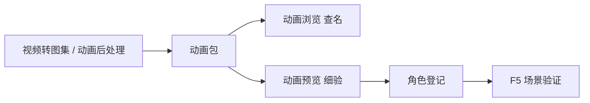

# 动画预览

主编辑器 **[动画浏览](../panels/anim-browser)** 适合快速查「有哪些状态、名字对不对」；若要**大图、高帧率、和游戏里一模一样的播法**验脚点与循环，开 **动画预览**。它在浏览器里跑，渲染规则与游戏一致，所见即玩家所见。

---

## 干什么

- **自动发现**工程内全部动画包。
- 按角色/包选状态，**实时播放**精灵动画。
- 查 **锚点、循环衔接、滑步** 等动画浏览小窗看不清的问题。
- 可选指定角色与状态直接打开（方便分享链接或脚本拉起）。

不负责导出、不改状态名、不绑角色——那些仍在资产管线与主编辑器完成。

---

## 怎么开

**方式一：命令**

```bash
./dev.sh anim-preview
```

终端会给出本地地址（常见端口 **5199**），浏览器自动打开。

**方式二：Web 控制台**

```bash
./dev.sh console
```

点 **动画预览**。

**方式三：带角色与状态**

```bash
./dev.sh anim-preview
```

若支持参数，可指定角色包名与状态（如关二狗行走），省去在列表里翻找——以终端提示为准。

---

## 一步步怎么用

1. 启动动画预览，等列表刷出工程内动画包。
2. 左侧选包（如 `guan_ergou_anim`），右侧选状态（如 `walk`）。
3. 播放，观察脚点是否贴地、循环首尾是否跳变。
4. 切换 `idle_dock`、`bow` 等剧情用状态，记准拼写回主编辑器填。
5. 发现问题 → 回 [视频转图集](./video-to-atlas) 或 [动画后处理](./animation-pipeline) 修源重导。
6. 满意后 **[角色登记](../panels/character)** 绑包，**F5** 在场景里终验。

---

## 何时用

| 情况 | 建议 |
|---|---|
| 刚导出动画包 | 动画浏览扫一眼后，预览里细验循环 |
| 策划抱怨滑步、闪一下 | 预览里慢看脚点与帧率 |
| 对比两套动画包 | 同状态并排播，定稿再登记 |
| 只改了动画、没改场景 | 预览通过再让人测 F5，省往返 |

---

## 当心什么

| 当心 | 说明 |
|---|---|
| 预览能播、游戏里不动 | 多半是角色未绑包或场景状态名写错 |
| 列表缺包 | 产出路径不对或工程未刷新，先查 [资源浏览器](./asset-browser) |
| 端口被占用 | 终端会提示实际端口，以页面为准 |
| 在预览里改不了动画 | 本工具只读播放，修改走资产管线 |

---

## 工作流



---

## 雾津例子

1. `guan_ergou_anim` 导出后，动画预览播 `walk`，看码头石板路上是否滑步。
2. `float` 纸人状态连播三遍，查鬼打墙巷口飘浮是否无缝。
3. 庙祝 `bow` 若只播前半段，回视频转图集补区间再导出。
4. 三状态拼写记为 `idle_dock`、`walk`、`bow`，与场景、遭遇选项一致。
5. F5 进庙对话，点作揖选项时角色动作与预览一致。

---

## 和相关工具怎么配合

| 工具 / 面板 | 关系 |
|---|---|
| [动画浏览](../panels/anim-browser) | 主编辑器内查列表；预览负责大图细验 |
| [视频转图集](./video-to-atlas) | 产出源 |
| [动画后处理](./animation-pipeline) | 批量产出源 |
| [运行预览](../main-editor/run-preview) | 动画过关后再做剧情向终验 |

---

## 相关

- [动画浏览面板](../panels/anim-browser)
- [教程：把视频做成角色动画](../../tutorials/video-to-anim)
- [工具打开方式](../launch-architecture)
