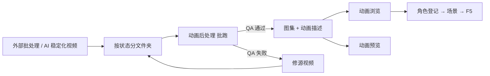

# 动画后处理

当每个角色状态已经是一段**抠好、对齐、稳定化**的短视频（通常来自外部批处理或 AI 管线），手动在 [视频转图集](./video-to-atlas) 里一段段抽帧会很慢。**动画后处理**走**命令行批量**：把一文件夹里的多段视频自动转成游戏可载入的 **图集 + 动画描述**，并带质量检查门控，不过就拦下来让你修源片。

没有图形界面——你要清楚**何时跑、从哪进、产出放哪、下一步开谁验**。

---

## 干什么

- 读取**按状态分好**的稳定化视频（每个文件或子文件夹对应一个动作状态）。
- 自动抠像、对齐、拼图集、写动画描述。
- **质量检查**：循环是否断、锚点是否稳、帧率是否合理——不合格则报错停住，不 silently 产出烂包。
- 输出可直接被游戏、[动画浏览](../panels/anim-browser)、[动画预览](./anim-preview) 发现。

与 [视频转图集](./video-to-atlas) 的分工：**视频转图集**适合手控抽帧；**动画后处理**适合「视频已经整理好，我要一口气出包」。

---

## 怎么开

**入口一：主编辑器菜单**

```bash
./dev.sh editor
```

**工具 → 外部工具** 里若有 **动画后处理** 或相关批处理入口，按向导选片段目录与输出目录。

**入口二：终端批跑**

在游戏仓库根目录，由管线同事或文档给出的启动脚本执行（通常指定「片段目录」和「输出目录」）。你没有 GUI，需要提前准备好文件夹结构。

**入口三：协作/CI**

大批量角色上线时，常在素材验收通过后由生产流程自动触发，人只验产出。

---

## 一步步：从输入到进游戏

1. **准备输入**：一个角色一个文件夹，里面每个状态一段稳定化视频，命名与将来场景要用的状态名一致（如 `idle_dock.mp4`、`walk.mp4`）。
2. **指定输出目录**：放到工程动画资源约定位置，不要与半成品混在一起。
3. **跑批处理**，看终端报告——绿灯再继续，红灯回源视频修。
4. 打开主编辑器 **[动画浏览](../panels/anim-browser)**，刷新后应能看到新包与各状态。
5. 开 **[动画预览](./anim-preview)** 大图预览，查脚点、循环、滑步。
6. **[角色登记](../panels/character)** 绑包 → **场景** 填状态 → **F5** 跑一遍剧情位。

---

## 何时用

| 情况 | 建议 |
|---|---|
| 十来个状态都已稳定化，要一次出包 | 用动画后处理，别手搓十遍视频转图集 |
| 视频转图集已试过一两条，流程定了 | 余下角色走批处理提效 |
| QA 报告锚点/循环失败 | 修源视频重跑，不要强行改场景状态名糊弄 |
| 只有单条短视频想试效果 | 优先 [视频转图集](./video-to-atlas) 更直观 |

---

## 当心什么

| 当心 | 说明 |
|---|---|
| 状态文件名与场景填的不一致 | 浏览里能播、场景填错仍不动 |
| 跳过 QA 红灯 | 游戏里滑步、闪帧、穿地 |
| 输出目录手滑 | 覆盖他人正在绑的包，先沟通或备份 |
| 以为跑完就结束 | 还必须动画浏览核对 + 角色登记 + 预览 |

---

## 工作流



---

## 雾津例子

1. 关二狗 `idle_dock`、`walk`、`bow` 三段稳定化视频放进 `guan_ergou_clips/`。
2. 跑动画后处理，输出到 `guan_ergou_anim/`；终端显示循环检查通过。
3. 动画浏览里三状态都能播；预览里走 `walk` 看是否滑步。
4. 角色登记绑 `guan_ergou_anim`；码头 NPC 与庙祝遭遇作揖选项对齐 `bow` 状态。
5. 纸人 `float` 若 QA 报循环断裂，回源片补帧重跑，不在场景硬填不存在的状态。

---

## 和相关工具怎么配合

| 工具 | 关系 |
|---|---|
| [视频转图集](./video-to-atlas) | 手动、精细的前段或单条试做 |
| [动画预览](./anim-preview) | 批产出后的游戏级验货 |
| [动画浏览](../panels/anim-browser) | 主编辑器内查状态名、绑角色 |
| [教程：把视频做成角色动画](../../tutorials/video-to-anim) | 手控流程；可与本页批处理衔接 |

---

## 相关

- [视频转图集](./video-to-atlas)
- [动画预览](./anim-preview)
- [工具打开方式](../launch-architecture)
