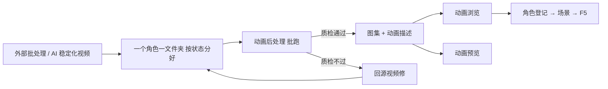

# 动画后处理

当每个角色状态已经是一段**抠好、对齐、稳定化**的短视频（通常来自外部批处理或 AI 管线），手动在 [视频转图集](./video-to-atlas) 里一段段抽帧会很慢。**动画后处理**走**命令行批量**：把一文件夹里的多段视频自动转成游戏可载入的 **图集 + 动画描述**，并带质量检查门控，不过就拦下来让你修源片，不会悄悄放行一份有问题的动画包。

它**没有图形界面**——你要清楚**何时跑、从哪进、产出放哪、下一步开谁验**。

---

## 这是什么（30 秒看懂）

如果说 [视频转图集](./video-to-atlas) 是一间「手工剪辑室」，师傅一帧一帧盯着剪，那动画后处理就是一条「流水线车间」：原料（已经稳定化好的视频）按角色、按动作分好装箱送进来，机器自动完成抠像、对齐、拼图集、写说明书这一整套工序，出货前还有质检员（质量检查）把关——不合格的整批打回，绝不让残次品混出厂。适合角色多、动作多、每个都要出包，靠人工一条条盯很费时间的场合。

它和视频转图集共用同一套「产出规格」——两边导出的图集和动画描述格式完全一致，游戏、动画浏览、动画预览都认；区别只在**谁来控每一帧**：视频转图集是你自己在剪辑台上控，动画后处理是机器按统一规则批量控。

---

## 入门：从输入到进游戏

**场景**：关二狗已经有三段稳定化好的动作视频——待机、走路、作揖，都放在同一个文件夹里，你要一口气把它们变成他的动画包。

1. **准备输入**：给关二狗单独建一个文件夹，里面每个状态一段视频，文件名要用你将来在场景/角色里会填的状态名，比如「待机」对应 `idle_dock`、「走路」对应 `walk`、「作揖」对应 `bow`。
2. **准备好输出位置**：指定一个干净的输出目录，不要和还没定稿的半成品混放。
3. **跑批处理**——由你自己在终端执行，或者由管线同事、协作流程代跑（见下方「怎么开」）。
4. 看终端/产出报告：全绿灯代表这一批全部通过质检，可以继续；只要有一项红灯，就回头修源视频，不要跳过去硬用。
5. 打开主编辑器 **[动画浏览](../panels/anim-browser)**，刷新后应该能看到关二狗的新包和三个状态。
6. 开 **[动画预览](./anim-preview)** 大图细看，逐个状态确认脚点没有滑步、循环衔接没有跳变。
7. **[角色登记](../panels/character)** 给关二狗绑上这个包；**场景**里码头 NPC 初始状态填 `idle_dock`、巡逻状态填 `walk`；如果庙祝遭遇里有作揖选项，也让它对齐 `bow`。
8. **F5** 进场景实际走一遍剧情位置，确认动作在真实演出里也没问题。

---

## 进阶：每一项都讲透

### 自动完成的工序

| 工序 | 干什么、你该知道的取舍 |
|---|---|
| 抠像 | 自动把角色从背景里抠出来。工具默认用一套经过反复实测挑出来的混合方法，专门解决「灰色/银色戏服容易被误抠出洞」这个常见坑；如果运行环境缺某些组件，会自动降级到一个效果稍逊但依然可用的备用方法，不会直接失败。 |
| 逐帧对齐 + 跨动作尺度统一 | 单个动作内，每一帧的位置会被重新锁定，去掉源视频里残留的轻微晃动；更关键的是**不同动作之间**——同一角色的待机、走路、作揖视频，生成时的身形比例常有细微差异，如果只对齐脚点，切换动作时角色头顶位置会明显跳一下。后处理会把所有动作统一缩放到同一个「站立身高」基准、脚点也统一到同一个基准线，这样游戏里切动作时角色不会忽高忽低、瞬间跳位。 |
| 循环点挑选 | 自动在动作视频里找一段首尾衔接最干净的循环区间，并自动跳过一开始角色站定不动的「起手」部分；不适合循环播放的动作（比如作揖这种一次性动作），会自动在前后接上匹配的待机姿态，让它播完能自然接回待机，不会卡在奇怪的收尾姿势。 |
| 拼一张统一图集 | 一个角色的**所有状态共用一整张图集**，格子大小统一。为了让这张图不超过引擎能加载的最大边长，动作或帧数越多，每一帧能分到的画面就相应越小——这是工具在「清晰度」和「装得下」之间做的自动取舍。如果某个角色状态特别多、导致每帧糊得看不清，可以考虑精简状态数量或分批处理。 |

### 质量检查（三种结果，不是简单的过/不过）

| 类型 | 举例 | 遇到会怎样 |
|---|---|---|
| 硬性红线 | 帧数不对、明明是原地动作却出现明显位移、画面边缘被裁切、图集尺寸超限 | 直接判不合格，整批停下不产出，必须回源视频修，程序不会自己放宽标准。 |
| 软性提示 | 疑似有漂浮的小碎片、剪影形状突然跳变、抠像边缘有点镂空 | 不会直接拦下，而是标记出来交给人工或 AI 复核——很多时候这类提示是「误报」（比如动作里角色手边搁着一杆长枪，被误判成漂浮碎片，其实是正常持握），需要人看一眼实际画面再判断是不是真问题。 |
| 通过 | 各项检查都合格 | 正常产出图集和动画描述，可以进入下一步验收。 |

### 老手技巧

- **别拿「差不多」的目录喂它**：这条流水线认的是「稳定化好」的视频——已经抠干净背景、动作原地不带位移的那种。拿一段没处理过的原始拍摄或生成视频直接喂进去，大概率会被硬性红线拦住，白跑一趟。
- **文件命名就是状态名**：批量出包全靠文件名对上未来要填的状态字符串，先想好命名规范再动手，别等出包了发现要重新来一遍。
- **红灯不要绕过去**：滑步、闪帧、穿地这些问题在批处理阶段能被拦下来，比它混进正式验收甚至上线后才被玩家发现要便宜得多——回源视频重跑，别在场景里硬填一个不存在的状态糊弄过去。
- **软提示别一律当真也别一律无视**：把标记出来的那一小段密集帧图调出来肉眼看一眼，分清「真缺陷」和「良性」——比如角色躺姿时手边放着的兵器被连通域检测误判成漂浮碎片，这种可以放心接受；但如果真的是兵器头凭空飘在半空、手里却是空的，那就是真缺陷，必须回去重做。

---

## 危险区与边界

- **状态文件名和场景里填的必须完全一致**：批处理产出的包在动画浏览里能正常播放，不代表场景就能用——场景 NPC 字段里的状态名如果和你产出的状态名对不上，游戏里该角色照样卡在第一帧或者播错动作。
- **跳过质检红灯**：会直接把滑步、闪帧、穿地这些问题带进游戏，别抱侥幸心理硬用没通过质检的产出。
- **输出目录手滑**：如果指定的输出目录和别人正在编辑、正在验收的角色包重了，会把对方的产出覆盖掉，跑之前最好先和相关同事确认或者备份一份。
- **跑完批处理不等于验收结束**：批处理只负责「产出」这一步，动画浏览核对状态、[角色登记](../panels/character)绑包、[动画预览](./anim-preview)细验、场景里 F5 实测，这几步一个都不能少。

更完整的编辑器整体风险说明，见[危险区](../concepts/danger-zone)。

---

## 常见问题

**Q：为什么我这批视频跑完直接报硬性错误，一张图都没出？**
先检查输入是不是真的「已经稳定化」——背景抠干净了没有、动作是不是原地（不该有整体位移的动作却在移动）。这类问题属于硬性红线，工具不会将就产出，需要回到生成/稳定化那一步重做源视频。

**Q：软性提示到底要不要处理？**
先肉眼看一眼实际画面再判断。很多软提示是「良性」的（比如角色身边正常持握的道具被算法误判成漂浮碎片），确认没问题可以直接接受；如果真的看出穿模、道具凭空飘等问题，就要回源视频修。

**Q：批处理产出后，动画浏览里没看到新包，怎么回事？**
先确认批处理本身有没有报告成功完成（有没有硬性红灯没处理完就中途看结果）；再检查动画浏览有没有刷新；最后确认输出目录是不是放对了地方。

**Q：这个工具能不能像视频转图集那样开个窗口手动调？**
不能，它专门为「已经整理好、要一次批量出包」这个场景设计，没有图形界面。需要手动精修某个动作的，请用 [视频转图集](./video-to-atlas)。

**Q：单个角色只有一两个状态，要不要也用这个批处理？**
不必，单条、少量的动作用视频转图集更直观、更容易边看边调；等到流程摸熟了、角色和状态数量上来了，再用这条批处理省时间。

**Q：我该找谁帮我跑这个批处理？**
如果你熟悉命令行操作可以自己跑；不熟悉的话，找项目里负责素材生产管线的同事代跑，把整理好的输入文件夹和期望的输出位置告诉对方即可。

---

## 怎么开

本工具**没有图形界面**，也没有出现在主编辑器或 Web 控制台的按钮列表里，只能通过下面两种方式使用：

**方式一：终端批跑**

在游戏仓库根目录，由你自己或熟悉命令行的同事执行对应的批处理命令，指定好「输入片段目录」和「输出目录」。你需要提前按约定整理好文件夹结构（一个角色一个文件夹，文件名对应状态名）。

**方式二：协作 / 生产流程代跑**

大批量角色上线时，通常在素材验收通过后由生产管线的同事或自动化流程代为触发，你只需要拿到产出后按上面的步骤验收即可。

---

## 和其它工具的配合

| 工具 | 关系 |
|---|---|
| [视频转图集](./video-to-atlas) | 手动、精细的前段试做，或状态少、需要精修每帧的场合。 |
| [动画预览](./anim-preview) | 批量产出后的游戏级验货，专门查脚点和循环衔接。 |
| [动画浏览](../panels/anim-browser) | 主编辑器内查状态名、准备绑角色前必看。 |
| [角色登记](../panels/character) | 产出通过验收后，在这里正式绑给角色。 |
| [教程：把视频做成角色动画](../../tutorials/video-to-anim) | 手控流程的端到端练习，可以和本页的批处理路线做对照。 |

---

## 相关

- [视频转图集](./video-to-atlas)
- [动画预览](./anim-preview)
- [动画浏览面板](../panels/anim-browser)
- [工具打开方式](../launch-architecture)
- [危险区](../concepts/danger-zone)
