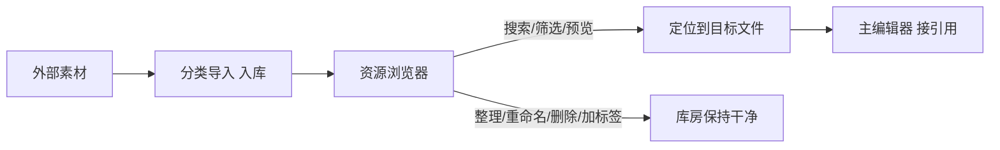

# 资源浏览器

雾津工程里的立绘、环境图、音效、动画包散在既定目录里。**资源浏览器**帮你在一个窗口里**翻、搜、预览、整理**工程内已经入库的素材——它不仅能看，还能重命名、加标签、挪目录、清理没用的旧文件。它和 [分类导入](./asset-ingest) 是一对：那边负责「从外面搬进来」，这边负责「搬进来之后怎么找、怎么管」。

---

## 这是什么（30 秒看懂）

打个比方：分类导入是雾津货栈的**收货口**，东西一批批从外面运进来、按类别码进仓；资源浏览器就是货栈本身那间**带抽屉柜、带索书签的库房**——你能翻抽屉找东西、能给常翻的抽屉插书签（收藏夹）、能在东西上贴标签写用途、能把放错格子的箱子挪个位置、能把确认没用的旧箱子扔进回收站，而不是随手拖进系统垃圾桶。

它管的是工程里**已经在仓库中**的文件本身（图片、音频、视频、动画包、文本/JSON 等），按目录树 + 收藏夹 + 搜索/筛选 的方式帮你定位；右侧有预览区，图片能看大图、音频视频能直接播放、文本能读内容。它**不碰游戏数据表**——场景背景指向哪张图、角色绑哪个动画包，这些引用仍要回主编辑器对应面板去接；它也**不做**抽帧、拼图集、缩放这类加工，那些是 [视频转图集](./video-to-atlas)、[图片缩放](./image-resizer) 等专项工具的活。

---

## 入门：手把手做第一次

**场景**：画师交了一批关二狗的新立绘，你已经用 [分类导入](./asset-ingest) 搬进了工程，现在要确认落位对不对、顺手清理掉一张画糊的废稿。

1. 打开资源浏览器（见下方「怎么开」）。
2. 左侧目录树里，找到立绘对应的分类目录，展开到关二狗所在的子目录。
3. 顶部搜索框可以直接按**文件名 / 相对路径 / 标签**搜（勾选「子目录（递归搜索）」能连子文件夹一起搜），比如搜「guan_ergou」。
4. 类型下拉选**仅图片**，把音频、JSON 这些无关文件先滤掉，视野清爽一点。
5. 点开每张图，右侧预览区看大图，确认哪张是要留的定稿、哪张是废稿。
6. 找到确认要用的定稿图，右键选**复制相对路径**，粘去主编辑器 **[角色登记](../panels/character)** 或 **场景** 面板对应的图片字段。
7. 那张画糊的废稿，右键选**删除（回收站）**——注意这是真的删文件，只是先进回收站，不是从这个列表里隐藏。
8. 顶部工具栏点**刷新（F5）**，确认目录里剩下的都是要用的图。



---

## 进阶：每一项都讲透

### 左侧：怎么定位到文件

| 功能 | 干什么 |
|---|---|
| 目录树 | 按工程实际文件夹结构逐级展开，和你在系统文件管理器里看到的结构一致。 |
| 收藏夹 | 把常去的目录（比如「立绘」「音效」）**加入收藏**，下次不用一层层展开找；收藏满了也能**删除所选收藏**清理。 |
| 搜索框 | 按**名字、相对路径、标签**做匹配搜索，默认只搜当前目录，勾「子目录（递归搜索）」连下级一起搜。 |
| 类型筛选 | 全部 / 仅图片 / 仅音频 / 文本 · JSON 等——按扩展名归类，快速把无关文件滤出视野。 |
| 缩略边长 | 调网格缩略图的显示大小，图多的目录调小一点看得更全，调大一点看得更清楚。 |
| 表格 / 网格切换 | 表格模式看文件名、大小、修改时间这类信息更方便对比批次；网格模式适合靠缩略图肉眼挑图。 |

### 右侧：预览区能看什么

| 素材类型 | 预览方式 |
|---|---|
| 图片 | 直接看大图，确认构图、透明通道、清晰度。 |
| 音频 | 一键播放 / 停止，听音效、BGM 是否对味。 |
| 视频 | 内嵌播放器直接放，不用另开播放器。 |
| 文本 / JSON | 直接读内容，核对文本文件有没有编码错乱。 |

### 整理类操作（右键菜单 / 顶部工具栏都能找到）

| 操作 | 干什么、什么时候用 |
|---|---|
| 打开 / 进入 | 图片交给系统看图软件、文件夹进去浏览。 |
| 在资源管理器中显示 | 跳到系统文件管理器里对应位置，配合其它桌面工具用。 |
| 重命名（F2） | 改单个文件/文件夹名字——改名前记得先搜一遍有没有场景、角色已经在引用这个文件名，否则会断链。 |
| 批量重命名 | 一次改一批文件的名字，支持**序号模式**（如 `原名_0001`，可设起始序号）、**查找替换**（文件名里的某段文字换成另一段）、**加前缀**、**加后缀**（不含扩展名）——四选一，整理一批命名混乱的素材很省事。 |
| 删除（回收站） | 真删除，但先进系统回收站，手滑了还能捞回来，不是「隐藏」。 |
| 复制相对路径 | 把工程内的相对路径复制到剪贴板，粘去主编辑器字段最准确，不会打错字。 |
| 加标签 | 给文件/文件夹打自定义标签，方便以后用标签词搜索——比如给一批关二狗相关素材都打上「关二狗」标签，不管它们散在哪个目录，搜标签就能一次找齐。 |
| 剪切 / 复制 / 粘贴 | 在浏览器内部把文件挪到别的目录，或复制一份副本。 |
| 移动到… | 一次把选中项挪去指定目标目录，整理错放的素材时比一个个剪切粘贴快。 |
| 新建文件夹 | 在当前目录下建子目录，配合自己的整理习惯用。 |
| 导入到当前 | 直接把外部文件拖/选进当前打开的目录——比开一次[分类导入](./asset-ingest)更快，但只适合你确定目标目录就是这里的时候；批量分类、走标准入库流程还是优先用分类导入。 |
| 全选 / 刷新（F5） | 全选配合批量操作用；导入完、外部改了文件后刷新能看到最新状态。 |

### 老手技巧

- **标签比目录好用的地方**：目录只能归一类，标签可以打好几个——同一张关二狗立绘，可以同时打「角色立绘」「关二狗」「码头场景候选」三个标签，搜任何一个都能翻到它。
- **先搜后删**：批量清理废稿前，先用搜索确认这个文件名有没有在别处出现过（比如同名缩放版本），避免误删还在用的文件。
- **收藏常用目录**：立绘、音效、动画包这几个你天天进的目录，第一时间加收藏，比每次展开目录树快得多。
- **操作有日志**：浏览器的整理操作（重命名、删除、移动等）会记一份操作日志，事后想查「这个文件什么时候被挪走的」有据可查。

---

## 和其它工具的配合

| 工具 / 面板 | 关系 |
|---|---|
| [分类导入](./asset-ingest) | 入库一端：素材先从这里搬进工程，浏览器负责搬进来之后的查找和整理。 |
| [图片缩放/镜像](./image-resizer) | 浏览器里发现图片尺寸不对，可以先复制路径去缩放工具处理，处理完的副本再导回来。 |
| [视频转图集](./video-to-atlas) | 动画包产出后，回浏览器确认图集大图与动画描述文件都已落位，再去登记。 |
| [动画浏览](../panels/anim-browser) | 浏览器确认文件齐了之后，去动画浏览核对状态名是否正确。 |
| [主编辑器](../main-editor/overview) | 各面板的图片、音频、动画字段最终都指向浏览器里能看到的这些文件。 |

---

## 常见问题

**Q：我在浏览器里删了/改名了一个文件，主编辑器里原来引用它的地方会怎样？**
不会自动更新。浏览器管的是文件本身，不知道谁在引用它；改名或删除前务必先搜一遍确认没有场景/角色/物品还指着旧文件名，否则回主编辑器会看到「找不到资源」的报错。

**Q：为什么刚导入完的一批文件在浏览器里没出现？**
目录缓存没刷新。按 F5 刷新，或重新展开一下目录树。

**Q：网格里的缩略图和实际图片对不上/一直转圈？**
缩略图是后台生成的缓存，遇到超大图或刚导入的新文件需要一点时间生成，稍等或刷新即可；如果长期不对，检查文件本身是不是已损坏。

**Q：批量重命名会不会影响已经被主编辑器引用的文件？**
会——文件名变了，任何写死了旧文件名的引用都会断。批量重命名前，最好先确认这批文件还没在任何面板里被绑定，或者改完立即回主编辑器同步一遍引用。

**Q：删除进了回收站，还能找回来吗？**
能，回收站是系统级的，和平时删文件误删找回的方式一样；但工程外部协作者如果已经基于旧文件同步过，仍建议先确认真的没用再删，而不是依赖回收站兜底。

**Q：「导入到当前」和专门的分类导入工具有什么区别？**
「导入到当前」是把文件直接扔进你此刻打开的目录，快但没有分类导入的类别校验和落位提示；批量、按标准分类入库，还是优先用[分类导入](./asset-ingest)。

---

## 怎么开

**方式一：命令**

```bash
./dev.sh asset-browser
```

**方式二：Web 控制台**

```bash
./dev.sh console
```

浏览器里点 **资源浏览器** 按钮。

---

## 相关

- [分类导入](./asset-ingest)
- [图片缩放/镜像](./image-resizer)
- [工具打开方式](../launch-architecture)
- [教程：导入一张素材](../../tutorials/import-art)
- [危险区](../concepts/danger-zone) / [可编辑面·危险区参考](/docs/reference/danger-zone)
