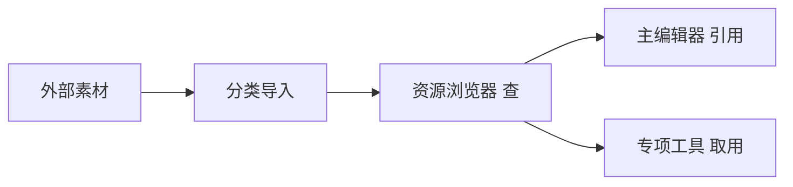

# 资源浏览器

雾津工程里的立绘、环境图、音效、动画包散在既定目录里。**资源浏览器**帮你在一个窗口里**翻、搜、预览、拖取**，确认素材已入库、路径对不对。它和 [分类导入](./asset-ingest) 是一对：那边负责「从外面搬进来」，这边负责「搬进来之后怎么找」。

---

## 干什么

- **按目录浏览**工程内已入库资源。
- **预览**图片、听音频（视资源类型）。
- **拖拽或复制路径**给其它工具、主编辑器面板引用。
- **查看入库记录**，核对某批素材是否已进工程。

本工具**不改**游戏数据表，也不替你做抽帧、拼图集——那是 [视频转图集](./video-to-atlas) 等专项工具的活。

---

## 怎么开

**方式一：命令**

```bash
./dev.sh asset-browser
```

**方式二：Web 控制台**

```bash
./dev.sh console
```

浏览器里点 **资源浏览器** 按钮。

---

## 一步步怎么用

1. 打开资源浏览器，左侧选资源大类（图、音频、动画等）。
2. 展开子目录，点文件看预览区。
3. 确认文件名、尺寸、格式符合预期。
4. 需要给别的工具用时，拖出或记下相对路径。
5. 发现缺文件 → 走 [分类导入](./asset-ingest) 补进工程，再回浏览器刷新核对。

---

## 何时用

| 情况 | 建议 |
|---|---|
| 刚做完分类导入 | 立刻开浏览器，逐批确认文件落位 |
| 主编辑器里引用报错「找不到资源」 | 先来浏览器查路径、文件名是否一致 |
| 对比两套立绘候选 | 并排预览，定稿再登记角色 |
| 动画包产出后 | 确认 atlas 与描述文件都在，再去 [动画浏览](../panels/anim-browser) |

---

## 当心什么

| 当心 | 说明 |
|---|---|
| 浏览不等于登记 | 文件在工程里，角色/场景仍要在主编辑器绑引用 |
| 改磁盘上的文件名 | 已引用处可能断链，改前搜一遍谁在用 |
| 与入库工具分工 | 浏览器只看不搬；新素材走分类导入 |
| 缓存未刷新 | 刚导入完列表空，重开或刷新目录 |

---

## 工作流



---

## 雾津例子

1. 茶馆内景背景图经分类导入进 `backgrounds` 一类目录。
2. 开资源浏览器，找到 `mantang_chake_interior.png`，预览桌沿与栏杆是否清晰。
3. 回主编辑器 **场景** 面板，背景字段指向同一路径。
4. 关二狗立绘两套候选都入库后，在浏览器里对比选中更贴码头阴湿气质的那套，再进角色登记。

---

## 和相关工具怎么配合

| 工具 / 面板 | 关系 |
|---|---|
| [分类导入](./asset-ingest) | 入库一端 |
| [动画浏览](../panels/anim-browser) | 动画包登记前可先浏览器确认文件齐 |
| [视频转图集](./video-to-atlas) | 产出图集后回浏览器核对 |
| [主编辑器](../main-editor/overview) | 各面板引用资源路径 |

---

## 相关

- [分类导入](./asset-ingest)
- [工具打开方式](../launch-architecture)
- [教程：导入一张素材](../../tutorials/import-art)
