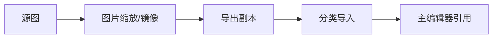

# 图片缩放/镜像

背景图太大、立绘要朝左、UI 切图要统一宽度——**图片缩放/镜像**在独立小窗里对单张或多张图做**等比缩放**和**水平/垂直镜像**，一律**导出副本**，不覆盖你手里的源文件，方便反复试尺寸。

---

## 干什么

- **等比缩放**到指定宽或高（保持比例）。
- **水平镜像**、**垂直镜像**（角色朝左朝右、水面倒影等）。
- **批量处理**多张图，统一规则导出。
- **非破坏性**：源图不动，结果写到新文件。

---

## 怎么开

**方式一：命令**

```bash
./dev.sh image-resizer
```

**方式二：Web 控制台**

点 **图片缩放** 按钮。

**方式三：主编辑器已在手**

菜单 **工具 → 外部工具** → **图片缩放**。

---

## 一步步怎么用

1. 打开工具，拖入或选择要处理的图片（可多选）。
2. 设目标宽度或高度（勾选保持比例）。
3. 若角色要朝反方向，勾 **水平镜像** 或 **垂直镜像**。
4. 指定导出目录与命名后缀（如 `_scaled`）。
5. 预览单张效果，满意后 **导出**。
6. 新文件经 [分类导入](./asset-ingest) 入库，或覆盖策略确认后再替换工程内引用。

---

## 何时用

| 情况 | 建议 |
|---|---|
| 背景图分辨率远超游戏需求 | 缩到目标宽再入库，减包体 |
| 同一立绘只要左右朝向不同 | 镜像出副本，不必让画师重画 |
| 一批 UI 图标要统一边长 | 批量缩放一次导出 |
| 视频转图集前 raw 帧过大 | 可先缩帧图再进图集工具 |

---

## 当心什么

| 当心 | 说明 |
|---|---|
| 覆盖同名导出 | 确认导出路径不会误盖成品 |
| 非等比拉伸 | 默认应保持比例；强行拉扁会变形 |
| 镜像后锚点 | 游戏内角色锚点在脚点，镜像后走位要预览验证 |
| 只缩放不登记 | 新文件还要在主编辑器或分类导入里接上引用 |

---

## 工作流



---

## 雾津例子

1. 码头全景背景原图 4K，游戏只需宽 1920——缩放导出 `dock_wide_1920.png`。
2. 关二狗立绘只有朝右版，场景里 NPC 要朝左——水平镜像出 `guan_ergou_face_left.png`。
3. 导入副本后，场景背景与角色头像字段改指向新文件。
4. F5 预览码头，确认缩放后细节仍可读、镜像后脸没糊。

---

## 和相关工具怎么配合

| 工具 | 关系 |
|---|---|
| [分类导入](./asset-ingest) | 处理后的副本入库 |
| [资源浏览器](./asset-browser) | 核对导出文件 |
| [场景深度](../render-domain/scene-depth-editor) | 背景尺寸稳定后再做深度 |

---

## 相关

- [工具打开方式](../launch-architecture)
- [教程：导入一张素材](../../tutorials/import-art)
