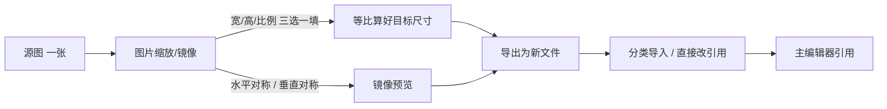

# 图片缩放/镜像

背景图太大、立绘要朝左、UI 切图要统一宽度——**图片缩放/镜像**在独立小窗里对一张图做**等比缩放**和**水平/垂直镜像**，结果一律**导出成新文件**，不碰你手里的源图，方便反复试尺寸、试朝向。

---

## 这是什么（30 秒看懂）

想象你在雾津裁缝铺量体裁衣：一块布（源图）要改多大尺寸、要不要翻个面缝反着穿，裁缝台上试来试去都不会剪坏原来那块布——真正下剪子（导出）之前，怎么调整都能反悔。这个工具就是这样一张「试衣台」：左边填参数、右边实时看效果，满意了再点导出，出来的是一份全新的副本，原图分毫不动。

它一次专心处理**一张图**：打开一张、调一张、导出一张，再拖入下一张继续——不是那种一次选一堆文件、套用同一组参数批量跑完的工具。如果你有很多张图要用完全相同的规则处理，效率窍门见下文「进阶」里的说明。它只管缩放和镜像这两件事，不做抠像、不做拼图集，那些是 [视频转图集](./video-to-atlas) 等工具的活。

---

## 入门：手把手做第一次

**场景**：码头全景背景原图是画师给的 4K 大图，游戏里只需要宽 1920 就够用；同时关二狗的立绘画师只画了朝右的一版，但码头场景里有个位置需要他朝左站。

1. 打开图片缩放工具（见下方「怎么开」）。
2. 把码头背景图拖进窗口（或点**打开**选择文件），窗口会显示原图的宽高与格式。
3. 在**宽**这一栏填 1920——**高**会跟着按原图比例自动算好，不用你去凑数字；填**比例**（如 50%）效果一样，三个数字（比例、宽、高）改哪个都会带动另外两个保持等比例。
4. 右侧预览区实时显示效果，配合下方的视口缩放（**-** / **+** 按钮、**1:1** 看实际像素、**适应** 让整张图塞进预览框）确认细节没糊。
5. 点**导出**，选保存位置和文件格式（PNG / JPEG / WebP / BMP 里选一个），确认文件名不是原图本身——工具会拒绝直接覆盖源文件。
6. 关二狗立绘另开一张（或拖入替换当前这张），这次不改尺寸，勾选**水平对称**，预览里看他翻到朝左，导出。
7. 两份新文件都经 [分类导入](./asset-ingest) 入库，或者如果本来就在工程目录内，直接在场景/角色字段里改指向新文件。



---

## 进阶：每一项都讲透

### 尺寸控制

| 控件 | 干什么 |
|---|---|
| 比例（%） | 按原图百分比缩放，比如填 50 就是缩到原图一半大。 |
| 宽（像素） | 直接指定目标宽度，高度和比例会自动跟着算，图形不会被拉变形。 |
| 高（像素） | 直接指定目标高度，宽度和比例同样自动跟算。 |

这三个数字**互相联动、永远保持原图比例**——填其中任何一个，另外两个自动更新。工具目前没有「强行拉伸变形」这个选项，所以不用担心手滑把图拉扁；如果你确实需要非等比的裁切效果，那不是这个工具的职责范围，需要用其它图像处理手段单独处理。

### 镜像

| 控件 | 干什么、什么时候用 |
|---|---|
| 水平对称 | 左右翻转——最常见的用途是让只画了一个朝向的角色立绘换个面朝，配合场景里角色朝向摆位用。 |
| 垂直对称 | 上下翻转——比如做水面倒影、招牌翻面这类效果。 |
| 两者可以同时勾选 | 水平+垂直一起勾，等于整张图转 180 度。 |

### 预览视口（只影响你看到的大小，不影响导出结果）

| 控件 | 干什么 |
|---|---|
| 视口缩放 -/+ | 一步步放大缩小预览画面，方便看细节或看全貌。 |
| 视口百分比数字 | 直接输入想要的预览缩放比例。 |
| 1:1 | 按输出图片的**实际像素**大小看，最适合检查缩放后是否还清晰。 |
| 适应 | 让整张图自动缩到刚好塞进预览框，适合先看个大概构图。 |
| 鼠标滚轮 + Ctrl | 在预览区直接滚轮缩放，效果同上。 |

视口缩放纯粹是给你看的放大镜，跟最终导出的图片尺寸没有任何关系——导出大小只看「宽/高/比例」那三个数字。

### 导出

| 行为 | 说明 |
|---|---|
| 格式选择 | 导出时可选 PNG / JPEG / WebP / BMP，透明背景的立绘务必选 PNG 或 WebP 这类支持透明通道的格式，选 JPEG 会把透明部分填成实色。 |
| 默认文件名 | 工具会在原文件名基础上自动建议一个新名字（缩放过会带上标记、镜像过再多带一个标记），你可以在保存框里改成任何你想要的名字。 |
| 禁止覆盖源图 | 如果你把导出路径设成和源文件一模一样，工具会拦下来提示不能这么做——这是防手滑的保护，逼你必须落到一个新文件。 |
| 目标目录任选 | 可以导出到工程内已有目录，也可以先导到桌面再手动搬——但如果目标已经在工程里，导出完记得回[资源浏览器](./asset-browser)确认落位对不对。 |

### 老手技巧

- **要处理很多张图怎么办**：这个工具单次只认一张图，但窗口不需要关——处理完一张导出后，直接把下一张图拖进同一个窗口，参数（比例/宽/高/镜像勾选）不会自动继承上一张，每张都要重新设一遍，适合「每张目标尺寸不一样」的场景；如果一批图要套**完全相同**的规则，效率会随图片数量线性增加，量非常大时考虑找生产管线/协作同事用别的批处理方式。
- **从命令行/脚本直接带图打开**：`./dev.sh image-resizer` 后面可以跟一个图片文件路径，工具会启动时就把这张图打开好，省去手动再选一次——适合从资源浏览器或别的脚本一键联动过来。
- **镜像后先别急着定稿**：游戏里角色的落地点是按脚底对齐的，镜像翻转理论上不影响这个对齐，但保险起见导出后还是回 [动画预览](./anim-preview) 或直接 F5 进场景看一眼，确认没有意外的错位观感。
- **背景图缩放选 1920 宽这类常见目标**：先问清楚这张图具体要用在哪个场景、游戏实际渲染的合理宽度，缩太小会糊，缩太大浪费包体，两头都不划算。

---

## 和其它工具的配合

| 工具 | 关系 |
|---|---|
| [分类导入](./asset-ingest) | 处理好的副本按类别正式入库。 |
| [资源浏览器](./asset-browser) | 核对导出文件是否落到了正确目录、有没有和旧文件混在一起。 |
| [视频转图集](./video-to-atlas) | 抽出来的原始帧图如果整体偏大，可以先用本工具缩小一批参考尺寸再进图集工具（注意图集工具内部有自己的分辨率设置，一般不需要你手动预缩每一帧）。 |
| [场景深度](../render-domain/scene-depth-editor) | 背景图尺寸定稿、不再变动之后，再做深度重建更省事，避免深度图和背景后续对不上尺寸。 |

---

## 常见问题

**Q：为什么改了宽度，高度也跟着变了，我不想要这样？**
工具设计上就是**永远保持等比例**，改宽高都会联动，目前没有强行拉伸的开关。如果你确实需要非等比的变形效果，这个工具管不了，需要另找方式处理。

**Q：导出时提示不能覆盖，为什么？**
工具刻意挡住了「导出路径 = 源文件路径」这种操作，防止你手滑把原图冲掉。换一个文件名或目录再导出即可。

**Q：镜像之后，游戏里角色的走位会不会乱？**
理论上镜像只翻转画面本身，脚底锚点位置逻辑上不变，但保险起见导出后建议回动画预览或 F5 场景里实际看一眼，尤其是本来就带轻微不对称设计的角色。

**Q：能不能一次拖 10 张图进去，套同一组参数批量导出？**
目前不能，这个工具是单图工作台，一次只处理一张。10 张图需要各来一遍；如果参数完全相同、图特别多，建议和生产管线的同事沟通用批处理方式解决。

**Q：导出的 JPEG 里透明背景变成了实色，怎么回事？**
JPEG 格式本身不支持透明通道，工具会把透明部分填实。立绘、带透明背景的素材请选 PNG 或 WebP。

---

## 怎么开

**方式一：命令**

```bash
./dev.sh image-resizer
```

**方式二：Web 控制台**

点 **图片缩放** 按钮。

**方式三：主编辑器已在手**

菜单 **工具 → 外部工具** → **图片缩放**。

---

## 相关

- [分类导入](./asset-ingest)
- [资源浏览器](./asset-browser)
- [工具打开方式](../launch-architecture)
- [教程：导入一张素材](../../tutorials/import-art)
