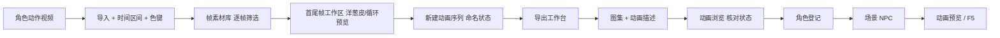

# 视频转图集

关二狗走路、纸人飘浮——若你手里是一段拍好或生成的**角色动作视频**，**视频转图集**帮你按时间区间**抽帧、管理多段动作、拼成一张大图集**，并写出游戏能读的动画描述。适合需要**亲手控每一帧**、分支动作多、或自动化管线覆盖不到的场合。

产出之后，到主编辑器 **[动画浏览](../panels/anim-browser)** 核对状态名，用 **[动画预览](./anim-preview)** 或 F5 细验。

---

## 这是什么（30 秒看懂）

把它想成一间小型剪辑室：素材带（视频）送进来，你在剪辑台上**逐段标记**「这几秒是待机」「这几秒是走路」，从每段里挑出清楚能用的帧，最后把所有挑好的帧**拼成一张大图**（图集），再配一份说明书（动画描述），告诉游戏「这张图哪一格对应哪个动作的第几帧」。整个过程你全程掌控每一帧，适合动作复杂、需要精修、或者角色数量不多但每个都要讲究的场合；如果你手头已经有一大批**处理好、稳定化**的视频要批量出包，效率更高的路线是 [动画后处理](./animation-pipeline)。

工作区会把你的进度存成一个工程文件夹，随时关掉、下次接着编，不用一次性做完。

---

## 入门：手把手做第一次

**场景**：关二狗在缆桩旁蹲点张望的一小段视频拿到手，你要把「待机」和「走路」两个动作抽出来拼成他的第一份动画包。

1. **新建或打开工作区**——上次编辑的进度会自动保留。
2. **导入视频**：菜单选导入，弹出的导入窗口里加载关二狗的视频，用滑块选出你要的**时间区间**（比如待机 0:02–0:05）。
3. 如果这段视频是绿幕或纯色背景拍摄的，导入窗口还提供**色键抠图**：吸取背景色、实时对照「原图」与「色键结果」两张预览，边调边看抠得干不干净。
4. 点抽帧，这段区间的画面会作为一批帧进入这段视频专属的素材库。
5. 帧格网格里逐张看缩略图，**Ctrl+左键**在你要用的那帧上设为**首帧**，**Alt+左键**设为**尾帧**；糊的、多余的帧直接删除。
6. 用**首尾帧工作区**的洋葱皮对照和循环预览，来回看首尾衔接顺不顺，调整播放速度确认没有跳变感。
7. **新建动画**，用刚才定好的首尾范围一键生成——这就是「待机」这个动作的雏形，给它起名 `idle_dock`，要和将来场景里 NPC 要填的状态名一致。
8. 走路片段（比如 0:08–0:14）重复上面的流程，命名 `walk`，把转身那两张糊帧删掉换成清楚的替补帧。
9. 到导出工作台，把 `idle_dock`、`walk` 都加进导出列表，选**合并导出**——两个动作会拼进同一张图集、同一份动画描述里。
10. 主编辑器打开 **[动画浏览](../panels/anim-browser)**，确认 `idle_dock`、`walk` 两个状态都能播。
11. **[角色登记](../panels/character)** 给关二狗绑上这个动画包，**场景**里码头 NPC 初始状态填 `idle_dock`、巡逻状态填 `walk`，F5 进场景验证。



---

## 进阶：每一项都讲透

### 素材库怎么管

| 能力 | 说明 |
|---|---|
| 多视频子库 | 一个工作区能导入多段视频，每段各自成一个「子库」，点视频列表切换当前在编辑哪一个。 |
| 帧只能尾部追加、中间删除 | 同一段视频里，新抽的帧只会加到末尾，中间可以删掉不要的帧，但**不能重新排序**——如果顺序不对，回导入阶段调整时间区间重抽更省事，别指望在帧格里拖动换位置。 |
| 首帧 / 尾帧标记 | Ctrl+左键设首帧、Alt+左键设尾帧，标好之后就能从这段范围一键建动画。 |
| 右键菜单 | 设首帧、设尾帧、删除帧、查看大图——大图查看能放大平移，逐像素检查这一帧糊不糊、抠像干不干净。 |

### 首尾帧工作区

| 能力 | 说明 |
|---|---|
| 洋葱皮对照 | 把首帧和尾帧叠在一起半透明对比，快速看出动作幅度和轮廓差异。 |
| 范围循环预览 | 把首尾之间的帧当成一小段循环播放，可调速度，专门用来判断「这个动作循环起来顺不顺、有没有跳一下」。 |

### 动画序列（真正会被导出的动作单元）

| 能力 | 说明 |
|---|---|
| 从子库范围新建 | 用当前子库标好的首尾范围一键生成一条动画序列。 |
| 引用而非复制 | 序列里每一帧引用的是素材库里的原始帧，不是另存一份，省空间也方便统一改。 |
| 单帧 / 整段水平翻转 | 某一帧朝向反了，可以只翻这一帧；整段动作要反向，可以一次性全翻——都是**非破坏性**的，翻转只影响这条序列怎么用这帧，原始帧数据不变。 |
| 缺帧标红 | 如果引用的原始帧被删掉了，序列里对应位置会标红提示缺失，可以手动换一张别的帧补上。 |
| 序列内帧不可重复 | 同一条动画序列里，同一张原始帧只能出现一次，避免拼出逻辑混乱的循环。 |

### 导出工作台

| 能力 / 选项 | 说明 |
|---|---|
| 添加动画到导出列表 | 把编好的动画序列加进这次要导出的清单。 |
| 移除选中行 | 从清单里去掉不想这次导出的序列。 |
| 分辨率缩放（每行独立） | 每条动画可以单独设一个缩放比例——同一角色不同动作的原始分辨率不一样时，用它统一到合适大小。 |
| 单元格内边距 | 给每一帧格子四周留白，避免拼图后帧与帧之间的画面互相蹭到。 |
| 世界宽 / 世界高（每行独立） | 明确指定这条动画在游戏世界里的显示宽高，留空则按自动规则处理。 |
| 分别导出 | 每条动画各自导出成独立的一张图集 + 一份动画描述。 |
| 合并导出（仅勾选行） | 把列表里**打勾**的多条动画拼进**同一张**图集、同一份带多个状态的动画描述里——这也是让一个角色的所有动作共用一张图集的标准做法；未勾选的行不会被带入这次合并。 |
| 合并导出复用相同帧 | 如果不同动作之间有完全相同的帧，合并时可以选择只存一份、大家共用，省图集空间。 |
| 同时写出调试信息文件 | 可选附带输出一份记录每格尺寸、帧索引这类细节的说明文件，排查问题时有用，不影响游戏读取。 |
| 帧编号固定从 0 开始 | 和游戏运行时的读取方式对齐，这个编号规则是固定的，不能改。 |

### 老手技巧

- **锚点固定在脚底中心**：拼图和摆位都遵循「精灵的落点在画面底部正中」这个约定，和游戏里其它角色对齐、和场景摆位逻辑一致，不用你额外操心。
- **保存靠手动**：编辑过程记得手动保存工作区，别只靠导出这一步——工作区进度和导出产物是两回事，前者是你的半成品草稿，后者才是游戏能读的成品。
- **多状态尽量一次合并导出**：一个角色好几个状态分开导出会变成好几张图集，游戏加载效率不如一张图集扛住全部状态；只要机器扛得住，优先合并导出。
- **图集有像素上限**：一张图集有边长上限，状态多、帧多的时候，拼进去的每一帧会被压得更小——这是工具在「画质」和「装得下」之间做的取舍，状态特别多时可以考虑分组分别导出，或者接受略小的单帧画质。

---

## 危险区与边界

- **覆盖旧图集**：对同一个角色重新导出，会把场景、角色已经绑定的旧图集替换掉。正在被别人编辑或已经上线验收过的角色，导出前最好先确认没人正在用这份旧包，或者先备份。
- **主编辑器动画面板是半开放的**：**[动画浏览](../panels/anim-browser)** 和 **角色动画** 面板里，帧序、帧率、是否循环、增删状态、世界尺寸这些是「廉价」信息，可以直接在主编辑器里改了保存，不会丢；但**图集本身的像素布局**——也就是这张大图具体怎么切格子、每格摆的是哪一帧——只有回到视频转图集重新导出才能改，主编辑器里对应的字段是只读的，改不动也不该硬改。
- **只导出不等于游戏里能看到**：图集导出成功，[动画浏览](../panels/anim-browser)里能看到包和状态，但角色要在场景里真正播放，还得走 **[角色登记](../panels/character)** 绑包、场景 NPC 填对状态名这两步。

更完整的编辑器整体风险说明，见[危险区](../concepts/danger-zone)。

---

## 常见问题

**Q：状态名要和什么保持一致？**
要和场景里 NPC 要填的初始状态、移动状态这类字段填的字符串完全一致（大小写、拼写都算），对不上游戏里会卡在第一帧或者播成默认动作。

**Q：帧的顺序拼错了，能不能直接拖动调整？**
不能，同一段视频的帧只支持在末尾追加和中间删除，不支持重新排序。顺序不对，回导入阶段重新框选时间区间、重新抽帧更省事。

**Q：动画预览里角色走路一直在滑步，是哪里的问题？**
多半是拼图前画面本身晃动没裁稳，或者首尾帧衔接不够顺。回到首尾帧工作区用洋葱皮和循环预览仔细看，或者干脆多留几帧过渡再拼。

**Q：导出后动画浏览还是看不到新状态？**
先确认导出流程本身有没有报错完成；再检查动画浏览有没有刷新；最后确认状态名拼写和你在场景/角色里期望的一致。

**Q：合并导出的时候有几条动画没有进去，为什么？**
合并导出只带**打勾**的行，检查一下导出列表里那几条是不是没勾选。

**Q：这工具能不能直接从命令行单独起？**
它没有独立的启动命令，只能从主编辑器的外部工具菜单进入，或者由动画包对应面板的入口按钮唤起。

---

## 怎么开

本工具**没有**单独的 `./dev.sh` 任务名，需要先打开主编辑器：

```bash
./dev.sh editor
```

菜单 **工具 → 外部工具** → **视频转图集**。如果这个角色之前用本工具编辑过工作区，重新打开时会自动接上次的工作区，不用你重新找路径。

---

## 和其它工具的配合

| 工具 / 面板 | 关系 |
|---|---|
| [动画后处理](./animation-pipeline) | 视频已经批量稳定化好、要一口气出很多角色的包时，换这条自动化路线更省时间。 |
| [动画预览](./anim-preview) | 大图级预览，和游戏渲染方式一致，导出后来这里细验循环和锚点。 |
| [动画浏览](../panels/anim-browser) | 主编辑器内查状态列表、绑角色前必看。 |
| [角色登记](../panels/character) | 动画包导出后，在这里正式绑定给某个角色。 |
| [教程：把视频做成角色动画](../../tutorials/video-to-anim) | 端到端练习，从视频到进游戏走一遍。 |

---

## 相关

- [动画后处理](./animation-pipeline)
- [动画预览](./anim-preview)
- [动画浏览面板](../panels/anim-browser)
- [工具打开方式](../launch-architecture)
- [危险区](../concepts/danger-zone)
