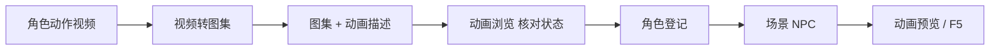

# 视频转图集

关二狗走路、纸人飘浮——若你手里是一段拍好或生成的**角色动作视频**，**视频转图集**帮你按时间区间**抽帧、管理多段动作、拼成一张大图集**，并写出游戏能读的动画描述。适合需要**亲手控每一帧**、分支动作多、或自动化管线覆盖不到的场合。

产出之后，到主编辑器 **[动画浏览](../panels/anim-browser)** 核对状态名，用 **[动画预览](./anim-preview)** 或 F5 细验。

---

## 干什么

- 导入一个或多个视频，按**时间区间**标出「哪几秒算走路、哪几秒算站立」。
- 预览、删减糊帧、重复帧。
- 为每个动作**命名状态**（如 `idle_dock`、`walk`、`float`）。
- 导出 **图集大图 + 动画描述**，供游戏与 [动画浏览](../panels/anim-browser) 加载。

工作区会记住进度，下次接着编。

---

## 怎么开

本工具**没有**单独的 `./dev.sh` 任务名，从主编辑器或控制台进：

```bash
./dev.sh editor
```

菜单 **工具 → 外部工具** → **视频转图集**。

也可 `./dev.sh console`，在工具区找同名入口。

---

## 一步步怎么用

1. **新建或打开工作区**（上次进度会保留）。
2. **导入视频**——例如关二狗在缆桩旁蹲点张望的片段。
3. 在时间轴上为每个动作标 **起止时间**。
4. **预览抽帧**，删掉糊的、跳变的、多余的帧。
5. 为每个动作 **起名**——与场景里 `initialAnimState`、`moveAnimState` 将来要填的字符串一致。
6. 设单元格大小、排列方式（保持角色在格内对齐，脚点稳定）。
7. **导出**图集与动画描述到工程约定目录。
8. 主编辑器打开 **[动画浏览](../panels/anim-browser)**，确认状态列表与预览播放正常。
9. **[角色登记](../panels/character)** 绑动画包 → **场景** NPC 填状态名 → F5 验证。

---

## 何时用

| 情况 | 建议 |
|---|---|
| 手上有角色动作视频，要进游戏 | 走本工具手动抽帧拼图集 |
| 动作少、要精修每帧 | 比全自动管线更可控 |
| 动画浏览里缺某个状态 | 回视频转图集补一段区间再导出 |
| 已有稳定化视频批量很多 | 可考虑 [动画后处理](./animation-pipeline) 自动化后半段 |

---

## 当心什么

| 当心 | 说明 |
|---|---|
| 状态名与场景不一致 | 游戏里会卡第一帧或播默认 |
| 脚点/锚点每帧乱跳 | 拼图前尽量裁稳画面，导出后动画预览里查滑步 |
| 覆盖旧图集 | 场景已绑的包会被新导出替换，先备份或确认无人正在改 |
| 只导出不绑角色 | 动画浏览能看到包，场景 NPC 仍要角色登记 |

主编辑器 **动画浏览** 里的动画表是**只读**的；要改动画内容，回视频转图集（或后处理管线）重新导出。

---

## 工作流



---

## 雾津例子

1. 导入关二狗码头待机视频，区间 0:02–0:05 命名为 `idle_dock`。
2. 走路片段 0:08–0:14 命名为 `walk`，删掉转身那两帧糊图。
3. 导出包 `guan_ergou_anim`。
4. 动画浏览里点 `idle_dock`、`walk` 各播一遍，记准拼写。
5. 角色登记关二狗绑此包；码头场景 NPC 初始 `idle_dock`、巡逻 `walk`。
6. 纸人 `float` 状态另开视频，连播三遍看循环是否无缝。

---

## 和相关工具怎么配合

| 工具 / 面板 | 关系 |
|---|---|
| [动画后处理](./animation-pipeline) | 批量稳定化视频后的自动化产出 |
| [动画预览](./anim-preview) | 大图集级预览，与游戏渲染一致 |
| [动画浏览](../panels/anim-browser) | 主编辑器内查状态、绑角色前必看 |
| [教程：把视频做成角色动画](../../tutorials/video-to-anim) | 端到端练习 |

---

## 相关

- [动画后处理](./animation-pipeline)
- [动画预览](./anim-preview)
- [工具打开方式](../launch-architecture)
