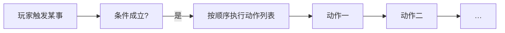

# 怎么编排动作

玩家摸到城隍庙的香炉、任务进行到某一步、遭遇里选了「硬闯」——背后都是一串 **动作**：游戏在这一刻**要发生的事**。动作不是某一块面板独有的，而是贯穿任务、场景、热区、图对话、过场、遭遇、小游戏结算的**通用编排方式**。读完这一页，你能看懂动作面板里的每一类选项在干什么、怎么把好几条动作串起来、什么时候该用动作、什么时候该用条件。

## 这是什么（30 秒看懂）

**大白话：** 动作 = 游戏立刻或稍后执行的一条指令。就像折子戏本子边上写的「科介」批注——「（起身）」「（递帕子）」「（暗下）」，标注这一刻演员要做什么。你在面板里看到的「结果动作」「进入时动作」「完成时动作」等列表，全都是同一种动作编辑器，只是**挂在不同的地方**罢了。

常见的动作大类：

- 播一段对白、字幕或系统提示
- 给玩家一个物品、扣一笔钱
- 把某个 **[旗标](../../reference/glossary)** 设为某个值
- 切换到雾津码头场景、挪动一个 NPC
- 播放音效、切 BGM、播一段角色动画
- 推进任务、剧本或规矩的进度
- 打开遭遇、商店，或拉起一个小游戏

条件（要不要发生）和动作（发生什么）是分开的两套控件——条件见 **[怎么设条件](./conditions)**，这一页只讲动作本身。

---

## 入门：手把手做第一次

以「玩家拾取雾津旧符后获得物品」为例，从头做一遍：

1. 打开 **[场景](../panels/scene)**，选中对应的 **拾取热区**。
2. 找到 **动作** 或 **拾取结果** 列表（名称因热区类型略有不同）。
3. 点 **添加**，在类型下拉里搜 **给予物品**（打字过滤，不用翻整个列表）。
4. 填这条动作要的参数：物品名（如「褪色的雾津符」）、数量等——面板给出哪些填空框，就填哪些。
5. `Ctrl+S` 保存，`F5` 运行预览里走过去拾取，确认背包真的多了这件物品。

改顺序：列表通常可以 **上移 / 下移**。删除：选中该条点 **删除**。想要几条相似配置，部分面板支持 **复制条目** 再改参数，比从零新建快。

:::tip[雾津小例子]
关二狗对白结束后要给玩家一支「狗哨」并推进任务：打开 **[图对话](../panels/dialogue-graph)**，在关二狗说完关键台词的节点上添加两条动作——**给予物品**（狗哨）和 **更新任务**（选对应任务、推进到下一步）。保存后 `F5` 完整走一遍对话，确认背包和任务栏都更新了。
:::

---

## 进阶：每一项都讲透

### 在哪编排动作

想到「这时要发生啥」，就去对应面板找动作列表：

| 你想… | 去哪找动作列表 |
|---|---|
| 玩家走进区域时 | [场景](../panels/scene) · 区域 / 热区 |
| 任务推进或完成时 | [任务](../panels/quest) |
| 遭遇里选某个选项后 | [遭遇](../panels/encounter) |
| 对白节点里执行副作用 | [图对话](../panels/dialogue-graph) |
| 过场时间轴某一刻 | [过场](../panels/cutscene) |
| 地图转场解锁时 | [地图](../panels/map) |
| 长按蓄力完成或中断时 | [临场长按](../panels/pressure-hold) |
| 档案条目第一次被读到时 | [档案](../panels/archive) |
| 小游戏拾取/拉取成败时 | 各小游戏面板 |

列表里每一行是一种动作类型，点开后填该项需要的参数（给谁、给什么、切到哪等）。

### 常见动作分几大类

动作类型很多，但按用途分类后并不难记。挑动作时，先想清楚「我要哪一类效果」，再去对应组里翻：

| 分类 | 这一类用来干什么 | 常见几项 |
|---|---|---|
| **组合与分支** | 把多条动作打包、择一或延后执行 | 顺序执行一组、让玩家择一、随机走一支、延时再执行、按规矩槽择一 |
| **对话与叙事** | 推进剧情、开对话、揭示线索 | 开始图对话、播脚本对白、发出叙事信号、启动/推进剧本、揭示文档、加入档案条目 |
| **旗标与计数** | 改一个进度开关或数值 | 设置旗标、追加旗标文本、旗标加减 |
| **任务** | 推进或完成某条任务 | 更新任务 |
| **物品与背包** | 增减玩家持有物或钱 | 给予物品、移除物品、给予钱币、扣钱币、商店购买 |
| **规矩** | 发放或解锁规矩相关内容 | 给予整条规矩、解锁规矩层、给予规矩碎片、启用/关闭规矩选项 |
| **场景与实体** | 挪动、开关、改场景里的东西 | 切换场景、移动实体到坐标、开关实体、设热区展示图、开关区域 |
| **镜头与画面** | 运镜、淡入淡出、叠图 | 设镜头缩放、世界淡出黑/淡入、显示/隐藏叠图 |
| **音频** | 控制音乐与音效 | 播放背景音乐、停止背景音乐、播放音效 |
| **表现与 UI** | 弹提示、演表情、放动画 | 显示系统提示、显示表情/说话气泡、播 NPC 动画、播放信号 Cue |
| **遭遇、商店、小游戏** | 拉起一整套独立玩法 | 开始遭遇、打开商店、开始水域/转盘/扎纸小游戏、开始临场长按 |
| **玩家状态** | 改血量、化身、气味 | 设玩家化身、设/加/减生命值、设气味、嗅闻 |
| **日程** | 推进游戏内的一天 | 结束当日 |

每一项具体「干什么、什么时候用」的完整清单，见 **[动作大全](../../reference/actions-catalog)**——这一页只讲怎么理解和组合它们，不重复罗列全部条目。

### 专用复杂表单：有些动作是「小表单」，不是一行字

约二十种动作打开后不是简单一两个填空，而是一整块专用表单，比如 **设玩家化身**、**设实体字段**、**移动实体到坐标**、**设热区展示图**、**显示叠图 / 叠图渐变切换**、**推进剧本阶段**、**开始图对话**、**播脚本对白** 等。

这类动作里，很多「目标」字段（选场景、选物品、选规矩、选任务、选遭遇、选过场、选音效、选角色）是**下拉选择器**，从工程里已经登记好的名字中选，而不是让你手打 id：

- 好处：选出来的名字保证「查得到」，不会因为手误多打个字导致运行时找不到目标。
- 前提：你要引用的东西得**先在对应面板里登记好**（比如先在物品面板建好这件物品），才会出现在下拉里。想引用的东西还没建，就先去建，再回来选。

### 动作可以套动作：五种「带子动作」的动作

有些动作本身是一个「壳」，打开后里面还能再塞一串子动作，可以无限层往下套，像折子戏里一层套一层的「楔子」：

| 动作 | 打开后长什么样 | 雾津例子 |
|---|---|---|
| **顺序执行一组** | 里面是一份有序子动作列表，从上到下挨个执行 | 玩过河后：先「给予钱币」赏钱，再「设置旗标」记住已还愿，再「显示系统提示」告诉玩家 |
| **让玩家择一** | 弹出几个选项，**每个选项自己挂一串子动作** | 关二狗问「要不要帮他找狗」：选「答应」这条走一串给任务的动作，选「拒绝」走另一串 |
| **随机走一支** | 两条备选（上/下），随机执行其中一条 | 街头卖糖画的老汉随机说一句吆喝，两条备选里随机选一条播放 |
| **延时再执行** | 挂一串子动作，等指定的游戏内时间过去后才触发 | 玩家给邮差捎信后，隔几个游戏日再收到回信——用这个挂一串「加入档案条目」之类的后续动作 |
| **按规矩槽择一** | 由规矩系统提供若干「槽」，每个槽各自挂结果动作 | 判定一条规矩后，让玩家在「认账」「狡辩」「装傻」几个规矩槽里选，每槽各走各的结果 |

:::tip
「让玩家择一」和专门的 **[遭遇](../panels/encounter)** 面板功能上有点像，都是「选项 + 各自后果」。轻量、就地插入一次的分支用「让玩家择一」；需要规矩判定、多选项、消耗物品等完整机制的复杂分支，还是用遭遇面板更省心。
:::

### 动作和条件怎么分工

这是最容易搞混的地方：**动作管「发生什么」，条件管「要不要发生 / 能不能发生」**，两者是分开的控件，不是一回事。

| 需求 | 用条件 | 用动作 |
|---|---|---|
| 选项灰掉不可点 | 选项的 **可见/可用条件** | — |
| 点选项后给物品 | — | **给予物品** 动作 |
| 满足 A 则播对白 B，否则播 C | 分支上的条件 | 各分支挂不同动作；或用 **让玩家择一** / **随机走一支** |
| 只有攒够好感才触发一整段事件 | 挂在该处的条件槽 | 事件本体仍是动作列表 |

:::warning[常见误区：动作里不能塞条件]
动作编辑器**没有**「如果…则…」的隐藏开关。「满足某条件才执行」正确做法是：在面板提供的 **条件槽** 里写条件，或用 **让玩家择一 / 随机走一支** 这类自带分支的动作。详见 **[怎么设条件](./conditions)**。
:::

### 批量做法与效率窍门

- **上移 / 下移**：调整同一个动作列表内的执行顺序。
- **复制条目**：部分面板支持复制已有动作再改参数，比从零新建省事，适合「给三种钱币面额都发一次系统提示」这类重复劳动。
- **边搜边选**：类型下拉支持打字过滤，不用死记全部名称。
- **浏览全部类型**：主编辑器左侧 **注册与扩展 → 动作总表** 面板是**只读目录**，可以按名字搜、看分类、查它一般挂在哪里用——但**不能**在这里编排实例，编内容还是回各业务面板。

### 调试专用动作，正式内容别用

**硬设叙事状态** 是唯一一个「仅调试」用的动作类型，正式内容不应该新建它——它会绕过叙事状态机直接跳状态，容易和状态机的正规流程打架。真的要推进叙事状态，请走 **叙事状态机** 的进入/离开动作或发信号方式。另外**弹窗打印动作参数**这类也是纯排错用的，正式内容不要留在里面。

---

## 危险区与边界

- **过场里的动作步是一个更窄的子集**：[过场](../panels/cutscene) 时间轴里的「动作」步骤，能选的类型比全工程动作表**少很多**——基本只覆盖「挪动/生成移除实体、播动画、开关表情气泡、切音效音乐、拉小游戏、位面切换」这类**改变演出状态**的动作，**不包含**给物、改旗标、切场景、开图对话这些叙事级安排。这些叙事效果请通过过场自身的呈现步骤（对白、字幕）表达，或放到过场结束之后触发的动作里。加动作前先在下拉里确认能不能选到，选不到不是漏填，是过场本身不允许。
- **动作列表所在的父条目都是往返无损**：编辑器会保留它不认识的字段，热区的「观察」详情、图对话节点、过场步骤本身不会因为打开保存过就被清掉。真正**编辑器完全没入口**、得换专项工具或手改的，只有旗标的「迁移/运行时」块、实体像素密度匹配这类盲区，见 **[危险区](./danger-zone)**。日常还是优先只通过动作编辑器填参数，界面之外的手写内容没有校验，容易打错字。
- 动作**没有内嵌条件框**：想在动作参数里塞一个隐藏的判断条件，无从下手，也不该这么做，见上文分工说明。

---

## 常见问题

**为什么下拉里搜不到我想要的动作类型？**

先确认你在的是不是过场时间轴——那里的动作类型池子本来就比其它地方窄。其次确认没打错关键词；某些类型是调试专用，正式面板里不建议用，但可能仍能搜到。

**动作能不能调整执行顺序？**

能，列表通常提供 **上移 / 下移**。想连着做好几件事，也可以用 **顺序执行一组** 把它们打包成一条。

**保存之后动作参数变回默认了，怎么回事？**

先查是不是引用的 NPC / 物品 / 场景本身被删了或改了 id——这是最常见的原因。如果确实是字段本身被清空，多半是**盲区**字段（旗标迁移块、像素密度匹配这类），或者你踩到了某个明确的破坏性操作（比如把区域从「标准」改成了「深度地板」）。对照 **[危险区速查](./danger-zone)** 确认。

**想要「满足某条件才执行」，但这条动作没有条件参数怎么办？**

动作本身不带条件框。请用外层的条件槽（前置条件、可见条件等），或者改用 **让玩家择一 / 随机走一支** 这类自带分支的动作，把判断挪到分支结构上，见 **[怎么设条件](./conditions)**。

**动作里要引用的 NPC / 物品 / 场景，下拉里找不到？**

需要先在对应面板里把它建好（比如先在物品面板新建这件物品），保存后再回来编排动作，它才会出现在下拉选择器里。

**一条动作能不能同时触发好几件事？**

单条动作通常只做一件事。想要「先给物再改旗标再弹提示」这种连续效果，用 **顺序执行一组** 把它们串成一条，或者直接在动作列表里按顺序添加多条。

---

## 相关

- **[怎么设条件](./conditions)** —— 什么情况下才执行
- **[怎么写带引用的文本](./rich-text)** —— 对白、描述里的名字与物品引用
- **[动作大全](../../reference/actions-catalog)** —— 每个动作干什么、何时用
- **[危险区](./danger-zone)** —— 危险区速查
- **[主编辑器总览](../main-editor/overview)** —— 面板入口
