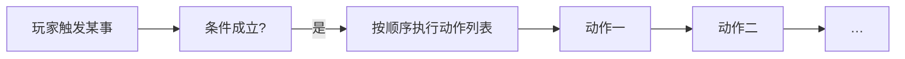

# 怎么编排动作

玩家摸到城隍庙的香炉、任务进行到某一步、遭遇里选了「硬闯」——背后都是一串 **动作**：游戏在这一刻**要发生的事**。

动作不是某一块面板独有的，而是贯穿任务、场景、热区、图对话、过场、遭遇、小游戏结算的**通用编排方式**。这一页教你像排折子戏一样，把「然后发生什么」一项项列清楚。

## 动作是什么

**大白话：** 动作 = 游戏立刻或稍后执行的一条指令。例如：

- 播一段对白
- 给玩家一个物品
- 把某个 **[旗标](../../reference/glossary)** 设为真
- 切换到雾津码头场景
- 播放音效或动效

你在面板里看到的「结果动作」「进入时动作」「完成时动作」等列表，都是同一种动作编辑器，只是**挂在不同的地方**。

---

## 在哪编排动作

常见挂载点——想到「这时要发生啥」，就来对应面板找动作列表：

| 你想… | 去哪找动作列表 |
|---|---|
| 玩家走进区域时 | [场景](../panels/scene) · 区域 / 热区 |
| 任务推进或完成时 | [任务](../panels/quest) |
| 遭遇里选某个选项后 | [遭遇](../panels/encounter) |
| 对白节点里执行副作用 | [图对话](../panels/dialogue-graph) |
| 过场时间轴某一刻 | [过场](../panels/cutscene) |
| 地图转场解锁时 | [地图](../panels/map) |
| 长按蓄力完成时 | [临场长按](../panels/pressure-hold) |

列表里每一行是一种动作类型，点开后填该项需要的参数（给谁、给什么、切到哪等）。

---

## 怎么加、改、删一条动作

以「玩家拾取雾津旧符后获得物品」为例：

1. 打开 **[场景](../panels/scene)**，选中对应 **拾取热区**。
2. 找到 **动作** 或 **拾取结果** 列表（名称因热区类型略有不同）。
3. 点 **添加**，在类型下拉里选 **给予物品**（或同类项）。
4. 填物品名（如「褪色的雾津符」）、数量等面板提供的字段。
5. `Ctrl+S` 保存，`F5` 预览里走过去拾取验证。

改顺序：列表通常可 **上移 / 下移**。删除：选中该条点 **删除**。想复制类似配置，部分面板支持 **复制条目** 再改参数。

---

## 动作可以套动作

有些动作本身是一「组」——里面还能再塞多条子动作，像折子戏里的「楔子」：

| 类型感 | 干什么 |
|---|---|
| **顺序执行一组** | 从上到下挨个做 |
| **按条件择一** | 满足哪条走哪条分支（条件在**外层**设，见 [怎么设条件](./conditions)） |
| **随机挑一支** | 多条里随机选一条执行 |
| **延时再执行** | 过一会儿再跑下一串 |

:::warning[常见误区：动作里不能塞条件]
「满足某条件才执行」**不能**写成某条动作里的隐藏开关。正确做法是：在面板提供的 **条件槽** 里写条件，或用 **按条件择一** 这类自带分支的动作。详见 **[怎么设条件](./conditions)**。
:::

---

## 雾津实例：关二狗对白后给任务道具

1. **[图对话](../panels/dialogue-graph)**：在关二狗说完关键台词的节点后，接一个 **执行动作** 类节点（或在该节点附加动作列表，视图结构而定）。
2. 添加动作：**给予物品** → 填「狗哨」；再添加：**更新任务进度** → 选对应任务。
3. 保存，`F5` 预览，完整走一遍对话，看背包和任务栏是否更新。

若要给玩家看系统提示，再加一条 **显示提示** 或 **播旁白** 类动作——具体名称在类型下拉里浏览，完整清单见 **[动作大全](../../reference/actions-catalog)**。

---

## 浏览全部动作类型

主编辑器左侧 **注册与扩展 → 动作总表** 面板是**只读目录**：按名字搜、看分类、跳转到哪里用到了它。编内容时不必先背完全部类型——在列表里 **添加** 时边搜边选即可。

需要查「这个类型到底干什么」时，打开 **[动作大全](../../reference/actions-catalog)** 速查。

---

## 保存时要注意

动作列表所在的父条目，若落在 **[危险区](./danger-zone)** 的重建范围，保存时只保留编辑器认识的字段。只通过动作编辑器填参数，别手写塞额外键。

---

## 接下来

- **[怎么设条件](./conditions)** —— 什么情况下才执行
- **[怎么写带引用的文本](./rich-text)** —— 对白、描述里的名字与物品引用
- **[动作大全](../../reference/actions-catalog)** —— 每个动作干什么、何时用
- **[主编辑器总览](../main-editor/overview)** —— 面板入口
