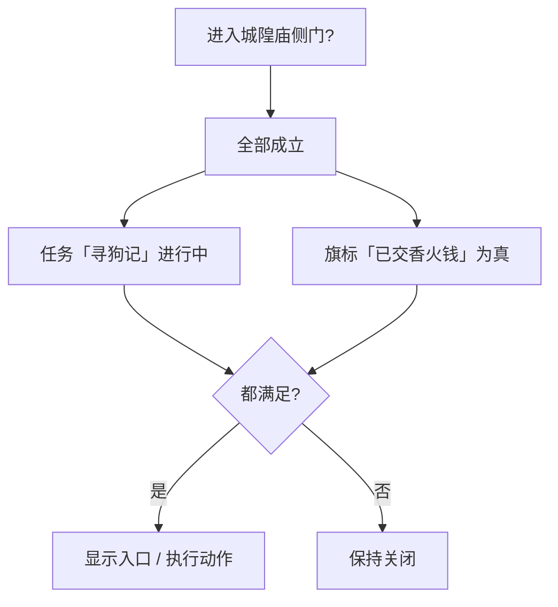

# 怎么设条件

关二狗肯不肯开口、城隍庙侧门是否解锁、遭遇里「硬闯」选项亮不亮——都取决于 **条件**：当前游戏状态**是否满足**你的要求。条件和动作是一对搭档：**条件**决定「能不能 / 要不要」，**动作**决定「发生什么」，见 **[怎么编排动作](./actions)**。读完这一页，你能看懂条件树的五种「查什么」、三种「怎么组合」，以及它在各面板里出现的所有位置。

## 这是什么（30 秒看懂）

**大白话：** 条件是一棵「是否成立」的判断树：

- **叶子**：查某一项状态——例如某个旗标是否为真、任务是否已完成、叙事是否停在某状态。
- **树枝**：把多条判断组合起来——**全部成立**、**任一成立**、**取反**。

就像城隍庙的门规:「香火钱交了，**并且**没在庙里喧哗」才放行——「交香火钱」「没喧哗」是两片叶子,「并且」是把它们捆在一起的树枝。

---

## 入门：手把手做第一次

以「城隍庙侧门仅任务进行中才能进」为例：

1. 打开 **[地图](../panels/map)**，选中「城隍庙」到「侧巷」的转场边（或场景里对应的转场热区）。
2. 找到 **解锁条件**，点 **编辑条件**。
3. 添加一个组合节点 **全部成立**：
   - 加一片叶子 **任务** → 选「寻狗记」→ 状态选 **进行中**
   - （可选）再加一片叶子 **旗标** → 选「已向庙祝打听」
4. `Ctrl+S` 保存，`F5` 运行预览：任务未开始时应该走不通；接下任务后再试一次，确认变得能走通。

改条件同理：选中某片叶子或某个组合节点可以**删除**、**改类型**、调整挂在哪一层。养成习惯——**改完条件必须 `F5` 验证两种状态**（满足 / 不满足）都对。

---

## 进阶：每一项都讲透

### 在哪设条件

条件**独立**出现在各面板的「条件」槽里，**不**塞进某条动作内部：

| 你想… | 去哪设条件 |
|---|---|
| 任务能否被看见/接取 | [任务](../panels/quest) · 前置条件 |
| 任务怎样算完成 | [任务](../panels/quest) · 完成条件 |
| 地图转场是否解锁 | [地图](../panels/map) · 解锁条件 |
| 遭遇某选项是否可选 | [遭遇](../panels/encounter) · 选项条件 |
| 热区/NPC 是否出现 | [场景](../panels/scene) · 显示条件 |
| 区域是否触发 | [场景](../panels/scene) · 区域条件 |
| 图对话选项是否可点 | [图对话](../panels/dialogue-graph) · 选项需要条件 |
| 图分支往哪走 | [图对话](../panels/dialogue-graph) · 分支条件 |
| 物品动态描述用哪条 | [物品](../panels/item) · 动态描述条件 |
| 档案条目何时解锁 | [档案](../panels/archive) · 解锁条件 |
| 文档何时揭示 | [文档揭示](../panels/doc-reveal) · 揭示条件 |

界面里通常标为 **条件**、**需要**、**解锁条件**、**可见条件** 等，点开就是同一套条件编辑器。

### 五种叶子：查什么状态，怎么填

第一次打开条件编辑器，添加 **叶子** 时选类型：

| 叶子类型 | 判断什么 | 怎么填 | 雾津例子 |
|---|---|---|---|
| **旗标** | 某个旗标当前值 | 选或填旗标名；选比较符（等于、不等于、大于、小于、大于等于、小于等于）；填比较值，值里还可以插 **[富文本引用](./rich-text)** | 「玩家已见过关二狗」「好感度 ≥ 3」 |
| **任务** | 某条任务的进度状态 | 选任务；选状态：未接 / 进行中 / 已完成 | 「寻狗记」是否进行中 |
| **剧本** | 某条剧本线整体状态 | 选剧本；选阶段名与阶段状态；可选结局 | 「纸人线」是否推进到第二章 |
| **剧本行** | 剧本里更细的一行节拍 | 选剧本行；选未触发 / 已激活 / 已完成 | 「评书段」这一拍是否已经播完 |
| **叙事状态** | 叙事状态机是否停在某状态 | 选叙事图；选状态；选「已到达」 | 位面切换后叙事是否已进入「夜探」状态 |

拼写必须与游戏里登记的一致——旗标名、任务 id 这些要跟对应面板里登记的名字对得上。**编辑器不一定当场报错**，写错了通常会**静默不成立**（条件永远判否），保存前务必用 `F5` 预览验证一遍。

### 三种组合：怎么搭逻辑

| 组合 | 意思 | 例子 |
|---|---|---|
| **全部成立** | 每一条子条件都得满足 | 任务进行中 **且** 旗标为真 |
| **任一成立** | 至少一条满足即可 | 持有道具甲 **或** 持有道具乙 |
| **取反** | 子条件不成立时才算成立 | **未**完成某任务 |

组合可以嵌套，像括号层层套叠——「全部成立」里再放一个「任一成立」，都没问题。但**嵌套深度有上限**（属于比较宽裕的量级，日常内容基本用不到）；如果你发现自己的条件树绕得数不清有几层，多半说明该拆成多个旗标，或者把逻辑挪到任务/剧本结构里去承担，而不是硬堆一棵超级复杂的树。

### 分支节点的特殊口径：图对话里有两种写法

**图对话**的「分支」节点，条件填法上有两种模式：

- **结构化条件树**：和上面五种叶子完全一样，功能最全，能表达任意复杂逻辑。
- **内联简化写法**（仅部分分支支持）：只支持「旗标」「任务」「剧本」三类做简单的与运算，填起来更快，但表达力有限。

新内容建议优先用结构化树；只是简单二选一的场合，用内联写法能省点操作。

### 条件之间怎么互相搭配、和其它系统联动

- **旗标类叶子的比较值** 可以插富文本引用（`[flag:…]` 等），让条件判断和动态文案保持同一份数据源，不用两处各写一遍。
- 任务的 **前置条件** 和 **完成条件** 是两套独立的树——前者决定「能不能接」，后者决定「怎样算交差」，别把两者混在一起编。
- 地图解锁条件、遭遇选项条件、图对话分支条件，本质上用的都是同一套控件；换面板不用重新学。

### 操作步骤：从零搭一棵稍微复杂的树

以「遭遇里『硬闯』选项，需要持有某规矩层，且未被庙祝盯上」为例：

1. 打开 **[遭遇](../panels/encounter)**，选中对应选项，点 **条件**。
2. 加一个 **全部成立** 组合：
   - 叶子 **旗标** → 「庙祝起疑」→ 等于 → 否
   - 叶子 **任务**（或改用旗标，视你的规矩记录方式而定）→ 判断是否已拿到对应规矩层
3. 保存，`F5` 预览：分别在「持有/不持有」「起疑/不起疑」两种存档状态下各走一遍，确认「硬闯」选项该亮的时候亮、该灰的时候灰。

---

## 危险区与边界

- 条件挂在父条目上时，父条目若属于 **[危险区](./danger-zone)** 的重建范围，保存会按编辑器格式整段重写。只通过条件编辑器操作，避免手写额外字段。
- 条件编辑器**不做拼写校验**——旗标名、任务 id 写错，通常表现为条件永远不成立，而不是报错弹窗，容易被误当成「逻辑有问题」，实际是「名字对不上」。
- 图对话分支的内联简化写法**表达力有限**（只支持三类叶子的与运算）；需要「任一成立」「取反」或引用剧本行/叙事状态时，必须换成结构化条件树。
- 嵌套虽然支持较深的层数，但过深的树不利于维护、也容易在改动时漏掉某个分支——遇到这种情况优先考虑拆任务或增加旗标简化逻辑，而不是继续往深处叠。

---

## 常见问题

**条件明明应该成立，游戏里却没生效，怎么排查？**

先查拼写：旗标名、任务名/id 是否和登记的完全一致，包括大小写。其次确认「全部成立」和「任一成立」有没有选反——很容易把「且」当成「或」填。改完务必 `F5` 用两种存档状态各走一遍。

**「全部成立」和「任一成立」该怎么选？**

需要**同时满足多个条件**才行，用「全部成立」；只要**任意一个满足**就行，用「任一成立」。想表达「不满足某条件」，用「取反」包一层，而不是硬凑一个相反的旗标。

**条件树能不能复制到别的地方直接用？**

条件树本身没有跨面板复制粘贴的入口；相同逻辑要在多处使用，建议先想清楚能不能提炼成一个旗标，让多处条件都判断这一个旗标，而不是到处手动重建同一棵树。

**图对话分支该用结构化树还是内联写法？**

简单的二选一（比如只判断一个旗标）用内联写法更快；需要「任一成立」「取反」，或者要判断剧本行、叙事状态，必须用结构化树，内联写法覆盖不到。

**条件改完要验证到什么程度？**

至少覆盖「成立」和「不成立」两种状态各走一次运行预览。牵扯多个叶子的组合条件，建议把每个叶子单独触发一次，确认没有哪一片叶子其实没生效。

---

## 接下来

- **[怎么编排动作](./actions)** —— 条件成立后发生什么
- **[条件类型速查](../../reference/conditions-catalog)** —— 每类叶子判断细节
- **[怎么写带引用的文本](./rich-text)** —— 旗标值也能插进文案里
- **[术语表 · 旗标](../../reference/glossary)** —— 旗标是什么
- **[主编辑器总览](../main-editor/overview)**
