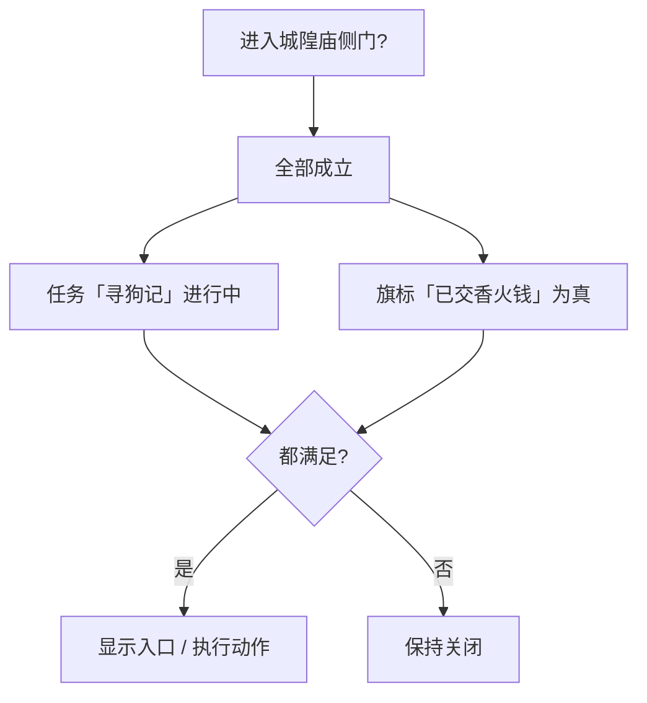

# 怎么设条件

关二狗肯不肯开口、城隍庙侧门是否解锁、遭遇里「硬闯」选项亮不亮——都取决于 **条件**：当前游戏状态**是否满足**你的要求。

条件和动作是搭档：**条件**决定「能不能 / 要不要」，**动作**决定「发生什么」。这一页只讲条件怎么设；动作见 **[怎么编排动作](./actions)**。

## 条件是什么

**大白话：** 条件是一棵「是否成立」的判断树：

- **叶子**：查某一项状态——例如某个旗标是否为真、任务是否已完成、叙事是否停在某状态。
- **树枝**：把多条判断组合起来——**全部成立**、**任一成立**、**取反**。

---

## 在哪设条件

条件**独立**出现在各面板的「条件」槽里，**不**塞进某条动作内部：

| 你想… | 去哪设条件 |
|---|---|
| 任务可被接取 | [任务](../panels/quest) · 前置条件 |
| 地图转场未解锁 | [地图](../panels/map) · 解锁条件 |
| 遭遇某选项可见 | [遭遇](../panels/encounter) · 选项条件 |
| 规矩是否生效 | [规矩](../panels/rule) 相关条目 |
| 图分支往哪走 | [图对话](../panels/dialogue-graph) · 分支条件 |

界面里通常标为 **条件**、**需要**、**解锁条件**、**可见条件** 等，点开就是同一套条件编辑器。

---

## 五种叶子：查什么状态

第一次打开条件编辑器，添加 **叶子** 时选类型：

| 叶子类型 | 判断什么 | 雾津例子 |
|---|---|---|
| **旗标** | 某个旗标当前值 | 「玩家已见过关二狗」 |
| **任务** | 任务进度状态 | 「寻狗记」是否进行中 / 已完成 |
| **剧本** | 剧本线状态 | 某条剧本阶段是否激活 |
| **剧本行** | 剧本里某一行的状态 | 特定剧情节拍是否已触发 |
| **叙事状态** | 叙事状态机停在何处 | 位面切换后的叙事节点 |

选中类型后，在下拉或输入里指定**查哪一个**（旗标名、任务 id 等）。拼写要和对游戏里登记的一致，错了会静默不成立——保存前用 `F5` 预览验证。

---

## 三种组合：怎么搭逻辑

| 组合 | 意思 | 例子 |
|---|---|---|
| **全部成立** | 每一条子条件都得满足 | 任务进行中 **且** 旗标为真 |
| **任一成立** | 至少一条满足即可 | 持有道具甲 **或** 持有道具乙 |
| **取反** | 子条件不成立时才算成立 | **未**完成某任务 |

组合可以嵌套，像括号的层层套叠，但不宜过深——逻辑太绕时，考虑拆成多个旗标或简化任务结构。嵌套有深度上限，极端复杂树建议拆任务。

---

## 操作步骤示例：侧门仅任务进行中可进

1. 打开 **[地图](../panels/map)**，选中「城隍庙」到「侧巷」的转场边。
2. 找到 **解锁条件**，点 **编辑条件**。
3. 添加组合 **全部成立**：
   - 叶子 **任务** → 选「寻狗记」→ 状态 **进行中**
   - （可选）再 ADD 叶子 **旗标** → 「已向庙祝打听」
4. `Ctrl+S` 保存，`F5` 预览：任务未完成时应走不通，推进任务后再试。

---

## 条件和动作的分工

| 需求 | 用条件 | 用动作 |
|---|---|---|
| 选项灰掉不可点 | 选项的 **可见/可用条件** | — |
| 点选项后给物品 | — | **给予物品** 动作 |
| 满足 A 则播对白 B，否则播 C | 分支上的条件 | 各分支挂不同动作；或用 **按条件择一** 动作 |

:::danger[别把条件写进动作参数里]
动作编辑器**没有**「如果…则…」的通用条件框。「满足条件才执行」请用面板上的条件槽，或 **[按条件择一](./actions)** 类动作。
:::

---

## 保存与验证

条件挂在父条目上时，父条目若属于 **[危险区](./danger-zone)** 重建范围，保存会按编辑器格式重写。只通过条件编辑器操作，避免手写额外字段。

改完务必 **`F5` 预览**，用两种存档状态各走一遍（满足 / 不满足），确认分支符合预期。

---

## 接下来

- **[怎么编排动作](./actions)** —— 条件成立后发生什么
- **[条件类型速查](../../reference/conditions-catalog)** —— 每类叶子判断细节
- **[术语表 · 旗标](../../reference/glossary)** —— 旗标是什么
- **[主编辑器总览](../main-editor/overview)**
