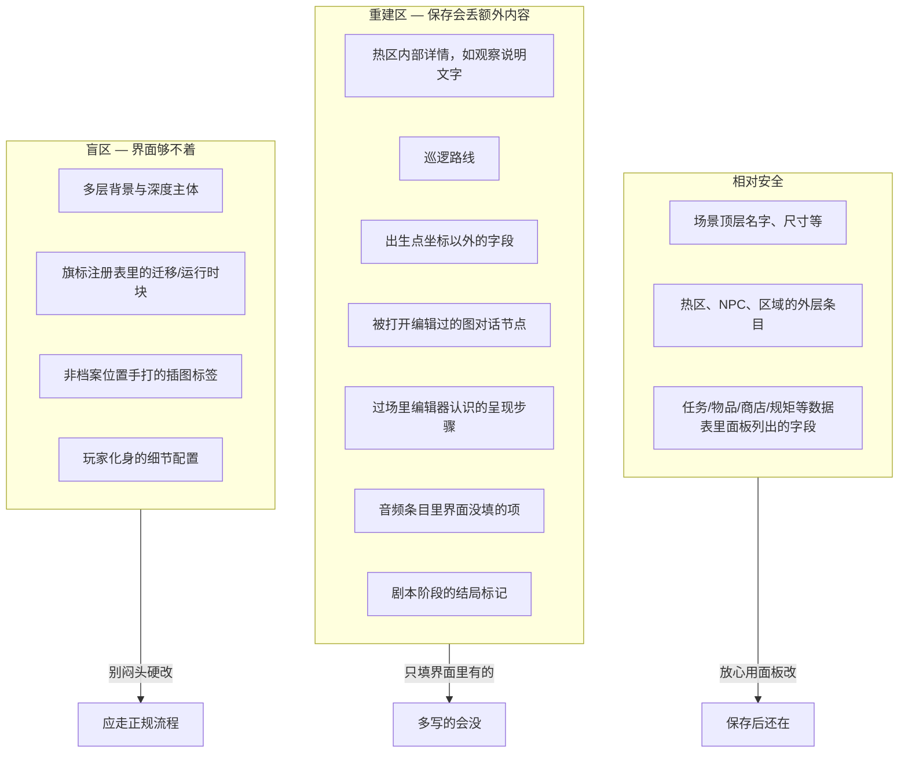

# 危险区：哪里改了会丢

在雾津编册子时，有些页你可以随意涂改；有些页编辑器保存时会**整页誊写**——只保留它认得下的字句，多写的旁注一律抹掉；还有些角落，编辑器压根没有笔可以伸进去，只能靠别的工具或手改。搞不清这几层差别，辛苦手写的细节可能一夜归零，或者做出「游戏能跑、同事却维护不了」的内容。

这一页用**用户能感知的后果**讲清两件事：**重建区**（保存会丢）和**盲区**（界面根本改不到）。读完你能自己判断「我现在要改的这块，安不安全」。

## 这是什么（30 秒看懂）

**大白话：** 主编辑器每块面板负责维护数据的**一部分**结构。你点开面板、填好界面上给出的框、点保存——编辑器只会把**它认识的那些字段**重新写一遍。如果某处数据里躺着一个面板从没提供过输入框的内容（不管是谁手写塞进去的），保存时大概率被当成「不认识的旧内容」清掉。

三种局面：

| 局面 | 意思 | 你的应对 |
|---|---|---|
| **相对安全** | 面板界面上看得见、填得到的字段 | 放心用面板改、保存 |
| **重建区** | 保存时这一小块会被**整段按面板认识的格式重写** | 只填面板提供的框，别指望手写的额外内容能留住 |
| **盲区** | 游戏运行时认，但主编辑器**没有任何入口**能改 | 换专项工具，或走升级流程，别自己闷头写 |

---

## 入门：手把手判断一次

拿到一个新需求时，按这几步走一遍，基本就能判断安全等级：

1. **打开对应面板，找这个字段在不在界面上。** 不在，先看是不是要换别的专项工具（比如场景深度、玩家化身各有自己的面板）。
2. **在，就用面板的输入框正常填。** 填完 `Ctrl+S` 保存。
3. **保存后重新打开这个面板，看刚填的内容还在不在。** 这一步很关键——重建区的坑往往是「当场看着没事，下次开面板才发现丢了别的东西」。
4. **拿不准某块具体是重建区还是盲区，查 [可编辑面参考](../../reference/danger-zone)**——按面板列出了每一块的具体后果。

:::danger[雾津实例]
你在城隍庙场景给「香炉」热区手写了一段插图标签，但场景面板的这个字段根本没有插图相关的按钮或说明。保存场景后再打开，这段标签大概率不见了——因为它落在了热区详情的重建区里。正确做法是把插图内容放进 **[档案](../panels/archive)** 或 **[叠图](../panels/overlay)** 面板登记，再在认插图的地方引用，详见 **[怎么写带引用的文本](./rich-text)**。
:::

---

## 进阶：重建区与盲区，各处都有哪些坑

### 重建区：保存时整段重写

**什么意思：** 你用某块面板改完点保存，编辑器会把那一小段数据**按它认识的格式重新写一遍**。界面上从没出现过的额外内容，不会一起带走——不管这段内容是别人手写的，还是你自己不小心留下的。

**常见的重建区，各面板都有自己的一份：**

- **场景**：热区「观察」详情里没有输入框的说明文字；NPC 巡逻路线（面板只认路线点、速度、走路动画）；出生点（只留横纵坐标）。
- **图对话**：**被你点开编辑过**的节点，保存后按编辑器格式整段重建——没动过的节点原样保留，不受影响。
- **过场**：时间轴上编辑器**认识**的呈现步骤（淡入淡出、字幕、对白等），多写的字段会被清掉；过场的动作步骤本身也只认白名单内的类型，见 **[怎么编排动作](./actions)**。
- **音频**：每条音效/BGM 保存时通常**只留文件路径**，音量、循环等界面没提供输入框的项会被丢。
- **剧本**：阶段表里的「结局」标记目前没有对应界面，保存会丢。
- **档案**：切换条目或子类型时若**没先应用**当前编辑，这次改动会直接丢；书籍的「页」只能加不能删；人物「印象」同样只能加不能删单条。
- **物品**：动态描述**只能新增条目，不能删除单条**——想去掉一条只能接受它继续留着，或联系工具维护者。

**该怎么办：**

1. **只通过面板填面板里有的项**，别往数据里偷偷加「编辑器不认识的旁注」。
2. 改之前想清楚：这块是不是重建区？不确定就查 **[可编辑面参考](../../reference/danger-zone)**（逐面板后果清单）。
3. 确实需要保存自定义内容时，先找负责工具的同事走**升级流程**——给面板加支持，而不是手写赌运气。

### 盲区：界面改不到的地方

**什么意思：** 游戏运行时**认得**某些数据，但主编辑器**没有任何按钮、输入框**去维护它们——不是编辑器忘了显示，是压根没做这块的编辑能力。

**常见的盲区：**

- 场景的多层背景与深度碰撞主体——要用 **[场景深度](../render-domain/scene-depth-editor)** 专项工具，主编辑器的场景面板管不到这层。
- 旗标注册表里「迁移」「运行时」相关的整块——界面完全不显示，需要走专门流程处理。
- 玩家化身的详细配置——全局配置面板管不到细节，要用专门的 **[玩家化身](../panels/avatar)** 面板。
- 富文本里的插图标签 `[img:…]`——**只有档案面板**提供插入按钮，别处手打的编辑器不会校验、也不引导，见 **[怎么写带引用的文本](./rich-text)**。

**该怎么办：**

1. 发现需求落在盲区，**别一个人闷头改底层数据**——容易改出「游戏能跑，同事却在界面里维护不了」的局面。
2. 用对的专项工具（见 **[工具速查表](../tool-matrix)**），或者向负责的同事提需求，补上编辑器支持。
3. 完整盲区列表见 **[可编辑面参考](../../reference/danger-zone)**。

### 相对安全：可以放心用面板改

并非处处是雷。这些通常可以安心在面板里改、保存：

- **场景顶层**：名字、世界尺寸、背景音乐、滤镜、行走速度等。
- **热区、NPC、区域的外层条目**：类型、位置、引用谁——用面板控件填的都会留住。
- **任务、物品、商店、规矩**等数据表：只改面板里出现的列，不额外塞字段。
- **遭遇、地图、文档揭示**：面板控件内填写的内容都可以正常保存。

:::tip[一句话记]
**面板里能看见、能填的 → 一般安全。面板里没有的 → 别手写塞，要么换工具，要么走升级。**
:::

### 主动删除也算一种危险区

除了「重建时丢弃未知字段」，还有一类是编辑器**主动清理过时结构**——比如切换区域类型时清空进入/离开动作、任务面板保存时去掉过时的单一后继任务字段。这类改动不是意外，是编辑器在帮你去旧换新，但如果你还依赖那些旧字段（比如别处手写引用了它），保存后引用会失效，动手前留意面板的提示或参考文档里的说明。

---

## 危险区与边界（怎么判断优先级）

| 我要做… | 先问自己… | 去哪查 |
|---|---|---|
| 改对白 | 节点是不是在图对话里改？改过的节点会整段重建，改完记得走一遍预览 | [图对话](../panels/dialogue-graph) |
| 摆 NPC | 巡逻、对话引用是不是都用面板填？ | [场景](../panels/scene) |
| 插图进正文 | 是不是档案条目？ | [档案](../panels/archive) · [富文本](./rich-text) |
| 多层景深 | 场景面板够不够？需不需要场景深度工具？ | [场景深度](../render-domain/scene-depth-editor) |
| 加新旗标 | 是不是在旗标面板里加，而不是碰迁移/运行时块？ | [旗标](../panels/flags) |
| 编排一串动作 | 这个动作类型在当前面板/过场里能不能选到？ | [怎么编排动作](./actions) |

重建区和盲区哪个更麻烦？**盲区**通常更麻烦——重建区至少你能在编辑器里看到「这块保存了」，只是内容变少；盲区是你连改的地方都找不到，容易走偏去手写维护不了的数据。遇到盲区优先升级或找专项工具，别绕开编辑器蛮干。

---

## 常见问题

**为什么我改的东西保存后就没了？**

先确认这块是不是重建区——面板里没提供输入框的内容，保存时会被当成「不认识的旧内容」清掉。查 **[可编辑面参考](../../reference/danger-zone)** 对照你改的这块面板。

**为什么这个字段在界面里完全找不到？**

大概率是盲区——游戏认这个数据，但当前面板没做这块的编辑能力。看看有没有对应的专项工具（如场景深度、玩家化身），没有就需要向负责的同事提需求补支持。

**能不能自己在数据里手写加一个字段，让功能先跑起来？**

不建议。就算当场能跑，只要有人再打开对应面板保存一次，这个手写字段就可能被整段重写抹掉——变成「你能跑、别人维护不了」的坑。真有这类需求，走升级流程让面板正式支持它。

**重建区会不会影响我没碰过的内容？**

一般不会。重建通常只发生在**你实际打开并保存过**的那一小块（比如某个具体的图对话节点、某条音效配置），没有点开编辑的部分原样保留。

**怎么确认自己刚做的改动是安全的？**

保存后**重新打开**这块面板，看内容是不是完整——尤其是你手动加过的细节。再配合 `F5` 运行预览，实际走一遍验证效果，而不是只看编辑器界面上「看起来还在」。

**升级流程具体找谁？**

这一层因项目分工而异——一般是找负责对应编辑器/工具的同事，说明你的需求（哪块数据、想加什么字段），由他们评估是否给面板补上编辑入口。

---

## 相关

- **[可编辑面参考](../../reference/danger-zone)** —— 逐面板：能改什么、会丢什么、够不着什么
- **[怎么编排动作](./actions)** · **[怎么设条件](./conditions)** · **[怎么写带引用的文本](./rich-text)** —— 三个通用控件各自的危险区细节
- **[主编辑器总览](../main-editor/overview)** —— 30 块面板入口
- **[出问题怎么办](../../tutorials/troubleshooting)** —— 改了没生效、东西不见了
