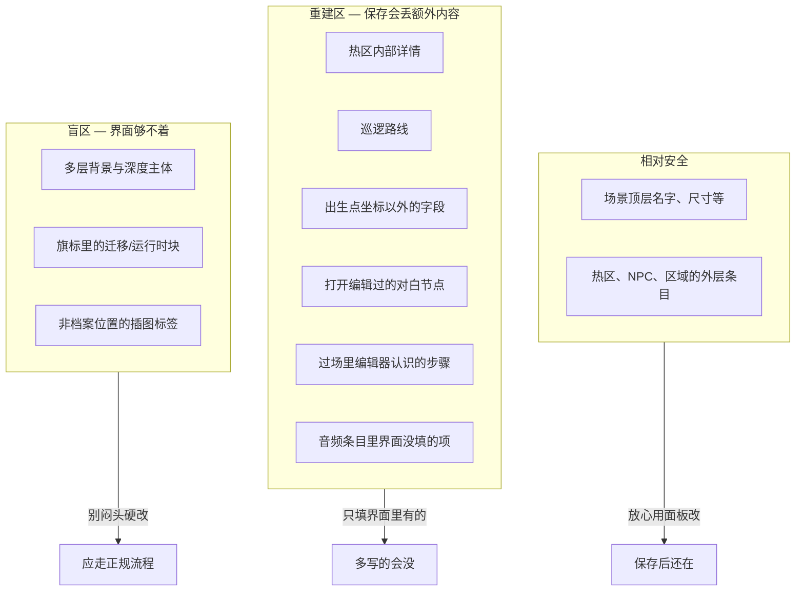

# 危险区：哪里改了会丢

在雾津编册子时，有些页你可以随意涂改；有些页编辑器保存时会**整页誊写**——只保留它认得下的字句，多写的旁注一律抹掉。搞不清差别，辛苦手写的细节可能一夜归零。

这一页用**用户能感知的后果**讲清两件事：**重建区**（保存会丢）和**盲区**（界面根本改不到）。

## 两层含义，一张图

---

## 重建区：保存时整段重写

**什么意思：** 你用某块面板改完点保存，编辑器会把那一小段数据**按它认识的格式重新写一遍**。界面上没出现过的额外内容，不会一起带走。

**你会遇到什么：**

- 热区「观察」里的说明文字，若面板没给你填的地方，你手写塞进去的，开面板保存后**消失**。
- NPC 巡逻路线，面板只认路线点、速度、走路动画——多写的字段**没了**。
- 出生点，面板只保留横纵坐标，别的**没了**。
- 图对话里**被你点开改过的节点**，保存后按编辑器格式重建，未知内容**没了**。
- 过场步骤、音频配置等同理——**只留界面里填得下的**。

**该怎么办：**

1. **只通过面板填面板里有的项**，别往数据里偷偷加「编辑器不认识的旁注」。
2. 改之前想清楚：这块是不是重建区？不确定就查 **[可编辑面参考](../../reference/authoring-surface)**（逐面板后果清单）。
3. 必须存自定义内容时，先跟负责工具的同事走**升级流程**——给面板加支持，而不是手写赌运气。

:::danger[雾津实例]
你在城隍庙场景给「香炉」热区手写了一段 `[img:…]` 插图标签，但场景面板根本没插图按钮。保存场景后，那段标签可能被抹掉。插图应走 **[档案](../panels/archive)** 或 **[叠图](../panels/overlay)** 面板登记，再在认插图的地方引用。
:::

---

## 盲区：界面改不到的地方

**什么意思：** 游戏运行时**认得**某些数据，但主编辑器**没有任何按钮、输入框**去维护它们。

**你会遇到什么：**

- 场景多层背景、深度碰撞主体——要靠 **[场景深度](../render-domain/scene-depth-editor)** 专项工具，主编辑器的场景面板管不全。
- 旗标注册表里「迁移」「运行时」相关块——面板不显示，界面改不了。
- 玩家化身详细配置——有专门的 **[玩家化身](../panels/avatar)** 面板，全局配置里管不全。
- 富文本里的 `[img:…]` 插图——**只有档案面板**提供插入按钮；别处手打标签，界面不会帮你检查。

**该怎么办：**

1. 发现需求落在盲区，**别一个人闷头改底层数据**——容易改出游戏能跑、同事却维护不了的局面。
2. 用对的专项工具（见 **[工具速查表](../tool-matrix)**），或提需求补编辑器支持。
3. 完整盲区列表见 **[可编辑面参考](../../reference/authoring-surface)**。

---

## 相对安全：可以放心用面板改

并非处处是雷。这些通常可以安心在面板里改、保存：

- **场景顶层**：名字、世界尺寸、背景音乐、滤镜、行走速度等。
- **热区、NPC、区域的外层条目**：类型、位置、引用谁——用面板控件填的都会留住。
- **任务、物品、商店、规矩**等数据表：只改面板里出现的列。

:::tip[一句话记]
**面板里能看见、能填的 → 一般安全。面板里没有的 → 别手写塞，要么换工具，要么走升级。**
:::

---

## 动手前的检查清单

| 我要做… | 先问自己… | 去哪查 |
|---|---|---|
| 改对白 | 节点是不是在图对话里改？ | [图对话](../panels/dialogue-graph) |
| 摆 NPC | 巡逻、对话引用是不是都用面板填？ | [场景](../panels/scene) |
| 插图进正文 | 是不是档案条目？ | [档案](../panels/archive) · [富文本](./rich-text) |
| 多层景深 | 场景面板够不够？ | [场景深度](../render-domain/scene-depth-editor) |
| 加新旗标 | 是不是在旗标面板里加？ | [旗标](../panels/flags) |

---

## 接下来

- **[可编辑面参考](../../reference/authoring-surface)** —— 逐面板：能改什么、会丢什么、够不着什么
- **[主编辑器总览](../main-editor/overview)** —— 30 块面板入口
- **[出问题怎么办](../../tutorials/troubleshooting)** —— 改了没生效、东西不见了
