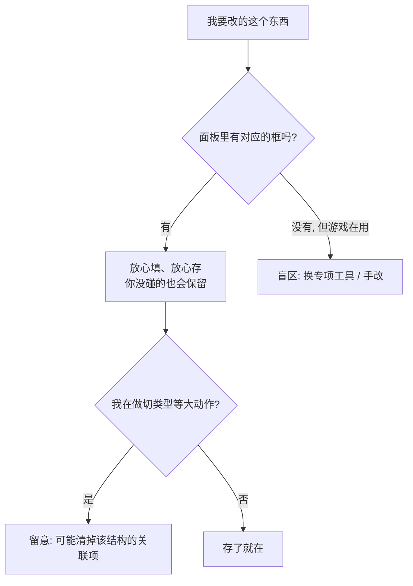

# 危险区：改动前要懂的三件事

编辑器保存很稳：你在面板里填的东西会存住，**你没碰的字段也不会被清掉**。真正需要你心里有数的，只有下面**三类**，都不复杂。

## 这是什么（30 秒看懂）

主编辑器每块面板管游戏数据的一部分。你点开面板、填好界面上的框、保存——你改的会写回去，你没碰的字段也照样保留。

要留心的就三种局面：

| 局面 | 意思 | 你的应对 |
|---|---|---|
| **盲区** | 游戏运行时用得到，但**主面板没有入口**改它（编辑器会保留，只是你在这儿编辑不了） | 换对应的专项工具，或手改 / 找维护者 |
| **显式破坏性操作** | 你**主动做了某个动作**（比如切换区域类型）才触发的清理 | 知道后果，想好再点 |
| **废弃字段清理** | 保存时编辑器顺手删掉一些**运行时早就不用的旧字段** | 不用管，这是让数据变干净 |

---

## 入门：一步判断安不安全

拿到需求，就问一句话：**这个东西，面板里有没有对应的框？**

1. **有** → 用面板正常填、`Ctrl+S` 保存。你填的会在，你没碰的字段也会保留。
2. **没有，但游戏里确实有这个效果** → 落在**盲区**了，别在这儿硬找。看是不是要换专项工具（场景深度、玩家化身各有自己的地方），或手改 / 找维护者。
3. **我要做"切换类型""改 id"这类大动作** → 先看下方「显式破坏性操作」，想好再点。

:::tip[雾津实例：一个真盲区]
你想给城隍庙场景加**多层背景**（前景纸幡随镜头飘、后景庙墙不动）。在场景面板翻遍了也找不到"加背景层"的地方——这不是编辑器丢了你的数据，是**多层背景本来就不在这个面板管**，属于盲区。正确做法：用 **[场景深度工具](../render-domain/scene-depth-editor)** 来做多层背景与遮挡。（顺带：场景面板那个「重新导入背景」按钮别用来换多层背景的图，它会把多层压成单层。）
:::

---

## 进阶：三类逐个说清

### 一、盲区：主面板改不到的活字段

游戏运行时**认得**这些数据，但主编辑器对应面板**没做**编辑入口。它们**不会丢**，只是你得换地方改：

- **场景的多层背景、深度 / 遮挡碰撞主体** → 用 **[场景深度工具](../render-domain/scene-depth-editor)**。
- **玩家化身**的外观细节 → 用 **[玩家化身面板](../panels/avatar)**，全局配置面板管不到细节。
- **旗标的「迁移」「运行时」块** → 暂无界面，手改或找维护者。
- **实体像素密度匹配** → 暂无界面，手改。

盲区不是"危险"，是"缺口"——别一个人闷头去手写底层数据（容易做出"游戏能跑、同事在界面里维护不了"的东西），用对工具或提需求补上编辑器支持。

### 二、显式破坏性操作：你主动点才会发生

- **把区域从「标准」改成「深度地板」** → 会清掉它的进入 / 停留 / 离开动作（还有气味）。深度地板区本就不触发这些，正常用没事；但**切过去再切回来，原来的动作找不回**。
- **改滤镜 id、位面「现世」的 id** → 只读，改名等于删了重建。
- **删小游戏实例** → 登记表里没了，但磁盘上旧文件不自动删，需手动清。

这些都是"你按了才会发生"的，知道后果就不会误伤。

### 三、废弃字段清理：不是丢你的东西

保存时编辑器会顺手删掉一些**旧格式字段**——它们运行时早就不用了，清掉只会让数据更干净：

- NPC 旧对白引用、区域旧矩形坐标 / 规矩槽位
- 任务旧式「单一下一任务 id」（现在都用连线格式）
- 过场顶层旧「命令列表」（现在用「步骤」）
- 规矩几个旧字段、转盘一个废弃的「同屏气泡数上限」

---

## 常见问题

**我改的东西保存后会不会丢？**

不会。你在面板里填的、以及你没碰的其它字段，都会保留。会"变没"的只有两种：你**主动**做了切换类型这类破坏性操作，或者那本来就是**废弃字段**被清理。

**为什么某个字段在界面里完全找不到？**

大概率是盲区——游戏认这个数据，但当前面板没做这块编辑能力。看有没有对应专项工具（场景深度、玩家化身），没有就向维护者提需求。数据本身不会因此丢，只是你在这儿改不了。

**能不能自己在数据里手写加个字段？**

面板里有对应功能就用面板；面板里没有（盲区），手写的东西编辑器多半会保留，但没有界面校验和引导，容易出维护不了的内容——更稳妥是走升级流程让面板正式支持。

**把区域改成「深度地板」要注意什么？**

它会清掉这个区域的进入 / 停留 / 离开动作。如果这个区域原本挂了剧情触发，切之前先确认不再需要，或把触发挪到别的标准区域。

---

## 相关

- **[危险区速查](../../reference/danger-zone)** —— 逐面板对照表
- **[怎么编排动作](./actions)** · **[怎么设条件](./conditions)** · **[怎么写带引用的文本](./rich-text)**
- **[主编辑器总览](../main-editor/overview)** —— 30 块面板入口
- **[出问题怎么办](../../tutorials/troubleshooting)**
