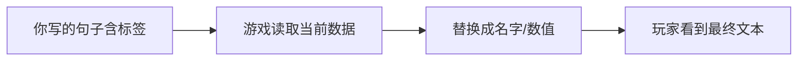

# 怎么写带引用的文本

雾津册子里的句子很少写死。「你」可能是玩家化身名，「那规矩」可能随进度变文案，物品名要对上背包里的登记——这类 **带引用的文本** 在主编辑器里到处出现：对白、物品描述、档案正文、任务说明。

这一页教你用 **`[标签:…]`** 写法，让运行时自动换成对的词。

## 什么是富文本引用

**大白话：** 在句子中插一段特殊标记，游戏播放时换成**当前**对应的名字、数值或链接，而不是你手打的死字。

例如档案里写：

> 据说 [物品:狗哨] 能引开雾津巷口的野狗——[NPC:关二狗] 从不承认他丢过。

玩家读到时，「狗哨」「关二狗」会从游戏里登记的名称解析出来；你改物品显示名，全文自动跟着变。

---

## 八种常用引用标签

输入格式统一为 **`[类型:标识]`**（界面里常有 **插入** 按钮帮你生成，不必死背）：

| 标签 | 引用什么 | 例子 |
|---|---|---|
| `[string:…]` | 文本库里的条目 | 固定系统用语 |
| `[flag:…]` | 旗标当前值 | 显示某进度相关的文字 |
| `[item:…]` | 物品 | `[item:dog_whistle]` → 狗哨 |
| `[npc:…]` | 角色 | `[npc:guan_ergou]` → 关二狗 |
| `[player:…]` | 玩家相关 | 化身名、称谓 |
| `[quest:…]` | 任务 | 任务标题 |
| `[rule:…]` | 规矩 | 规矩条文摘要 |
| `[scene:…]` | 场景 | 场景显示名 |

完整语法与边界见 **[富文本标签速查](../../reference/text-tags)**。

---

## 在哪会遇到富文本框

| 面板 | 典型字段 |
|---|---|
| [图对话](../panels/dialogue-graph) | 台词 `text` |
| [物品](../panels/item) | 描述、动态描述 |
| [档案](../panels/archive) | 条目正文 |
| [任务](../panels/quest) | 任务说明 |
| [规矩](../panels/rule) | 规矩文本层 |
| [文本库](../panels/strings) | 分类下的字符串值 |

框边若有 **插入引用** 按钮，点选类型和条目即可插入，比手打不易错。

---

## 插图标签 `[img:…]` 的特殊规矩

正文里还能插 **`[img:短名]`** 显示图片，但：

- **只有 [档案](../panels/archive) 面板**提供插图插入按钮，最省心。
- 其它位置若手打 `[img:…]`，运行时可以显示，但编辑器**不会**帮你校验短名是否存在——属于 **[危险区](./danger-zone)** 里的盲区行为。
- 图片短名须先在 **[叠图](../panels/overlay)** 或资源流程里登记好。

雾津见闻录里配城隍庙线图，应在 **档案** 编辑器里用插图按钮插入；别在场景热区手写标签赌保存不丢。

---

## 操作示例：改关二狗一句台词

1. **[图对话](../panels/dialogue-graph)** → 选中关二狗的 `line` 节点。
2. 在 **台词** 富文本框里编辑。要把「狗哨」写成随物品名变的引用：点 **插入** → **物品** → 选「狗哨」。
3. 框里出现 `[item:…]` 片段，前后补上对白原文。
4. `Ctrl+S` 保存，`F5` 预览对话，确认显示名正确。

---

## 手打标识要注意

标签里的 **标识**（物品 id、NPC id 等）必须与游戏里登记的 **一致**。编辑器不一定当场报错，错 id 可能显示空白或 fallback。

**建议：**

- 优先用 **插入** 按钮，不从别处复制手打。
- 保存后 `F5` 预览必做。
- 工程若开了 JSON 语言服务的提示，留意红色波浪线（见 **[JSON 语言服务](../services/json-lang)**）。

---

## 和动作、条件的关系

- **富文本**只管「显示什么字」。
- **条件**管「要不要显示某选项 / 能不能进」。
- **动作**管「说完话后发生什么」。

一句对白可以只有富文本；是否出现该节点，由图上的条件或分支决定，见 **[怎么设条件](./conditions)**。

---

## 接下来

- **[富文本标签速查](../../reference/text-tags)** —— 每个标签怎么用
- **[档案面板](../panels/archive)** —— 带插图的长文
- **[叠图面板](../panels/overlay)** —— 插图短名登记
- **[危险区](./danger-zone)** —— 哪些文本保存会丢
