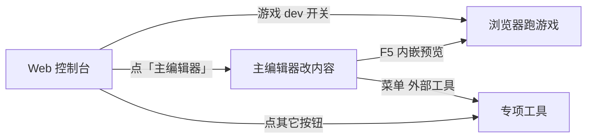

# Web 控制台

有时你站在雾津书案前，手里握着素材，却一时想不起该掀哪扇屏门——**Web 控制台**就是那块挂在墙上的 **工具仪表盘**：浏览器里一排按钮，把主编辑器、资源工具、模拟器、构建测试都收在一处。读完这一页，你能知道控制台适合在什么时候用、每个区域按钮大概管什么、以及它和主编辑器、和游戏本体之间是怎么配合的。

**改内容仍以主编辑器为主**；控制台负责「我不知道该开谁」和「我想一键跑起来」这两类需求。

## 这是什么（30 秒看懂）

**大白话：** 控制台是一个**不改内容**的启动台。它本身不提供编排对白、场景之类的编辑能力，只负责两件事——**帮你找到该开哪个工具**，以及**把起服、构建、测试这类不适合天天敲命令行的操作变成按钮**。



日常编纂的主线永远是：**打开主编辑器 → 改 → `F5` 验证**。控制台是这条主线之外，帮你「起服、构建、测试、换工具」的辅助台面。

---

## 入门：手把手打开一次

1. 在游戏仓库根目录，终端里敲：

```bash
./dev.sh console
```

2. 终端会打印出一个本地地址（形如 `http://localhost:xxxx`），用浏览器打开这个地址。
3. 页面加载出来后，你会看到一排工具按钮，顶部是菜单栏，下方分成「工具按钮区」「游戏 dev 开关」「构建/测试」「场景快捷入口」几块。
4. 想改内容，直接点 **主编辑器** 按钮，会另开一个进程/窗口进入主编辑器，接下来的编排操作和直接用命令打开主编辑器完全一样。
5. 用完后，关掉浏览器标签页**不会**自动停止后台服务；要彻底停控制台，回到当初敲命令的终端窗口按 `Ctrl+C`。

<div style={{margin: '1.5rem 0'}}>
<svg viewBox="0 0 720 280" xmlns="http://www.w3.org/2000/svg" role="img" aria-label="Web 控制台示意" style={{width: '100%', height: 'auto'}}>
  <rect x="20" y="20" width="680" height="50" rx="8" fill="#1a1712" stroke="#5a8a86" strokeWidth="1.5" />
  <text x="360" y="52" textAnchor="middle" fill="#e0a44e" fontSize="18" fontFamily="serif">Web 控制台</text>
  <rect x="40" y="90" width="120" height="36" rx="6" fill="#1f1810" stroke="#e0a44e" strokeWidth="1" />
  <text x="100" y="113" textAnchor="middle" fill="#f0e7d2" fontSize="12">主编辑器</text>
  <rect x="180" y="90" width="120" height="36" rx="6" fill="#1f1810" stroke="#3a2f20" strokeWidth="1" />
  <text x="240" y="113" textAnchor="middle" fill="#c9bda1" fontSize="12">资源浏览器</text>
  <rect x="320" y="90" width="120" height="36" rx="6" fill="#1f1810" stroke="#3a2f20" strokeWidth="1" />
  <text x="380" y="113" textAnchor="middle" fill="#c9bda1" fontSize="12">图对话</text>
  <rect x="460" y="90" width="120" height="36" rx="6" fill="#1f1810" stroke="#3a2f20" strokeWidth="1" />
  <text x="520" y="113" textAnchor="middle" fill="#c9bda1" fontSize="12">生产工作台</text>
  <text x="360" y="155" textAnchor="middle" fill="#8a7a5c" fontSize="12">… 更多工具按钮 …</text>
  <rect x="40" y="180" width="200" height="70" rx="8" fill="#161d1c" stroke="#5a8a86" strokeWidth="1" />
  <text x="140" y="210" textAnchor="middle" fill="#c9bda1" fontSize="13">游戏 dev 开关</text>
  <text x="140" y="232" textAnchor="middle" fill="#8a7a5c" fontSize="11">起 / 停开发服</text>
  <rect x="260" y="180" width="200" height="70" rx="8" fill="#161d1c" stroke="#3a2f20" strokeWidth="1" />
  <text x="360" y="210" textAnchor="middle" fill="#c9bda1" fontSize="13">构建 · 测试</text>
  <rect x="480" y="180" width="200" height="70" rx="8" fill="#161d1c" stroke="#3a2f20" strokeWidth="1" />
  <text x="580" y="210" textAnchor="middle" fill="#c9bda1" fontSize="13">场景快捷入口</text>
</svg>
</div>

:::tip[雾津小例子]
你今天要做的事是「给关二狗加一句新台词，再确认这句话在城隍庙场景里能触发」。这属于日常改内容，不需要控制台——直接 `./dev.sh editor` 开主编辑器，改完 `F5` 预览就够了。控制台更适合「我还没决定用哪个工具」或者「我想顺手打个包测试一下」这种场合。
:::

---

## 进阶：每一块区域讲透

### 什么时候用控制台，什么时候不用

| 情况 | 建议 |
|---|---|
| 日常改对白、场景、任务 | 直接 `./dev.sh editor` 开 **主编辑器**，不必绕控制台 |
| 不确定该用哪个专项工具 | 先开 **控制台**，看按钮说明再点 |
| 想一键起游戏、不嵌在编辑器里玩 | 控制台里的 **游戏 dev 开关** |
| 打包发布，或跑一遍全量测试 | 控制台的 **构建** / **测试** 区 |
| 已经在游戏里，想直接跳到某个场景/叙事点位 | 控制台的 **场景快捷入口** / 叙事跳转 |

:::tip[记不住就记这句]
**改东西 → 主编辑器。犯迷糊、想一键跑 → Web 控制台。**
:::

### 工具按钮区：每个按钮对应一件工具

控制台上一排按钮，每个对应一件编辑器或工具。点一下，会在新进程里打开对应窗口，效果和你在终端里敲对应的启动命令完全一样——控制台只是把命令行操作包成了按钮，方便记不住命令、或者不想开终端的场合。

常见按钮大致分这么几类：

| 类别 | 常见按钮 | 帮你干什么 |
|---|---|---|
| 内容编排 | **主编辑器**、**图对话** | 主编辑器是日常编内容的主战场；图对话是独立窗口版的图对话编辑，适合只想专注改一张对话图 |
| 生产质检 | **生产工作台** | 剧情验收、素材质检等生产向的多个 Tab |
| 资源与美术 | **资源浏览器**、**资源入库**、**图片缩放**、**滤镜工具** | 翻工程里的资源文件、把外部图/音频分类导入、批量改尺寸镜像、调画面滤镜 |
| 画面与光影 | **光照体积实验室**、**视差编辑器** | 烘焙光照体积、编辑多层视差场景 |
| 动画 | **动画预览** | 预览角色动画效果 |
| 叙事模拟 | **编年史模拟（v2 / v3）** | 叙事时间线模拟，检查大范围叙事走向 |
| 工程治理 | **治理台** | 技能与工作流治理 |

完整列表与每个工具的启动命令对照，见 **[工具速查表](../tool-matrix)** 和 **[工具打开方式](../launch-architecture)**。

:::note[不在按钮里的工具]
少数工具**没有**控制台按钮，例如 **视频转图集**、**文案管理**、**场景深度**、**通用图编辑器** 等——需要从 **主编辑器菜单 → 外部工具** 打开，或查 **[工具打开方式](../launch-architecture)** 里对应的启动方式。看不到按钮不代表工具不存在，先去这两个地方确认。
:::

### 游戏 dev 开关：单独跑游戏，不嵌在编辑器里

控制台可以 **启动 / 停止** 游戏开发服——就是浏览器里能直接玩的那一份雾津。

- 启动后，用终端或页面上提示的地址（常见 `http://localhost:5173` 起）在浏览器里玩。
- 端口被占用时会自动换下一个可用端口，以页面实际显示的地址为准，不要死记某个固定端口号。
- 这和主编辑器里 `F5` 内嵌预览是**同一套游戏数据**。两边容易搞混的地方是「改了但没保存」的状态——**改内容一定要先在主编辑器里保存**，再回浏览器刷新游戏，光靠切窗口看不到编辑器里未保存的改动。

### 构建与测试

- **构建**：打出一份可部署的游戏包，等同日常说的「正式打一版」。
- **测试**：跑工程里的自动化测试，确认数据与逻辑没有被最近的改动弄坏。

发布前，或者一次性改了大批量数据之后，建议构建和测试各走一遍，别只凭肉眼在预览里走几步就当验证完成。

### 场景快捷入口与叙事跳转

控制台还会根据当前工程数据，列出 **场景快捷入口**（读自地图与全局配置）和 **叙事 warp 入口**（开发用，快速跳到某个叙事位置）。

适合的场景：**游戏已经跑起来了**，你想直接跳进城隍庙试一下刚改过的热区，而不用从开头把寻狗记走一遍。这是控制台相比「从头玩一遍」最省时间的地方。

---

## 危险区与边界

- 控制台**不提供任何内容编辑能力**——它只是启动器，改场景、对话、任务这些内容，一律得回到主编辑器或对应专项工具里做，控制台本身没有面板可以填字段。
- 关掉控制台的浏览器标签页**不会**停止后台进程；忘记这一点容易在电脑上堆一堆没关掉的开发服，长期占着端口。用完记得回终端 `Ctrl+C` 收尾，或者用控制台/终端里对应的停止操作逐个关。
- 游戏 dev 开关起的游戏和主编辑器 `F5` 内嵌预览是**同一份数据**，但不是同一个「会话」——两边各自的浏览状态、页面刷新时机要分开看，别把「浏览器那边刷新了」误当成「编辑器这边也保存了」。

---

## 常见问题

**控制台打不开怎么办？**

确认终端里 `./dev.sh console` 命令正常跑起来、没有报错退出；再确认浏览器打开的地址和终端打印的一致。仍不行参考 **[出问题怎么办](../../tutorials/troubleshooting)**。

**点了某个工具按钮没反应？**

大概率是对应工具的启动进程需要几秒钟才能弹出窗口，稍等一下；如果确实没反应，回到终端看有没有报错信息，或者尝试直接用对应的启动命令手动开一次，排查是控制台的问题还是工具本身的问题。

**同一个按钮点了两次，会不会开出两个重复的工具？**

有可能——控制台按钮多数是「起一个新进程」，重复点击容易开出多个窗口或占用多个端口。已经开着的工具，直接切到那个窗口用，不必再点一次按钮。

**控制台里的游戏 dev 开关，和主编辑器 `F5` 内嵌预览是不是各玩各的？**

数据是同一份工程数据，但运行的是两个独立的浏览会话。改内容后要先在主编辑器里保存，两边各自刷新才能看到最新内容，别指望一边动、另一边自动同步画面。

**用完忘了关，会有什么后果？**

后台进程会一直占着端口和内存跑着。下次再开同样的工具，可能因为端口被占用而换到另一个端口，也可能干脆报错说端口已被占用。建议每次用完顺手在终端里 `Ctrl+C` 停掉，或整理一下开着的服务。

---

## 接下来

- **[主编辑器总览](../main-editor/overview)** —— 30 块面板
- **[工具速查表](../tool-matrix)** —— 全工具一览
- **[工具打开方式](../launch-architecture)** —— 每个工具怎么开
- **[教程：5 分钟跑起来](../../tutorials/intro)** —— 第一次启动
