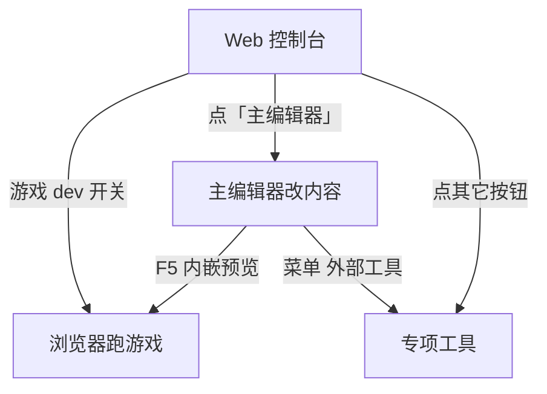

# Web 控制台

有时你站在雾津书案前，手里握着素材，却一时想不起该掀哪扇屏门——**Web 控制台**就是那块挂在墙上的 **工具仪表盘**：浏览器里一排按钮，把主编辑器、资源工具、模拟器、构建测试都收在一处。

**改内容仍以主编辑器为主**；控制台负责「我不知道该开谁」和「我想一键跑起来」。

## 怎么打开

在游戏仓库根目录：

```bash
./dev.sh console
```

终端会给出本地地址，用浏览器打开即可。关掉浏览器页不会自动关后台服务；要停控制台，在终端里 `Ctrl+C`。

<div style={{margin: '1.5rem 0'}}>
<svg viewBox="0 0 720 280" xmlns="http://www.w3.org/2000/svg" role="img" aria-label="Web 控制台示意" style={{width: '100%', height: 'auto'}}>
  <rect x="20" y="20" width="680" height="50" rx="8" fill="#1a1712" stroke="#5a8a86" strokeWidth="1.5" />
  <text x="360" y="52" textAnchor="middle" fill="#e0a44e" fontSize="18" fontFamily="serif">Web 控制台</text>
  <rect x="40" y="90" width="120" height="36" rx="6" fill="#1f1810" stroke="#e0a44e" strokeWidth="1" />
  <text x="100" y="113" textAnchor="middle" fill="#f0e7d2" fontSize="12">主编辑器</text>
  <rect x="180" y="90" width="120" height="36" rx="6" fill="#1f1810" stroke="#3a2f20" strokeWidth="1" />
  <text x="240" y="113" textAnchor="middle" fill="#c9bda1" fontSize="12">资源浏览器</text>
  <rect x="320" y="90" width="120" height="36" rx="6" fill="#1f1810" stroke="#3a2f20" strokeWidth="1" />
  <text x="380" y="113" textAnchor="middle" fill="#c9bda1" fontSize="12">图对话</text>
  <rect x="460" y="90" width="120" height="36" rx="6" fill="#1f1810" stroke="#3a2f20" strokeWidth="1" />
  <text x="520" y="113" textAnchor="middle" fill="#c9bda1" fontSize="12">生产工作台</text>
  <text x="360" y="155" textAnchor="middle" fill="#8a7a5c" fontSize="12">… 更多工具按钮 …</text>
  <rect x="40" y="180" width="200" height="70" rx="8" fill="#161d1c" stroke="#5a8a86" strokeWidth="1" />
  <text x="140" y="210" textAnchor="middle" fill="#c9bda1" fontSize="13">游戏 dev 开关</text>
  <text x="140" y="232" textAnchor="middle" fill="#8a7a5c" fontSize="11">起 / 停开发服</text>
  <rect x="260" y="180" width="200" height="70" rx="8" fill="#161d1c" stroke="#3a2f20" strokeWidth="1" />
  <text x="360" y="210" textAnchor="middle" fill="#c9bda1" fontSize="13">构建 · 测试</text>
  <rect x="480" y="180" width="200" height="70" rx="8" fill="#161d1c" stroke="#3a2f20" strokeWidth="1" />
  <text x="580" y="210" textAnchor="middle" fill="#c9bda1" fontSize="13">场景快捷入口</text>
</svg>
</div>

---

## 什么时候用控制台

| 情况 | 建议 |
|---|---|
| 日常改对白、场景、任务 | 直接 `./dev.sh editor` 开 **主编辑器** |
| 不确定用哪个工具 | 先开 **控制台**，看按钮说明再点 |
| 想一键起游戏、不嵌编辑器 | 控制台里 **游戏 dev 开关** |
| 打包或跑全量测试 | 控制台 **构建** / **测试** 区 |

:::tip[记不住就记这句]
**改东西 → 主编辑器。犯迷糊 → Web 控制台。**
:::

---

## 工具按钮区

控制台上一排按钮，每个对应一件编辑器或工具。点一下，会在新进程里打开对应窗口（跟你在终端敲 `./dev.sh <任务名>` 效果一样）。

常见按钮包括：

| 按钮 | 帮你干什么 |
|---|---|
| **主编辑器** | 内容编纂主工作台 |
| **生产工作台** | 剧情验收、素材质检等生产向 Tab |
| **图对话** | 独立窗口版图对话编辑 |
| **资源浏览器** | 翻工程里的资源文件 |
| **资源入库** | 把外部图/音频分类导入工程 |
| **图片缩放** | 批量改尺寸、镜像 |
| **滤镜工具** | 调画面滤镜 |
| **光照体积实验室** | 烘焙光照体积 |
| **动画预览** | 预览角色动画 |
| **视差编辑器** | 编辑视差场景 |
| **编年史模拟** | 叙事时间线模拟（v2 / v3） |
| **治理台** | 技能与工作流治理 |

完整列表与启动命令对照 **[工具速查表](../tool-matrix)** 和 **[工具打开方式](../launch-architecture)**。

:::note[不在按钮里的工具]
少数工具**没有**控制台按钮，例如 **视频转图集**、**文案管理**、**场景深度**、**通用图编辑器** 等——从 **主编辑器菜单 → 外部工具** 打开，或查 **[工具打开方式](../launch-architecture)**。
:::

---

## 游戏 dev 开关

控制台可 **启动 / 停止** 游戏开发服（浏览器里跑雾津的那一个）。

- 启动后，用终端或页面上提示的地址（常见 `http://localhost:5173` 起）在浏览器玩。
- 端口被占用时会自动换下一个可用端口，以页面显示为准。
- 与主编辑器里 `F5` 内嵌预览是**同一套游戏**；两边不要混淆「改了但没保存」的状态——改内容请在主编辑器保存后再刷新游戏。

---

## 构建与测试

- **构建**：打出可部署的游戏包（等同日常说的「正式打一版」）。
- **测试**：跑工程里的自动化测试，确认数据与逻辑没被改坏。

发布前或大批量改数据后，建议构建 + 测试各走一遍。

---

## 场景快捷入口与叙事跳转

控制台还会根据当前工程数据，列出 **场景快捷入口**（从地图与全局配置里读）和 **叙事 warp 入口**（开发用快速跳到某叙事位置）。

适合：**已经起游戏**，想直接跳进城隍庙试改过的热区，而不用从开头再走一遍寻狗记。

---

## 和主编辑器怎么配合



日常编纂：**控制台或终端打开主编辑器 → 改 → F5 验证**。控制台额外方便 **起服、构建、测试、换工具**。

---

## 接下来

- **[主编辑器总览](../main-editor/overview)** —— 30 块面板
- **[工具速查表](../tool-matrix)** —— 全工具一览
- **[工具打开方式](../launch-architecture)** —— 每个工具怎么开
- **[教程：5 分钟跑起来](../../tutorials/intro)** —— 第一次启动
