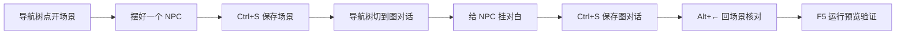

# 主编辑器怎么逛

主编辑器像雾津书案上一本厚册子：左边是目录，右边是你要改的那一页。这一页只讲**怎么在册子里走动**——开哪块面板、怎么存、怎么反悔、怎么像浏览器一样来回翻。读完你能在 30 块面板之间自如切换，不用每次都从目录树最上面重新找。

## 这是什么（30 秒看懂）

**大白话：** 主编辑器是一个「左边选、右边改」的单一窗口应用——所有内容（场景、对话、任务、物品……）都在同一个程序里，靠左侧一棵**导航树**切换面板，而不是每块内容单独开一个窗口。保存、撤销、前进后退这些操作，行为都和你熟悉的写作软件、浏览器差不多，不需要专门学一套新手势。

## 入门：手把手认三块地方

<svg viewBox="0 0 820 360" xmlns="http://www.w3.org/2000/svg" role="img" aria-label="主编辑器界面示意" style={{width: '100%', height: 'auto'}}>
  <rect x="10" y="10" width="800" height="40" rx="6" fill="#1f1810" stroke="#e0a44e" strokeWidth="1.5" />
  <text x="410" y="36" textAnchor="middle" fill="#f0e7d2" fontSize="16" fontFamily="serif">菜单栏 — 文件 · 视图 · 运行 · 工具 …</text>
  <rect x="10" y="60" width="200" height="250" rx="6" fill="#161d1c" stroke="#5a8a86" strokeWidth="1.5" />
  <text x="110" y="90" textAnchor="middle" fill="#e0a44e" fontSize="15" fontFamily="serif">左侧导航树</text>
  <text x="110" y="115" textAnchor="middle" fill="#c9bda1" fontSize="12">物理世界</text>
  <text x="110" y="135" textAnchor="middle" fill="#c9bda1" fontSize="12">叙事编排</text>
  <text x="110" y="155" textAnchor="middle" fill="#c9bda1" fontSize="12">规则与经济</text>
  <text x="110" y="175" textAnchor="middle" fill="#c9bda1" fontSize="12">注册与扩展</text>
  <text x="110" y="195" textAnchor="middle" fill="#c9bda1" fontSize="12">资源与本地化</text>
  <text x="110" y="225" textAnchor="middle" fill="#8a7a5c" fontSize="11">运行与预览 → Game</text>
  <rect x="220" y="60" width="590" height="250" rx="6" fill="#1a1712" stroke="#3a2f20" strokeWidth="1.5" />
  <text x="515" y="100" textAnchor="middle" fill="#e0a44e" fontSize="15" fontFamily="serif">右侧编辑区</text>
  <text x="515" y="130" textAnchor="middle" fill="#c9bda1" fontSize="13">点左边哪项，右边就显示那块面板</text>
  <rect x="10" y="320" width="800" height="30" rx="6" fill="#12100e" stroke="#3a2f20" strokeWidth="1" />
  <text x="410" y="340" textAnchor="middle" fill="#8a7a5c" fontSize="13">状态栏 — 当前文件、保存状态</text>
</svg>

| 区域 | 你用它干什么 |
|---|---|
| **左侧导航树** | 在 30 块面板和「运行与预览」之间切换 |
| **右侧编辑区** | 改当前面板里的内容 |
| **菜单栏** | 保存、撤销、起外部工具、运行预览等全局操作 |
| **状态栏** | 看当前文件是什么、有没有未保存的改动 |

跟着下面这一小段练一遍，走完你就摸清了「开面板 → 改 → 存 → 核对」的基本节奏：

1. 启动主编辑器：`./dev.sh editor`
2. 左侧导航树里展开 **叙事编排 → 图对话**，点开任意一张对话图，右边会出现节点画布。
3. 随便点一个 `line` 节点，看右边编辑区跳出这个节点的详情。
4. 改一个字，`Ctrl+S` 保存，看状态栏是否从「未保存」变回「已保存」。
5. `Alt+←` 试一次后退——如果你之前打开过别的面板，这一步会带你回到上一个面板。

想先摸清每块面板管什么内容，去看 **[主编辑器总览](./overview)**。

:::tip[雾津小例子]
你要改关二狗在城隍庙门口的第一句对白：左侧展开 **叙事编排 → 图对话**，选对应对白图，右边就会出现节点画布——从头到尾就是「导航树点一下，右边编辑区跟着换」这一个动作。
:::

---

## 进阶：每一项都讲透

### 开关面板

- 在左侧导航树里**点一项**，右边立刻切到对应面板。
- 导航按五大组折叠排列——**物理世界**、**叙事编排**、**规则与经济**、**注册与扩展**、**资源与本地化**。组名左边的小三角可以展开/收起，面板多的时候先把不用的组收起来，导航树会清爽很多。
- 最底下还有 **运行与预览 → Game**，用来边改边看游戏（详见 **[运行预览](./run-preview)**）。
- 导航树顶部通常有**过滤框**：面板一多，直接输入「任务」「音频」之类关键词，比在五大组里翻快得多。

### 保存

改完记得落笔存档，不然预览和游戏里看到的还是旧内容。

| 操作 | 快捷键 | 作用 |
|---|---|---|
| 保存当前面板 | `Ctrl+S` | 只把**当前这一块**的改动写进工程 |
| 保存全部 | `Ctrl+Shift+S` | 把所有已改但未存的面板一次性写入 |

保存时，状态栏会提示是否还有未保存的编辑。准备按 `F5` 跑预览前，编辑器也会先帮你存一遍——但这只覆盖你**当前停留**的面板，别的还没切回去存过的面板不受影响，养成随手 `Ctrl+S` 的习惯更稳妥。

同时改了好几块面板（比如场景摆好 NPC，又去图对话改了台词），建议用 `Ctrl+Shift+S` 一次性全存，避免漏掉某一块没保存导致预览里对不上。

### 撤销与重做

写错了可以反悔，跟常见写作软件一样：

| 操作 | 快捷键 |
|---|---|
| 撤销 | `Ctrl+Z` |
| 重做 | `Ctrl+Y` 或 `Ctrl+Shift+Z` |

撤销只管**当前面板里**的编辑历史。切到别的面板再回来，各面板各自记着自己的撤销栈——也就是说，你在场景面板撤销不了图对话面板里刚才的改动，得先切回那块面板再撤销。这也意味着**已经保存过的改动，撤销栈也可能被清空或重置**，撤销更适合「刚改错、还没保存」的即时反悔，别指望它能跨会话当版本历史用。

### 前进与后退（像浏览器翻页）

主编辑器支持**浏览器式导航**：你在面板之间跳来跳去，可以沿访问记录往回走、再往前走。

| 操作 | 快捷键 | 效果 |
|---|---|---|
| 后退 | `Alt+←` | 回到上一个你打开过的面板 |
| 前进 | `Alt+→` | 从后退记录里再往前走 |

典型用法：你在 **场景** 里摆好了 NPC，切到 **图对话** 改他的台词，改完按 `Alt+←` 立刻回到场景核对位置——不用在导航树里重新找。

<svg viewBox="0 0 640 120" xmlns="http://www.w3.org/2000/svg" role="img" aria-label="面板导航示意" style={{width: '100%', height: 'auto'}}>
  <rect x="20" y="40" width="100" height="40" rx="8" fill="#1f1810" stroke="#e0a44e" strokeWidth="1.5" />
  <text x="70" y="66" textAnchor="middle" fill="#f0e7d2" fontSize="13">场景</text>
  <path d="M130,60 L170,60" stroke="#8a7a5c" strokeWidth="2" markerEnd="url(#arr)" />
  <rect x="180" y="40" width="100" height="40" rx="8" fill="#1f1810" stroke="#5a8a86" strokeWidth="1.5" />
  <text x="230" y="66" textAnchor="middle" fill="#f0e7d2" fontSize="13">图对话</text>
  <path d="M290,60 L330,60" stroke="#8a7a5c" strokeWidth="2" />
  <text x="360" y="66" fill="#c9bda1" fontSize="12">Alt+← 回到场景</text>
  <defs><marker id="arr" markerWidth="8" markerHeight="8" refX="6" refY="3" orient="auto"><path d="M0,0 L6,3 L0,6 Z" fill="#8a7a5c"/></marker></defs>
</svg>

前进后退记的是「你打开过哪些面板」的顺序，不是「你改过什么内容」——它不会带着撤销/重做走，纯粹是页面级的跳转记录。

### 视图与搜索

菜单 **视图** 里可以调整界面细节（例如字号、布局）。左侧导航树顶部的过滤框，面板一多就用得上——比死记 30 块面板分别在哪个分组下省心得多。

### 一次编排的完整走位举例

把上面几件事串起来，看一次典型的编纂节奏：

---

## 危险区与边界

- 保存时，绝大多数面板会保留它不认识的字段，手写的旁注不会被抹掉。真正编辑器完全没入口、得换专项工具或手改的，只是少数几个「盲区」字段（比如旗标迁移块、场景多层背景），动手改内容前花两分钟扫一眼 **[危险区](../concepts/danger-zone)** 心里有数就行。
- 撤销**不跨面板**，也不保证跨越「已保存」的节点长期有效——别把它当成通用的版本回退工具，重要改动前建议留意工程本身的版本管理方式。
- 前进/后退只是**导航记录**，不会撤回你在某个面板里的实际编辑；回退到某个面板时，看到的是它**当前**的最新状态，不是你上次离开时的快照。

---

## 常见问题

**`Ctrl+S` 之后状态栏还是显示未保存，怎么回事？**

先确认你保存的是不是当前正在看的这块面板——`Ctrl+S` 只存当前面板。如果你切换过好几块面板都改了内容，建议直接用 `Ctrl+Shift+S` 一次性全存，再看状态栏。

**撤销没反应？**

检查你是不是已经切换到别的面板了——撤销只对**当前面板**的编辑历史生效，切走再切回来，之前的撤销栈可能已经不可用。

**导航树里找不到我要的面板？**

用导航树顶部的**过滤框**输入关键词搜；也可能是面板被折叠在某个收起的分组里，把五大组都展开看一遍。

**前进 / 后退按钮是灰的，点不动？**

后退到底了自然没法再后退，前进也是同理——这只是导航记录的边界，不代表编辑器出问题，正常导航几下通常就恢复了。

**改了内容切到别的面板，会不会自动帮我存？**

不一定，取决于具体操作——稳妥的做法是切面板前先手动 `Ctrl+S`，别依赖编辑器自动帮你存，尤其是准备做危险区相关的改动时。

---

## 相关

- **[主编辑器总览](./overview)** —— 30 块面板各管什么活
- **[运行预览](./run-preview)** —— 边改边看游戏
- **[危险区](../concepts/danger-zone)** —— 危险区速查
- **[怎么编排动作](../concepts/actions)** · **[怎么设条件](../concepts/conditions)** —— 面板里最常用的两个通用控件
- **[快捷键大全](../../reference/shortcuts)** —— 完整按键表（参考区）
