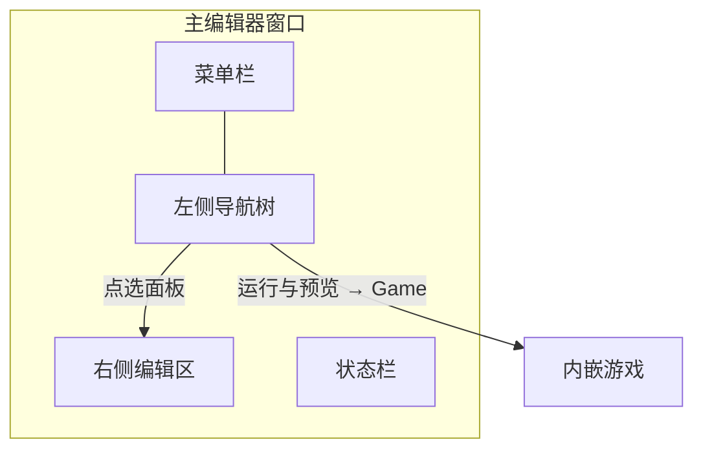

# 主编辑器总览

主编辑器是 GameDraft 的 **编纂主案**——一盏油灯、一方桌面窗口，雾津的场景、对白、任务、规矩、小游戏……几乎都在这里落笔。一个窗口里装着 **30 块编辑面板**，外加 **运行预览**；动作、条件、富文本这三件事贯穿所有面板。

启动：

```bash
./dev.sh editor
```

---

## 能做什么

| 能力 | 说明 |
|---|---|
| **改游戏内容** | 场景、NPC、对白、过场、任务、物品、商店、规矩、小游戏配置等 |
| **边改边看** | 内嵌运行游戏，改完立刻验证（见 **[运行预览](./run-preview)**） |
| **拉起专项工具** | 菜单里可开资源、视差、文案等独立工具 |
| **查动作目录** | 动作总表面板浏览全部可用动作 |

你日常 80% 的活儿，不用离开主编辑器。

---

## 界面怎么逛



| 区域 | 作用 |
|---|---|
| **菜单栏** | 文件（保存）、编辑（撤销）、视图、运行（预览）、工具（外部工具） |
| **左侧导航树** | 30 块面板 + **运行与预览**，按五大组折叠 |
| **右侧编辑区** | 当前面板的表单、画布、列表 |
| **状态栏** | 保存状态、提示信息 |

走动细节——开关面板、保存、撤销、`Alt+←` / `Alt+→` 前进后退——见 **[主编辑器怎么逛](./basics)**。

---

## 30 块面板（按组）

导航树里的数据面板共 **30 块**（不含运行预览的 Game 页）。点中文名进该面板的详细手册（陆续补齐）。

### 物理世界

| 面板 | 管什么 |
|---|---|
| **[场景](../panels/scene)** | 摆背景尺度、热区、NPC、区域、出生点 |
| **[角色登记](../panels/character)** | 角色身份一处登记，场景里引用 |
| **[地图](../panels/map)** | 大地图节点、场景转场与解锁 |

### 叙事编排

| 面板 | 管什么 |
|---|---|
| **[过场](../panels/cutscene)** | 时间轴式演出步骤 |
| **[图对话](../panels/dialogue-graph)** | 节点图对白与分支 |
| **[叙事状态机](../panels/narrative)** | 多线叙事状态与跳转 |
| **[位面](../panels/plane)** | 位面规则、移动与交互 |
| **[遭遇](../panels/encounter)** | 选项式遭遇与判定 |
| **[临场长按](../panels/pressure-hold)** | 蓄力、中断与完成回调 |
| **[信号](../panels/cue-signal)** | 可复用的表现动作序列 |
| **[水域小游戏](../panels/water-minigame)** | 水域玩法实例 |
| **[转盘小游戏](../panels/sugar-wheel)** | 糖画转盘配置 |
| **[扎纸小游戏](../panels/paper-craft)** | 扎纸订单与部件 |
| **[剧本](../panels/scenarios)** | 剧本阶段与暴露内容 |
| **[任务](../panels/quest)** | 任务链、分组与图形视图 |

### 规则与经济

| 面板 | 管什么 |
|---|---|
| **[规矩](../panels/rule)** | 雾津「规矩」条文与验证 |
| **[商店](../panels/shop)** | 店铺与价目 |
| **[物品](../panels/item)** | 物品属性与描述 |
| **[滤镜](../panels/filters)** | 场景画面滤镜 |

### 注册与扩展

| 面板 | 管什么 |
|---|---|
| **[旗标](../panels/flags)** | 进度旗标注册 |
| **[动作总表](../panels/actions)** | 浏览动作用途（只读目录） |

### 资源与本地化

| 面板 | 管什么 |
|---|---|
| **[档案](../panels/archive)** | 人物簿、见闻录、文档 |
| **[文本库](../panels/strings)** | 分类字符串表 |
| **[音频](../panels/audio)** | BGM、环境音、音效 |
| **[动画浏览](../panels/anim-browser)** | 角色动画状态与帧序 |
| **[玩家化身](../panels/avatar)** | 玩家角色动画与映射 |
| **[叠图](../panels/overlay)** | 短名登记叠层图片 |
| **[文档揭示](../panels/doc-reveal)** | 模糊/清晰文档与揭示条件 |
| **[气味](../panels/smell)** | 气味视觉配置 |
| **[全局配置](../panels/config)** | 初始场景、视口等全局项 |

---

## 三块通用概念（贯穿所有面板）

几乎所有面板里的「发生什么」「什么情况下」「写什么字」，都靠同一套概念：

| 概念 | 读完你能 | 文档 |
|---|---|---|
| **动作** | 编排播对白、给物品、切场景等 | **[怎么编排动作](../concepts/actions)** |
| **条件** | 设旗标、任务、叙事等判定 | **[怎么设条件](../concepts/conditions)** |
| **富文本** | 写带名字、物品引用的句子 | **[怎么写带引用的文本](../concepts/rich-text)** |

:::warning[动作里没有内嵌条件]
「满足某条件才执行」在**条件槽**或分支动作里写，不能塞进任意一条普通动作。见 **[怎么设条件](../concepts/conditions)**。
:::

---

## 运行预览

左侧 **运行与预览 → Game**，或按 `F5` 内嵌跑游戏。改完对白、摆好热区，立刻走进去试。

| 快捷键 | 作用 |
|---|---|
| `F5` | 保存后内嵌运行 |
| `Ctrl+F5` | 独立窗口运行 |
| `Shift+F5` | 停止 |

详见 **[边改边看：运行预览](./run-preview)**。

---

## 菜单里的外部工具

**工具 → 外部工具** 可新开窗口启动专项编辑器，例如：

- **[通用图编辑器](../narrative-domain/graph-editor)**
- **[图对话编辑器](../narrative-domain/dialogue-graph-editor)**（独立窗口版）
- **[场景深度](../render-domain/scene-depth-editor)**
- **[滤镜工具](../render-domain/filter-tool)**
- **[图片缩放](../asset-domain/image-resizer)**
- **[文案管理](../narrative-domain/copy-manager)**
- **[视频转图集](../asset-domain/video-to-atlas)**
- **[生产工作台](../workbench/overview)**
- **[视差编辑器](../render-domain/parallax-editor)**

更多工具从 **[Web 控制台](../concepts/web-console)** 或 **[工具打开方式](../launch-architecture)** 查。

---

## 动手前必读：危险区

部分面板保存时会 **整段重写** 数据，界面里没有的额外内容会丢；还有些字段界面根本改不到。

花两分钟读 **[危险区](../concepts/danger-zone)**，再查 **[可编辑面参考](../../reference/authoring-surface)** 逐面板后果。

---

## 接下来

- **[主编辑器怎么逛](./basics)** —— 保存、撤销、前进后退
- **[运行预览](./run-preview)** —— F5 边改边看
- **[编辑器总览](../overview)** —— 主编辑器以外的工具
- **[教程：改你的第一句对白](../../tutorials/first-line)** —— 上手练一遍
