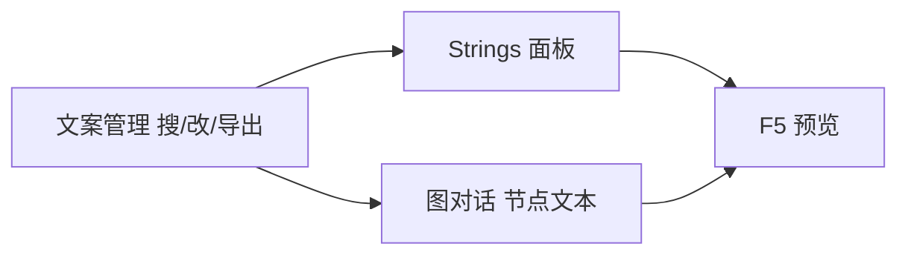

# 文案管理/导出

雾津对白、UI 提示、物品描述、任务说明——字散在好多数据里。主编辑器 **Strings** 面板适合边改边预览；**文案管理** 另开一窗，用 **树 + 搜索 + 详情** 集中翻、批量改、**导出** 给翻译或台本核对。

---

## 干什么

- **树状浏览**工程内文案条目（按类型/来源分组，以界面为准）。
- **全文搜索**——例如搜「纸人」所有出现位置。
- **详情编辑**单条或批量改文案。
- **导出**为表格或协作格式（方便翻译、配音台本）。
- 菜单栏、工具栏提供保存、刷新、跳转等常用操作。

不负责图对话节点布线、不负责叙事状态——改完长句可贴回 [图对话](../panels/dialogue-graph) 节点。

---

## 怎么开

**没有** `./dev.sh` 短命令，也**没有** Web 控制台按钮：

```bash
./dev.sh editor
```

菜单 **工具 → 外部工具** → **文案管理**。

窗口会带上当前工程；确认工程路径是雾津再改。

---

## 一步步怎么用

1. 从主编辑器菜单打开文案管理。
2. 左侧树展开类别——如 UI、物品、任务描述。
3. 顶部 **搜索** 关键词「寻狗」「纸人」，定位要改的条目。
4. 右侧详情改文案，注意 [富文本](../concepts/rich-text) 标记是否保留。
5. **保存**。
6. 若需给翻译：**导出**选格式，发协作；译回后再导入或手贴（以工具导出说明为准）。
7. 回主编辑器 **Strings** 或对应面板刷新，F5 看游戏里显示。

---

## 何时用

| 情况 | 建议 |
|---|---|
| 改一两句 UI | 主编辑器 Strings 即可 |
| 全文替换称谓、统一术语 | 文案管理搜索批量改 |
| 出翻译包、配音台本 | 导出 |
| 图对话单句微调 | 图对话面板直接改更贴上下文 |

---

## 当心什么

| 当心 | 说明 |
|---|---|
| 与图对话重复维护 | 同一句若在图节点里写死，Strings 改了不生效——分清文案来源 |
| 富文本标记弄断 | 导出/粘贴后 `{ref:...}` 类标记损坏会导致游戏里显示异常 |
| 只导出未保存 | 先保存再导出 |
| id 对不上 | 搜索改的是条目 id，引用处仍指向原 id |

---

## 工作流



---

## 雾津例子

1. 搜索「狗」，统一把玩家自嘲句里的「狗子」改成「犬儿」（全工程术语统一）。
2. 导出任务描述给编剧外审，译注在表格外列。
3. 物品「油纸伞」描述加长，保存后物品面板刷新可见。
4. 关二狗某句吐槽仍在图对话节点里——去图对话改，不在文案管理里找。

---

## 和相关工具怎么配合

| 面板 / 工具 | 关系 |
|---|---|
| [Strings](../panels/strings) | 主编辑器内轻量改文案 |
| [图对话](../panels/dialogue-graph) | 节点内台词的主战场 |
| [富文本](../concepts/rich-text) | 带引用的写法规范 |

---

## 相关

- [Strings 面板](../panels/strings)
- [图对话面板](../panels/dialogue-graph)
- [工具打开方式](../launch-architecture)
