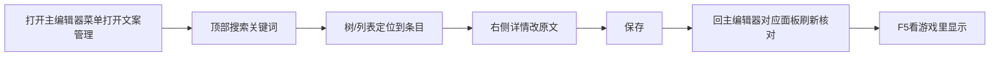
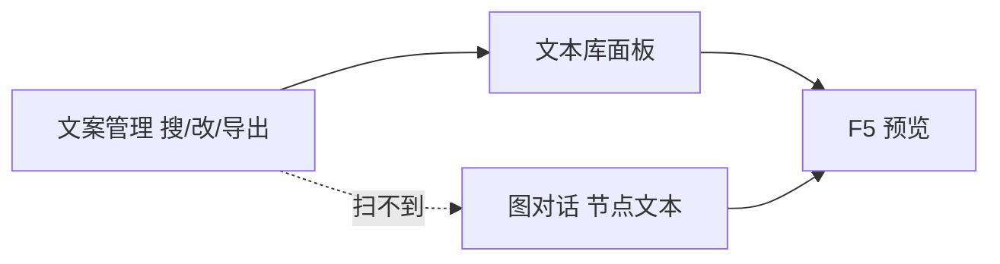

# 文案管理/导出

雾津对白、UI 提示、物品描述、任务说明、过场台词——字散在好多份数据里。主编辑器 **文本库（Strings）** 面板适合边改边预览一两句；**文案管理** 另开一窗，用**树 + 搜索 + 详情**集中翻、批量改、**导出**给翻译或台本核对。读完这页你能：搞清楚它到底扫了哪些地方的字（以及哪些地方它压根**扫不到**）、放心地批量统一一个称呼、也知道导出和「改原文」到底是不是同一件事。

---

## 这是什么（30 秒看懂）

把它想成雾津衙门专门管**誊抄与校订**的书吏房：不管一句话原本记在哪本册子里——任务簿、规矩碑文、物品清单、遭遇判词、过场脚本——书吏房都能把它调出来看、改、核对，还能整理出一份誊本交给外面的译官。它不负责**新写**内容（对话图布线、叙事状态这些还是要去原来的编辑器），它负责的是「这句话到底写得对不对、翻没翻译、要不要批量统一措辞」。

---

## 入门：手把手做第一次

目标：把工程里所有玩家自嘲台词里的「狗子」统一改成「犬儿」。



1. 从主编辑器菜单打开**文案管理**（窗口会带上当前工程，确认工程路径是雾津再改）。
2. 左侧树展开类别——比如 UI、任务、物品描述。
3. 顶部**搜索**关键词「狗子」，会列出所有出现这个词的条目，不管它原本记在哪个类别里。
4. 逐条打开右侧详情，把原文里的「狗子」改成「犬儿」，注意[富文本](../concepts/rich-text)标记别被误删。
5. **保存**。
6. 回主编辑器对应面板（比如任务或物品面板）刷新，确认改动同步过去了。
7. F5 运行预览，进游戏实际看一眼显示效果，别只看编辑器里的文字。

---

## 进阶：每一项都讲透

### 它到底扫了哪些地方的字

文案管理不是漫无边际地扫全部文件，而是按**固定的抓取规则**去认哪些字段是「玩家看得到的文案」：

| 分类 | 抓的是什么 |
|---|---|
| UI（文本库） | 与[文本库面板](../panels/strings)同一份数据里的短句 |
| 任务 | 任务的标题、描述 |
| 规矩 | 规矩的名称、未完成时的名称；规矩下挂的**规矩碎片**的正文与出处 |
| 物品 | 物品名称、描述；物品的动态描述（只增不减，跟物品面板本身的规则一致） |
| 遭遇 | 遭遇的叙事文本；每个选项的文案与结果文案 |
| 剧本 | 剧本的描述 |
| 商店 | 商店名称 |
| 地图 | 地图节点名称 |
| 档案 | 人物的姓名与称号；见闻录/文档的标题、正文、出处、批注；书籍的标题、分页标题、分页正文、批注 |
| 过场 | 过场的标题、对白、说话人、演员名 |

**这份清单里没有图对话。图对话节点里写死的台词，文案管理扫不到、也改不了。** 关二狗某句吐槽如果是直接写在对话图节点里，你得去[图对话](../panels/dialogue-graph)改，回文案管理搜是搜不到的——这一点很重要，别在这里翻半天找不到就以为文案丢了。

工具里历史上还留着一套认「旧对话脚本文件」的扫描分类，但那套格式已经被项目全面弃用，看到这类条目直接忽略，别照着改，一切以图对话为准。

### 树是怎么分组的

左侧树按「大类 → 具体条目」两层组织：大类就是上表里的九种（UI、任务、规矩、物品……），每条具体文案还会带上它归属的条目 id（比如这句描述是哪个任务、哪个物品的），方便你在一堆搜索结果里分清楚「这句话到底是谁的台词」。跟档案、任务这些面板里看到的 id 是同一套，认出 id 就能反查回对应的面板。

### 每条文案有什么信息

- **原文**：可以直接在这里改的源文字。
- **状态**：待处理 / 已复核 / 已翻译 / 已优化——自己给团队标进度用的标签，不影响游戏逻辑，纯粹是协作用的进度条。
- **备注**：写给译者或同伴看的说明，比如「这里是双关，注意」。
- **各语言的翻译栏**：默认给出两栏（可以理解成"外语 1""外语 2"），也可以自己加更多语言栏位。

### 改「原文」其实是在改回原始数据文件

这一点是本工具最容易被误解的地方：**在这里改「原文」并按保存，改的就是原来那份数据文件本身**（比如任务数据、物品数据），不是另存一份草稿。为了防止手滑，工具在每次真正写回之前，都会先给原文件做一份备份，而且只会把「本来就是文字」的值替换成新文字——**绝不会新增、删除或者改名任何字段**。

但正因为它只做"替换已存在的字符串"，如果你搜到的这条文案，它记住的位置在原文件里**已经因为别的改动而发生了结构变化**（比如条目被删掉重建过、字段路径变了），回写时找不到对应位置，就会**悄悄跳过这一条**——界面上看起来你已经改好了，保存也没报错，但游戏文件其实压根没变。碰到「明明改了却在游戏里看不到效果」，先怀疑这一条。

### 状态标签怎么用才有意义

四种状态（待处理 / 已复核 / 已翻译 / 已优化）不是摆设，它是团队协作时判断"这句话现在能不能动"的信号：策划刚写完、还没定稿的文案标"待处理"；同事看过觉得没问题的标"已复核"；已经有翻译的标"已翻译"；反复打磨过、语气拿捏准了的标"已优化"。养成随手标状态的习惯，团队里任何人打开文案管理都能一眼看出"这句还能不能再改"，不用来回问人。

### 导出：给翻译或配音团队的誊本

导出和"改原文"是两回事：

1. 点导出，选**目标语言**（可以从已有语言里选，也可以自定义）。
2. 勾选想导出的**类别**（默认全选，不勾就是导出全部）。
3. 导出会在工程数据目录下**新建一个按语言命名的子目录**，把选中类别的原文件结构原样复制一份，只是把里面认识的文字换成你填的翻译——**绝不碰原文件本身**。
4. 这份新目录可以整包发给翻译或者配音团队核对台本，译完的内容回填也是走"只替换已有字符串、不改结构"的同一套安全规则。

### 老手技巧

- 统一术语、改称谓这种"全工程一个词出现好几十次"的活，就该来文案管理搜索批量改，不要跑去一个个面板里翻。
- 导出前先把状态标好（哪些已经复核过、哪些还没翻译），译者和你自己都能一眼看出进度。
- 遇到搜索结果特别多、改起来眼花的情况，先在备注里标记"待改""已改"，改到一半被打断也不会乱。
- 文案管理和主编辑器的**文本库面板用的是同一份 UI 文字数据**——两边都能改，谁后保存谁生效，别两头同时开着改同一条。
- 打开一个条目先看它的归属 id，改之前顺手去对应面板扫一眼上下文（比如这句话是任务失败时的提示还是成功时的提示），比只盯着孤零零一句文字瞎猜语气准得多。
- 批量导出前先按类别筛一遍需要的范围，不必每次都整包全导出——只发给翻译真正要看的那几类，对方核对起来也更快。

---

## 和主编辑器面板/其它工具的关系



| 面板 / 工具 | 关系 |
|---|---|
| [文本库面板](../panels/strings) | 与文案管理里的 UI 分类是同一份数据，轻量改一两句用面板更快 |
| [图对话](../panels/dialogue-graph) / [图对话编辑器](./dialogue-graph-editor) | 节点内台词的真正战场，文案管理**扫不到**这里的文字 |
| [富文本](../concepts/rich-text) | 带引用的写法规范，改文案时注意别把标记弄断 |
| [物品](../panels/item)、[任务](../panels/quest)、[规矩](../panels/rule)、[遭遇](../panels/encounter)、[档案](../panels/archive) | 这些面板管的文案字段，文案管理都能搜到并集中改 |

---

## 怎么开

**没有** `./dev.sh` 短命令，也**没有** Web 控制台按钮：

```bash
./dev.sh editor
```

菜单 **Tools → External tools (new process) → Copy Manager**（英文菜单，对应中文即「文案管理」）。

窗口会带上当前工程；确认工程路径是雾津再改。

---

## 危险区与边界

| 当心 | 说明 |
|---|---|
| **图对话节点文案扫不到** | 关二狗写死在对话图节点里的台词，文案管理搜不到也改不了，必须去[图对话](../panels/dialogue-graph)改 |
| **回写可能悄悄跳过** | 若目标字段在原文件里已经结构变化，改了原文保存也不会真正写回，界面不会报错提醒你 |
| **与文本库面板共用数据** | UI 分类和文本库面板是同一份数据，两边都能改，注意保存顺序，别互相覆盖 |
| **富文本标记容易弄断** | 改文字时如果碰到 `[名字]`、`[图]` 这类引用标记，务必保持格式完整，弄断会导致游戏里显示异常 |
| **只导出未保存的内容不会生效** | 导出前先保存，导出的是已保存的数据 |
| **搜索改的是条目本身，不是引用它的地方** | 改了某个条目的原文，只要引用处的 id 没变就会自动生效；但如果你是新建了一条、旧的没删，引用处仍然指向旧 id，看不到新内容 |
| **旧版对话脚本扫描分类已废弃** | 项目已全面改用图对话，看到旧格式相关的条目忽略即可，不要照着改 |

更完整的规则说明见[危险区](/docs/reference/danger-zone)。

---

## 常见问题

| 现象 | 原因 | 怎么办 |
|---|---|---|
| 搜索一句我记得写过的台词，搜不到 | 这句台词写死在图对话节点里，文案管理扫不到 | 去[图对话面板](../panels/dialogue-graph)搜或改 |
| 改了原文并保存，游戏里还是老样子 | 目标字段的位置在原文件里已经结构变化，回写时被悄悄跳过 | 回原来的编辑器面板确认这条数据现在的实际结构，必要时直接在那边改 |
| 导出之后原文件是不是被替换了 | 不会，导出只会新建一个按语言命名的子目录 | 原文件完全不受导出影响，放心导出 |
| 想批量统一一个称呼要怎么做最快 | 全文搜索一次性看到所有出现的地方 | 搜索关键词，逐条改原文，改完统一保存 |
| 文本库面板和文案管理是不是要分别维护 | 不是，UI 分类是同一份数据 | 挑一边改就行，改完注意保存顺序，别两边同时开 |
| 富文本标记看着乱码或不显示 | 编辑时不小心把标记的括号或前缀改坏了 | 对照[富文本](../concepts/rich-text)规范核对标记完整性 |

---

## 雾津例子

1. 搜索「狗」，把玩家自嘲句里的「狗子」统一改成「犬儿」（全工程术语统一），改完保存。
2. 导出任务描述，选目标语言，交给编剧外审，译注写在备注列供参考。
3. 物品「油纸伞」的描述加长，保存后回物品面板刷新，确认描述变长了。
4. 关二狗某句吐槽仍然只在图对话节点里——去图对话改，不在文案管理里白费功夫找。

---

## 相关

- [文本库面板](../panels/strings)
- [图对话面板](../panels/dialogue-graph)
- [图对话编辑器](./dialogue-graph-editor)
- [富文本](../concepts/rich-text)
- [危险区](/docs/reference/danger-zone)
- [工具打开方式](../launch-architecture)
