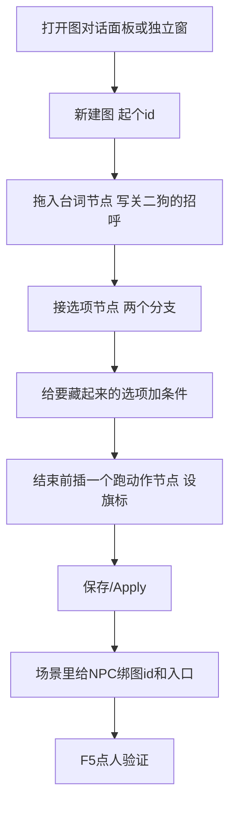
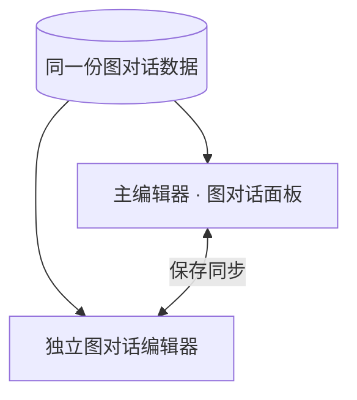
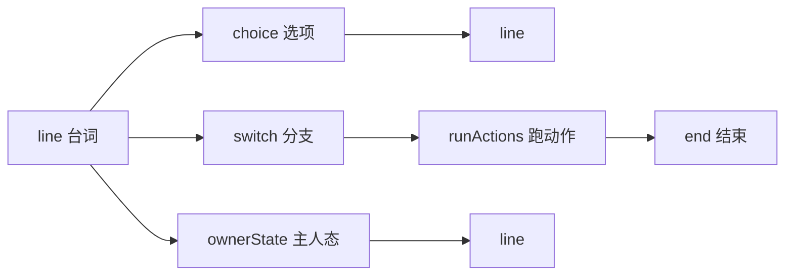
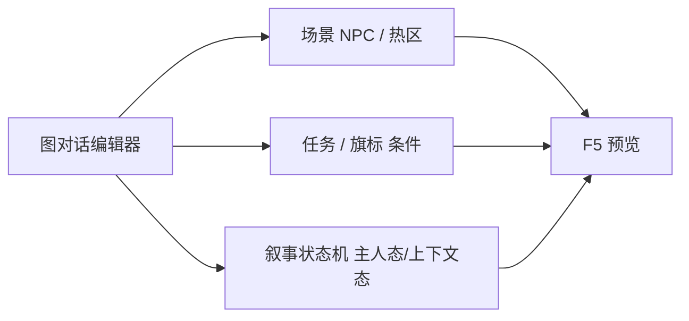

# 图对话编辑器

「哟，寻狗啊？」接选项「打听码头怪事」「算了」——分支一多，表格就盯不住谁接谁。**图对话编辑器**用**节点 + 连线**画整张对话：台词、选项、条件分支、跑动作、结束，一眼就能看出整张图的走向。雾津里关二狗的码头闲聊、城隍庙门口的抉择、旗标门控的隐藏选项，都适合在这里编。读完这页你能：认清「独立窗」和「面板」其实是同一份数据，把七种节点的每一个填法搞懂，也知道节点保存时其实是往返无损的，不用提心吊胆。

---

## 这是什么（30 秒看懂）

想象雾津的说书人手里有一沓卡片，每张卡片写一句话或一个选择，卡片之间用红线牵着——「说完这句，看情况翻到哪张」。图对话编辑器就是让你在电脑上摆这些卡片、牵这些红线：一张台词卡（谁说的、说什么）、一张选项卡（给玩家几个选择）、一张分支卡（按旗标或任务状态自动挑一条路走）、一张动作卡（顺手给东西、改旗标）、一张结束卡。摆完之后，游戏里场景中的 NPC 或热区只要指向这张图的 id 和入口卡片，玩家一点它，说书人就照着卡片念下去。

主编辑器里有一块内嵌的「图对话」面板，另外还有一个可以单开的**独立大窗**——两者**编的是同一份图数据**，只是窗口大小和顺手程度不同，不是两份互不相干的东西。

---

## 入门：手把手做第一次

目标：给关二狗做一段码头闲聊，接一个任务相关的隐藏选项。



1. **打开**：日常走主编辑器 **叙事编排 → 图对话**；要长时间专注布线，走独立大窗（下面「怎么开」有命令）。
2. **列表选已有图，或点新建图**，起一个能看懂的 id，比如 `guan_ergou_dock_smalltalk`。
3. **设入口节点**——对话从哪张卡片开始念，通常是第一张台词卡。
4. **拖入一张台词节点**：说话人选「关二狗」，台词填「哟，寻狗啊？」。
5. **接一张选项节点**：两个选项——「打听码头怪事」「算了」，各自的下一跳指向不同的台词节点。
6. **给要藏起来的选项加条件**：比如「打听码头怪事」这条，要任务 `find_dog` 进行中才显示，就在这个选项上挂条件。
7. 分支复杂时用**分支开关节点**，按旗标或任务状态自动分路，不用把条件全堆在选项上。
8. 结束前如果要给玩家东西、改旗标，插一张**跑动作节点**。
9. **保存 / Apply**。
10. 到[场景面板](../panels/scene)，把码头 NPC（关二狗）的对话图 id 和入口节点填好，F5 运行预览，点一下人物验证台词、分支、旗标改动是否都对。

---

## 进阶：每一项都讲透

### 独立窗 vs 主编辑器面板：一份数据，两扇门

| 入口 | 适合什么时候 |
|---|---|
| 主编辑器 **叙事编排 → 图对话** 面板 | 日常改对白，边改边 Apply、随时切别的面板查角色/任务/旗标 |
| **独立图对话编辑器**（大窗） | 一张图节点很多、要长时间专注布线、双屏拉大画布、要在很多张图/很多编排里翻找跳转目标 |

从主编辑器菜单里的「Graph Editor」类工具入口打开的独立窗，与面板内嵌的是**同一套编辑界面、同一份磁盘数据**——在任一处保存，另一处刷新即可看到最新结果。不要把它们当成"两份图各改各的"，也别两边同时开着改同一张图，后保存的会覆盖先保存的。



场景 NPC、热区、过场、任务里「开始某图对话」的设置，指向的都是这里的 **图 id + 入口节点**。

### 七种节点，逐个讲透

| 节点 | 干什么 | 能填什么 |
|---|---|---|
| **台词（line）** | 一人说一句或连续说几句 | 说话人可以是「玩家」「具名 NPC」「场景里的这个 NPC」或「纯字面旁白（不挂具体角色）」；台词支持[富文本](../concepts/rich-text)引用；可以追加「连播多拍」——一张卡里放好几句连续台词，念完再往下一跳 |
| **选项（choice）** | 给玩家几个选择 | 每个选项各自的文案、下一跳去哪、是否要求某旗标、是否要花钱（金币消耗）、要不要挂一条「规矩提示」（点选项前先看到的暗示）、禁用时给玩家看的提示语、以及是否要满足某条件才出现 |
| **分支开关（switch）** | 按条件自动选路 | 多条「case」——每条一个条件 + 一个下一跳；都不满足就走「默认」出口。简单情况可以用内联的与（AND）写法，但内联写法只认旗标、任务、剧本三类条件；再复杂就用结构化条件树，能用全部满足/任一满足/取反组合 |
| **跑动作** | 顺手做点事 | 挂一串[动作](../concepts/actions)（改旗标、给物品、播过场……），执行完自动往下一跳走 |
| **主人态** | 按叙事图里某个「编排」当前处在哪个状态分路 | 先选定叙事状态机里的一个编排（narrative 里的一段子构图），再按它「现在停在哪个状态」分几条出口：命中某状态走对应 case，都不命中走默认，如果那段编排根本没被激活/找不到还有专门一条「缺失」出口兜底 |
| **上下文态** | 读法与主人态类似，但看的是「上下文」层面的叙事状态 | 同样是按状态分 case + 默认，用于不特别指定某个编排、只想按大局面前的叙事状态分支的场景 |
| **结束（end）** | 对话收束 | 没有更多字段，接到它就代表这条对话线走完了 |



### 连线怎么牵

两种等效的方式：
- **检视器填法**：选中节点，在「下一跳」框里直接填目标节点 id，或点「选择…」弹出节点选择器搜。
- **画布拖法**：在图形画布上直接把一个节点的出口端口拖到另一个节点上。

老手窍门：不管是纯粹挪动节点在画布上的位置，还是真的改了连线目标（出口指向变了），保存都不会丢字段——已知类型节点的全部字段会往返保留，未知类型的内容也整块原样透传。想美化布局、腾地方，尽管拖，不用担心「拖一下就丢字段」。

### 画布自带的诊断色

画布会自动标出**不可达节点**（从入口怎么走都到不了）和**没有出口的死路节点**（既不是结束节点又没接下一跳），用醒目颜色圈出来。改完一张复杂图，先扫一眼画布有没有警示色，比自己一条条顺线排查快得多。

### 图级设置

除了节点，一张图本身还有**图级前置条件**（决定这张图能不能被启动，比如没打过某段剧情就不让开这段对话），以及入口节点的指定。

### 老手技巧

- 一张图节点多了，先想清楚「入口 → 结束」有几条主干，再往主干上插分支和岔路，比东拼西凑好维护。
- 选项上的「规矩提示」和「禁用点击提示」是让玩家不满足条件时也能看懂「为什么点不了」，别漏填，否则玩家会觉得游戏卡住了。
- 需要在很多张图之间来回切换对照（比如查一个「主人态」节点该连去哪个编排的哪个状态）时，独立大窗的搜索式选择器比面板里翻列表快。
- 保存时如果编辑器判断数据有问题会弹出强制确认框，默认选项不是「强制保存」——弹出来先看清楚提示内容，别手滑把带错误的图存下去。

---

## 和主编辑器面板/其它工具的关系



| 面板 / 工具 | 关系 |
|---|---|
| [图对话面板](../panels/dialogue-graph) | 主编辑器内嵌的同一功能，日常改一两句台词优先用这里 |
| [叙事状态机](./narrative-editor-web) | 主人态/上下文态节点点名的就是这里的编排与状态 |
| [任务](../panels/quest)、[旗标](../panels/flags) | 条件与动作的来源，选项门控、分支条件都会引用它们 |
| [文案管理](./copy-manager) | 长文案在那边集中搜索/批量改后，改完贴回这里的节点 |
| [场景](../panels/scene) | NPC 和热区里配置对话图 id 与入口 |

---

## 怎么开

**日常（面板）**

```bash
./dev.sh editor
```

→ **叙事编排 → 图对话**。

**独立大窗**

```bash
./dev.sh dialogue-graph
```

或主编辑器菜单 **Tools → External tools (new process) → Dialogue Graph Editor**（菜单是英文，对应中文就是「图对话编辑器」）。

Web 控制台也可点 **图对话** 按钮，效果等同 `./dev.sh dialogue-graph`。

---

## 危险区与边界

| 当心 | 说明 |
|---|---|
| **节点保存往返无损** | 打开并保存过的节点不会被清空——已知类型的全部字段都会往返保留，未知类型整块原样透传；不用担心「打开一次就把手塞的东西洗没了」 |
| 图级前置里的非结构化叶子 | 会被原样保留，仍以检视器展示为准，不确定就不要手写花样写法，免得检视器解析不出来 |
| 入口节点填错 | 对话从错误的节点开始念，测试起来会觉得「怎么少了一半」 |
| 选项没连线 | 玩家点了选项却没反应，八成是这条线没接上，画布诊断色能帮你揪出来 |
| 独立窗与面板各开一份旧缓存 | 一边改完记得保存，另一边要手动刷新才能看到最新内容，别以为会自动同步 |
| 检视器里某个下拉/选择器是空的 | 多半是这次打开时工程没有正确关联上，先关掉重开一次工具或面板，而不是怀疑数据本身丢了 |

更完整的规则说明见[危险区](/docs/reference/danger-zone)。

---

## 常见问题

| 现象 | 原因 | 怎么办 |
|---|---|---|
| 对话怎么从一句莫名其妙的话开始 | 入口节点填错，或指向了别的节点 | 检查图的入口设置，对照第一句该说的话 |
| 玩家点了选项，人物没反应 | 选项没连下一跳，或者条件没满足所以选项本就没显示出来 | 看画布诊断色，或检查选项的条件与下一跳 |
| 独立窗改完，面板里没看到 | 面板那边的数据是打开时的旧缓存 | 切换或刷新面板对应的图 |
| 节点上多写的一段说明，保存后不见了 | 这个节点被打开编辑过，触发了整段重建 | 说明类的内容用节点自带的描述字段/备注，不要塞进界面认不出的地方 |
| 明明连了线，画布还是标不可达 | 连线方向反了，或者中间某个分支的条件永远走不到这条路 | 顺着诊断色标出的节点往回查连线方向和条件 |

---

## 雾津例子

1. 新建图 `guan_ergou_dock_smalltalk`，入口 `line_greet`。
2. 台词节点，关二狗说：「哟，寻狗啊？」→ 选项「码头最近怪事多」「没事」。
3. 「怪事」这个选项要任务 `find_dog` 进行中才显示，在选项上加任务条件。
4. 分支开关：已经见过纸人的走 A 线台词，否则走 B 线台词。
5. 结束前插一个跑动作节点，设旗标 `heard_dock_rumor`。
6. 码头场景里关二狗这个 NPC 绑上这张图、入口 `line_greet`；F5 进游戏点人，走一遍确认对话通顺、旗标真的被设上了。

---

## 相关

- [图对话面板](../panels/dialogue-graph)
- [危险区](/docs/reference/danger-zone)
- [叙事状态机](./narrative-editor-web)
- [文案管理](./copy-manager)
- [教程：分支对话](../../tutorials/branching-dialogue)
- [工具打开方式](../launch-architecture)
