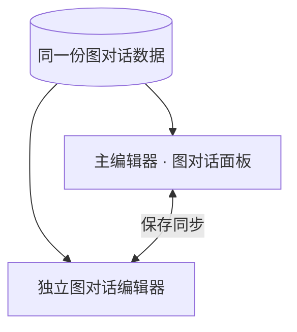
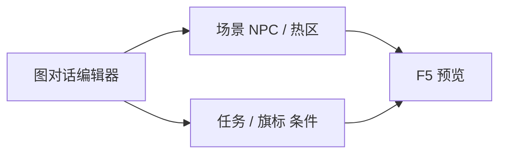

# 图对话编辑器

「哟，寻狗啊？」接选项「打听码头怪事」「算了」——分支一多，表格就盯不住。**图对话编辑器**用**节点 + 连线**画整张对话：台词、选项、条件分支、跑动作、结束。雾津里关二狗吐槽、庙里抉择、旗标门控的隐藏选项，都适合在这里编。

---

## 独立窗 vs 主编辑器内面板

**编的是同一份数据**，只是窗口大小和顺手程度不同：

| 入口 | 适合什么时候 |
|---|---|
| 主编辑器 **叙事编排 → 图对话** 面板 | 日常改对白，边改边 Apply、切别的面板查角色/任务 |
| **独立图对话编辑器**（大窗） | 一张图节点很多、要长时间专注布线、双屏拉大画布 |

从菜单开的独立窗与面板内嵌的是**同一套编辑界面**——在任一处保存，另一处刷新即见。不要误以为有两份图各改各的。



场景 NPC、热区、过场、任务里「开始某图对话」都指向这里的 **图 id + 入口节点**。

---

## 干什么

- 管理多张对话 **图**（每张有 id、入口节点）。
- 七种节点：**台词、选项、分支开关、跑动作、主人态、上下文态、结束**（详见 [图对话面板](../panels/dialogue-graph)）。
- **拖端口连线**或检视器填下一跳。
- 节点内填说话人、台词、[富文本](../concepts/rich-text) 引用、条件与动作。

---

## 怎么开

**日常（面板）**

```bash
./dev.sh editor
```

→ **叙事编排 → 图对话**。

**独立大窗**

```bash
./dev.sh dialogue-graph
```

或主编辑器 **工具 → 外部工具** → **图对话编辑器**。

Web 控制台也可点 **图对话** 按钮，效果等同 `./dev.sh dialogue-graph`。

---

## 一步步怎么用

1. 列表选已有图，或 **新建图**，id 如 `guan_ergou_dock_smalltalk`。
2. 设 **入口节点**（通常第一张台词节点）。
3. 画布拖入 **台词**，说话人选关二狗，写「哟，寻狗啊？」。
4. 接 **选项**：「打听码头怪事」「算了」各指不同台词节点。
5. 某选项要任务进行中才显示 → 在选项上设 **条件**。
6. 分支复杂用 **分支开关** 按旗标/任务状态分路。
7. 给人东西、改旗标前插 **跑动作** 节点。
8. **保存 / Apply**。
9. 到 [场景](../panels/scene) 给 NPC 绑图 id 与入口，F5 点人验证。

---

## 何时用

| 情况 | 建议 |
|---|---|
| 改一两句台词 | 主编辑器面板够用 |
| 新做一张多分支图 | 独立大窗 + 面板交替查任务/旗标 |
| 跨图跳转、选项很多 | 独立窗拉大画布 |
| 只改场景 NPC 指哪张图 | 主编辑器场景面板即可，不必开独立窗 |

---

## 当心什么

| 当心 | 说明 |
|---|---|
| [危险区](../concepts/danger-zone) | 在本工具里打开并保存过的节点可能被**整段重建**，手写字段会丢；未打开过的节点原样保留 |
| 入口节点填错 | 对话从错节点开，测试像「少了一半」 |
| 选项没连线 | 玩家点选项无反应 |
| 独立窗与面板各开一份旧缓存 | 一边改完记得保存，另一边刷新 |

---

## 工作流



---

## 雾津例子

1. 新建 `guan_ergou_dock_smalltalk`，入口 `line_greet`。
2. 台词关二狗：「哟，寻狗啊？」→ 选项「码头最近怪事多」「没事」。
3. 选「怪事」且任务 `find_dog` 进行中才亮 → 选项上加任务条件。
4. 分支开关：已见过纸人走 A 线，否则 B 线。
5. 结束前跑动作：设旗标 `heard_dock_rumor`。
6. 码头场景关二狗 NPC 绑此图、入口 `line_greet`；F5 对话走通。

---

## 和相关工具怎么配合

| 面板 / 工具 | 关系 |
|---|---|
| [图对话面板](../panels/dialogue-graph) | 主编辑器内同一功能 |
| [叙事状态机](./narrative-editor-web) | 主人态/上下文态节点联动 |
| [任务](../panels/quest)、[旗标](../panels/flags) | 条件与动作来源 |
| [文案管理](./copy-manager) | 长文案批量维护后可贴回节点 |

---

## 相关

- [图对话面板](../panels/dialogue-graph)
- [危险区](../concepts/danger-zone)
- [教程：分支对话](../../tutorials/branching-dialogue)
- [工具打开方式](../launch-architecture)
