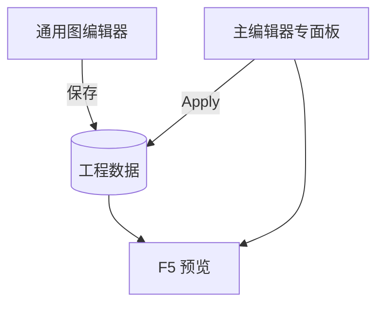

# 通用图编辑器

早年为了「一个窗口通吃多种内容」，做了 **通用图编辑器**：同一套画布界面里能切换 **对话、遭遇、任务、规则、场景、区域、物品、旗标、碎片** 等多类图。现在日常编纂更推荐 **主编辑器各专面板** + **[图对话编辑器](./dialogue-graph-editor)**；本工具仍可从菜单打开，适合**维护老工程、对照旧图**，或你明确习惯单窗切换时使用。

:::caution[用前先确认]
若团队已全面迁到主编辑器面板，本工具可能**不再维护**。不确定时问项目负责人；新内容请优先专面板，避免与主流程两套图各改各的。
:::

---

## 干什么

- 一个桌面窗口，左侧或 Tab **切换内容类型**。
- 每种类型用节点图编排关系（与对应主编辑器面板管的是同类数据，但界面合一）。
- 适合**快速跳转**多种图之间对照，不适合替代主编辑器的检视器、危险区提示与预览联动。

---

## 怎么开

**没有** Web 控制台按钮，也**没有** `./dev.sh` 短命令：

```bash
./dev.sh editor
```

菜单 **工具 → 外部工具** → **通用图编辑器**。

窗口标题会显示当前工程名，确认开的是雾津工程再改。

---

## 一步步怎么用

1. 从主编辑器菜单打开通用图编辑器（带当前工程）。
2. 在类型列表里选要编的图种类——例如 **对话** 或 **任务**。
3. 在列表里选具体条目，画布加载节点。
4. 拖节点、连线，右侧改属性（与专面板字段大致对应，以界面为准）。
5. **保存**后回主编辑器对应面板 **刷新**，确认改动已同步。
6. F5 预览验证；若面板与这里显示不一致，以主编辑器 Apply 后的数据为准。

---

## 何时用

| 情况 | 建议 |
|---|---|
| 新做雾津内容 | 用主编辑器专面板 + 图对话编辑器 |
| 老存档只有通用图里改过 | 在这里改完，回面板核对 |
| 要对照任务图与对话图连线 | 单窗切换可能省事 |
| 团队说已废弃 | 不要再开，迁数据到专面板 |

---

## 当心什么

| 当心 | 说明 |
|---|---|
| 与专面板双开各改 | 后保存的覆盖先保存的，容易丢改动 |
| 字段不全 | 专面板有而这里没有的新字段，保存可能丢——见 [危险区](../concepts/danger-zone) |
| 语义模糊 | 「通用」不等于「推荐」；新图对话请用 [图对话编辑器](./dialogue-graph-editor) |
| 无 F5 | 改完必须回主编辑器预览 |

---

## 工作流



---

## 雾津例子

1. 你从老分支迁来一张 `encounter_temple_guard` 遭遇图，只在通用图编辑器里能打开完整节点。
2. 在这里改选项连线，保存。
3. 回主编辑器 **遭遇** 面板刷新，确认节点与通用图一致。
4. 新写的关二狗码头闲聊则直接在 **图对话** 面板做，不再放进通用图。

---

## 和相关工具怎么配合

| 工具 / 面板 | 关系 |
|---|---|
| [图对话编辑器](./dialogue-graph-editor) | 对话类内容的首选 |
| [主编辑器](../main-editor/overview) | 30 块专面板是日常主战场 |
| [叙事状态机](./narrative-editor-web) | 通用图**不包含**叙事状态机画布 |

---

## 相关

- [图对话编辑器](./dialogue-graph-editor)
- [主编辑器总览](../main-editor/overview)
- [危险区](../concepts/danger-zone)
- [工具打开方式](../launch-architecture)
