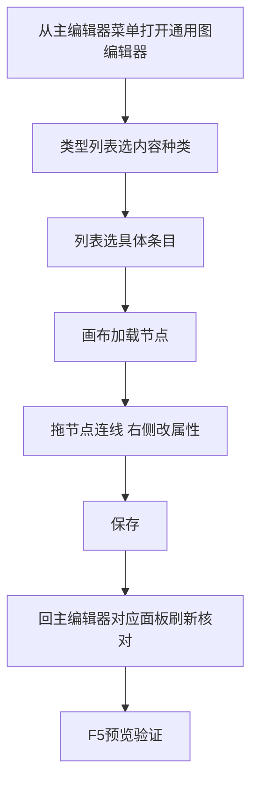
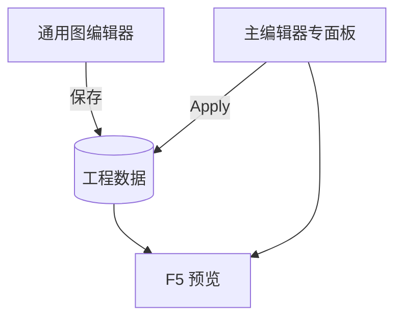

# 通用图编辑器

早年为了「一个窗口通吃多种内容」，做了 **通用图编辑器**：同一套画布界面里能切换 **对话、遭遇、任务、规则、场景、区域、物品、旗标、规矩碎片** 九类图，改哪类都不用换窗口。现在日常编纂更推荐 **主编辑器各专面板** + **[图对话编辑器](./dialogue-graph-editor)**——它们有更贴心的检视器、危险区提示、运行预览联动；本工具仍能从菜单打开，适合**维护老工程、对照旧图**，或你明确习惯单窗切换时使用。读完这页你能判断「什么时候该开它、什么时候不该开它」，以及它和专面板到底是谁改了谁说了算。

:::caution[用前先确认]
若团队已全面迁到主编辑器面板，本工具可能**不再维护**——出了问题也不一定有人来修。不确定时问项目负责人；新内容请优先用专面板，避免与主流程两套图各改各的。
:::

---

## 这是什么（30 秒看懂）

把它想成雾津衙门早年的一个「万能公文柜」——一个柜子里塞了对话稿、遭遇判词、任务清单、规矩条文、场景布防图、旗标登记册等九种不同的公文夹，你打开柜子选一个夹子就能翻。后来衙门给每类公文各配了专门的书案（也就是主编辑器的各个专面板），公文柜就渐渐退到了仓库角落——还能开，但不再是日常办公的地方。它和专面板管的是**同一批数据**，只是界面合而为一，左侧或 Tab 切类型、中间画布看节点连线、右侧一栏改选中项的属性，三栏布局跟专面板的检视器逻辑差不多，学起来不算陌生。

---

## 值不值得为这件事打开它：一张自查清单

遇到下面任何一条，再考虑开它；否则直接用专面板 + 图对话编辑器就够了：

- [ ] 手头这份工程是接手自很早的老分支，某类内容明显是用这套工具做的，专面板打开要么报错要么字段是空的。
- [ ] 你要做的事纯粹是「对照着看」——比如同时盯着一张任务图和一张遭遇图，核对两边的连线关系，不涉及真的改动。
- [ ] 项目负责人明确告诉你这类内容目前还没迁移完，暂时仍要在这里维护。

如果这三条一条都不占，就没有必要专门为了「省得切换窗口」而选它——专面板的检视器、危险区提示、运行预览联动这些安全网，都是它没有的。

---

## 入门：手把手做第一次

目标：老工程里有一张只在通用图编辑器保存过、专面板打不开的旧图，需要在这里改完再核对回专面板。



1. 从主编辑器菜单打开**通用图编辑器**（会带上当前工程）。
2. 窗口标题会显示当前工程名，**先确认开的是雾津工程**再动手改。
3. 在左侧或 Tab 的**类型列表**里选要编的图种类——例如「对话」或「任务」。
4. 在列表里选具体条目，画布加载该条目的节点。
5. 拖节点、连线，右侧改属性（字段与对应主编辑器面板大致对应，具体以界面为准，遇到不确定的字段不要瞎填）。
6. **保存**后回主编辑器对应面板**刷新**，确认改动已经同步过去。
7. F5 运行预览验证；如果面板与这里显示的不一致，**以主编辑器 Apply 后的数据为准**。

---

## 进阶：每一项都讲透

### 九种能编的内容，逐个对上专面板

| 通用图编辑器里的类型 | 对应主编辑器专面板 | 提醒 |
|---|---|---|
| 对话 | [图对话面板](../panels/dialogue-graph) / [图对话编辑器](./dialogue-graph-editor) | 新对话优先在专面板/独立图对话工具做，这里只用来对照老图 |
| 遭遇 | [遭遇面板](../panels/encounter) | 选项上下移、结果动作等字段以专面板为准 |
| 任务 | [任务面板](../panels/quest) | 任务分组、父子关系等专面板才有的整理功能，这里未必齐全 |
| 规则（规矩） | [规矩面板](../panels/rule) | 规矩的三层文案（文本/锁定提示/已验证）以专面板字段为准 |
| 场景 | [场景面板](../panels/scene) | 场景相关的画布拖拽、碰撞多边形编辑等能力这里不一定有 |
| 区域（热区/区域） | [场景面板](../panels/scene) | 区域的进入/停留/离开动作要核对是否与专面板一致 |
| 物品 | [物品面板](../panels/item) | 物品的动态描述等只增不减的规则，改的时候要留意 |
| 旗标 | [旗标面板](../panels/flags) | 旗标的静态/模式登记以专面板与旗标登记表为准 |
| 规矩碎片 | [规矩面板](../panels/rule) | 碎片挂在具体规矩下，改完记得核对归属没有串门 |

### 单窗切换的价值

它最大的价值是**跳转快**：不用在九个专面板之间来回开关，一个窗口按类型切换就能看。适合「对照任务图和对话图连线关系」这类跨类型核对工作，也适合接手老工程时快速扫一遍历史内容长什么样。

画布本身的操作手感跟专面板类似：左边选类型和具体条目，中间是节点图，右边是选中节点/元素的属性栏，改完同一套「保存」按钮落盘。如果你已经熟悉图对话编辑器或者任意一个专面板的操作逻辑，上手这个通用图编辑器不会有太大的陌生感——难的不是"怎么操作"，而是"改完之后谁说了算"这件事，见下面「它没有的东西」和「危险区」。

### 它没有的东西

- 没有专面板贴心的字段级说明、危险区提示。
- 没有 F5 运行预览联动——改完必须回主编辑器验证。
- 没有专面板里那些专属的画布操作（比如场景面板里拖碰撞多边形、地图面板里拖坐标）。
- 一般没有复制条目、批量重排这类专面板逐步补齐的效率功能。
- 字段可能滞后：专面板新增的字段，这里未必跟着更新，保存时可能会因为不认识而丢掉。

### 老手技巧

- 只有在明确知道自己在处理「老图」或「团队还没迁移完」的情况下才开它，日常创作不要养成习惯用它。
- 每次用完，一定回专面板刷新核对，不要想当然认为两边已经自动同步。
- 如果发现某类内容在这里能打开、专面板却打不开或字段对不上，先向项目负责人确认这批数据是否该由程序迁移，而不是在这里长期维护下去。
- 改动尽量控制在「小范围核对性质的修改」——比如顺一下连线、改一两个字段，别把它当成长期编辑某类内容的主战场，改得越多、和专面板对不齐的风险越大。
- 如果你只是想「看看」某类图长什么样、不打算真的改，看完直接关掉别保存，能避免触发它对字段的重写风险。

---

## 和主编辑器面板/其它工具的关系



| 工具 / 面板 | 关系 |
|---|---|
| [图对话编辑器](./dialogue-graph-editor) | 对话类内容的首选，通用图编辑器**不建议**再作为对话主战场 |
| [主编辑器总览](../main-editor/overview) | 30 块专面板是日常主战场 |
| [叙事状态机](./narrative-editor-web) | 通用图编辑器**不包含**叙事状态机画布，那是完全独立的一块 |

---

## 怎么开

**没有** Web 控制台按钮，也**没有** `./dev.sh` 短命令：

```bash
./dev.sh editor
```

菜单 **Tools → External tools (new process) → Graph Editor**（英文菜单，对应中文即「通用图编辑器」）。

窗口标题会显示当前工程名，确认开的是雾津工程再改。

---

## 危险区与边界

| 当心 | 说明 |
|---|---|
| 与专面板双开各改 | 后保存的覆盖先保存的，容易丢掉对方那边刚做的改动 |
| 字段不全 | 专面板有而这里没有的新字段，保存可能被丢——见[危险区](/docs/reference/danger-zone) |
| 语义模糊 | 「通用」不等于「推荐」；新做的图对话请用[图对话编辑器](./dialogue-graph-editor) |
| 无 F5 | 改完必须回主编辑器运行预览验证，这里没有内置预览联动 |
| 可能停止维护 | 团队若已全面迁移到专面板，这个工具可能不会再收到更新，遇到界面报错或打不开某类图不要意外 |
| 团队协作时的并发风险 | 它不是团队日常主力工具，别人多半在专面板上改同一批数据；你在这边保存的瞬间，可能正好覆盖了别人刚提交的改动而互相不知情 |

---

## 常见问题

| 现象 | 原因 | 怎么办 |
|---|---|---|
| 打开通用图编辑器和专面板看到的内容不一样 | 有一边保存过、另一边还没刷新 | 回专面板手动刷新，以主编辑器 Apply 后的数据为准 |
| 在这里保存后，专面板里某些字段消失了 | 通用图编辑器不认识专面板才有的新字段 | 尽量少在这里编辑有新字段的内容，改完务必核对 |
| 不确定该不该用这个工具 | 团队迁移进度不透明 | 直接问项目负责人；新内容一律优先专面板 |
| 想跨类型对照任务图和对话图 | 这正是通用图编辑器的强项 | 用它的类型切换来回看，改动仍以各自的专面板/独立工具为准 |
| 找不到某类图的打开入口 | 该类型可能已经从这个工具移除或没跟上新增类型 | 去对应专面板确认，不要执着于在这里找 |
| 只是打开看了一眼，什么都没改，也担心会不会出问题 | 只要没有点保存，一般不影响原数据 | 看完直接关闭窗口，不要顺手按保存 |
| 团队说"通用图编辑器不用管了"，还需要学吗 | 视你接手的工程历史而定 | 如果你手上的工程完全是新起的，可以跳过这个工具，专心学专面板和图对话编辑器 |

---

## 雾津例子

1. 你从老分支迁来一张 `encounter_temple_guard` 遭遇图，只在通用图编辑器里能打开完整节点。
2. 在这里改选项连线，保存。
3. 回主编辑器 **遭遇** 面板刷新，确认节点与通用图一致，字段没有被莫名清空。
4. 新写的关二狗码头闲聊则直接在**图对话**面板做，不再放进通用图里维护。

---

## 相关

- [图对话编辑器](./dialogue-graph-editor)
- [主编辑器总览](../main-editor/overview)
- [危险区](/docs/reference/danger-zone)
- [工具打开方式](../launch-architecture)
