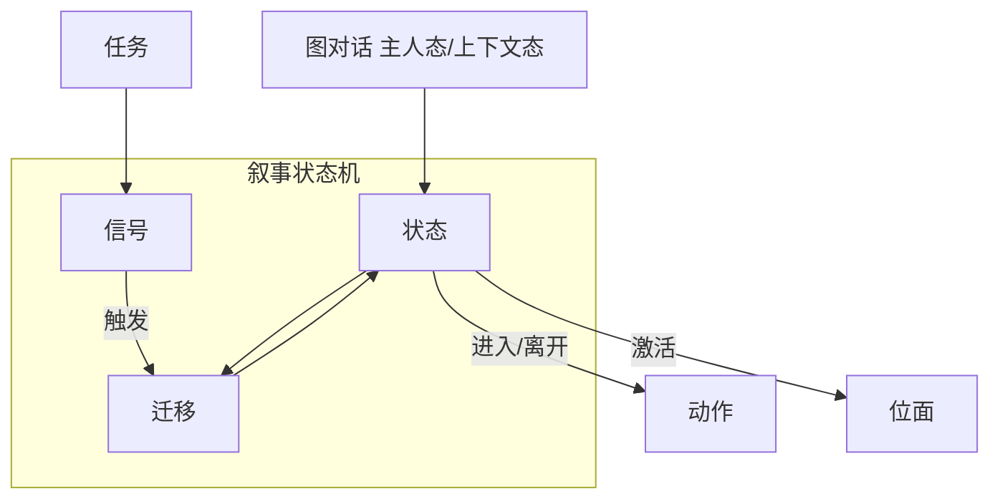

# 叙事状态机

任务面板管「接了什么、交什么」；图对话管「这句怎么说」；**叙事状态机**管更高一层：**故事现在处于哪个阶段、什么信号一来就跳转、进哪个位面**。寻狗记里日夜切换、剧本线推进、主动激活某「位面」——很多要在这里画成 **状态** 和 **迁移**。

---

## 干什么

- **构图**：主图与子图，把大剧本拆块。
- **状态**：故事停在哪个节点；进入/离开时跑 [动作](../concepts/actions)。
- **迁移**：从 A 到 B 的边；触发方式（信号、被动条件）、优先级、条件。
- **信号**：你起的信号名；别处玩法或动作可 **发信号** 推图往前走。
- **激活位面**：某状态可声明进状态时哪个 [位面](../panels/plane) 生效。

任务主路径改状态请优先走叙事图，不要依赖调试专用的「硬设叙事状态」类动作。

---

## 怎么开

**正常使用：主编辑器内嵌面板（推荐）**

```bash
./dev.sh editor
```

→ **叙事编排 → 叙事状态机**。

中间画布是流程图 UI，你仍在主编辑器里操作；保存与 Apply 跟其它面板一样。

**独立开发预览（少见）**

仅当你要单独调画布、不加载整个主编辑器时，由前端开发命令拉起本地页——策划日常**不必**记这条，用面板即可。

---

## 一步步怎么用

1. 打开 **叙事状态机** 面板，选要编的构图（主图或子图）。
2. 画布 **拖入状态**，起名、写描述给自己看。
3. 标 **初始状态**——故事从哪开始。
4. **拖连线**做迁移：从状态 A 到状态 B（从/到只能在画布上改，检视器里只读）。
5. 选中迁移，设 **触发类型**（作者信号、被动等）、**条件**、**优先级**（多条边时谁先匹配）。
6. 状态上设 **进入/离开动作**、**激活位面**（下拉选已登记位面）。
7. 在 **信号** 列表登记会用到的信号 id。
8. 保存后 **F5** 或 [工作台](../workbench/overview) 运行时调试，看状态是否按预期跳。

---

## 何时用

| 情况 | 建议 |
|---|---|
| 设计寻狗记主线阶段 | 在主图加状态与迁移 |
| 日夜/位面切换 | 状态上绑激活位面 + 信号触发迁移 |
| 任务只改进度 | 任务面板即可；动主线阶段再开叙事图 |
| 调试「卡在某个剧本阶段」 | 工作台看当前状态，回图查哪条迁移没满足 |

---

## 当心什么

| 当心 | 说明 |
|---|---|
| 迁移从/到只读 | 拖错线要在画布上改，别在检视器里硬填 |
| 多条迁移无优先级 | 可能走你不想要的边 |
| 信号名不一致 | 发了信号图不动——对齐发信号处与图上登记名 |
| 位面未登记 | 激活位面下拉空，先去 [位面](../panels/plane) 面板登记 |
| 旧跨图端点 | 部分历史端点可能不可编辑，用新连线替代 |

---

## 工作流



---

## 雾津例子

1. 主图状态 `prologue_dock` 为初始，进入时激活位面 `foggy_dock`。
2. 迁移：`prologue_dock` --信号 `enter_temple`--> `act1_temple`。
3. 进庙状态离开动作：推任务 `find_dog` 到可接取。
4. 图对话里 **上下文态** 节点读当前叙事状态，分「已听过码头谣言」支线。
5. F5 从码头进庙，工作台确认状态从 `prologue_dock` 跳到 `act1_temple`。

---

## 和相关工具怎么配合

| 面板 | 关系 |
|---|---|
| [叙事状态机面板](../panels/narrative) | 与本文同一功能，面板是日常入口 |
| [图对话](../panels/dialogue-graph) | 主人态/上下文态联动 |
| [位面](../panels/plane) | 激活位面前须登记 |
| [任务](../panels/quest) | 任务进度常通过动作/信号推叙事图 |

---

## 相关

- [叙事状态机面板](../panels/narrative)
- [怎么编排动作](../concepts/actions)
- [工具打开方式](../launch-architecture)
