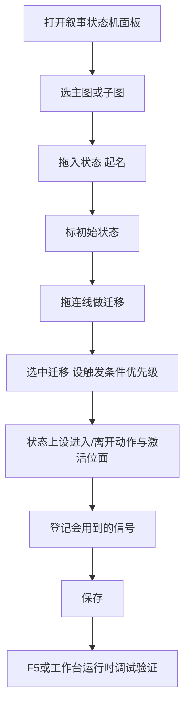
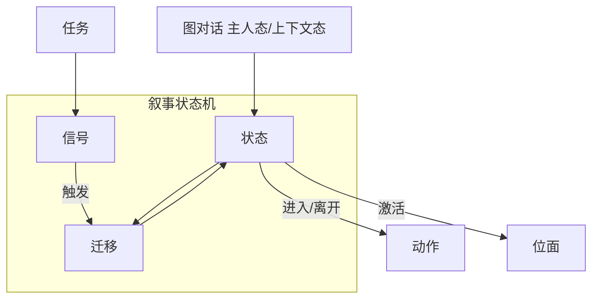
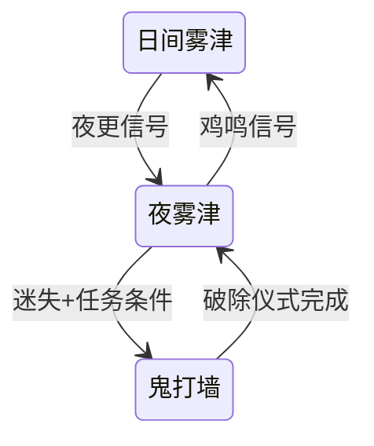

# 叙事状态机

任务面板管「接了什么、交什么」；图对话管「这句怎么说」；**叙事状态机**管更高一层：**故事现在处于哪个阶段、什么信号一来就跳转、进哪个位面**。寻狗记里日夜切换、剧本线推进、主动激活某「位面」——很多要在这里画成 **状态** 和 **迁移**。读完这页你能：画出一张状态图、看懂「信号」怎么牵着迁移走、用模板一键铺出一整套新任务骨架，也知道两步保存和过期提醒是怎么回事。

---

## 这是什么（30 秒看懂）

如果把寻狗记想成一出大戏，叙事状态机就是舞台监督手里的**分场表**：现在演到哪一幕（状态）、听到什么提示词（信号）就该切到下一幕（迁移）、切到某一幕时该不该把灯光换成阴间的调子（激活位面）。图对话是演员台词本，任务面板是道具与验收清单，而叙事状态机是**统筹全局的那张大表**——寻狗记从码头开场，到进城隍庙，到夜里撞见鬼打墙，每一次「阶段性质变」都该在这里画成一条清清楚楚的边。

---

## 入门：手把手做第一次

目标：做一条「白天进庙 → 夜里撞鬼」的阶段切换。



1. 打开 **叙事状态机** 面板，选要编的构图（主图或某个子图）。
2. 画布 **拖入状态**，起名、写描述给自己看——比如「日间雾津」。
3. 标 **初始状态**——故事从哪里开始。
4. **拖连线**做迁移：从状态 A 拖到状态 B（从/到只能在画布上改，检视器里是只读的，改错了要回画布重连）。
5. 选中这条迁移，设 **触发类型**（作者信号、被动条件等）、**条件**、**优先级**（一个状态同时有多条边可选时，谁先匹配）。
6. 在状态上设 **进入/离开动作**（比如换 BGM、推进任务）、**激活位面**（下拉选已登记的[位面](../panels/plane)）。
7. 在 **信号** 列表里登记会用到的信号 id，比如「夜更信号」。
8. 保存后 **F5** 运行预览，或到[工作台运行时调试](../workbench/overview)看状态是否按预期跳转。

---

## 进阶：每一项都讲透

### 构图：主图、子图与黑盒

一个「作品」可以拆成一张**主图**加若干**子图**，方便把大剧本拆成能分头维护的小块；子图之间也可以互相当作「黑盒」封装引用——不需要在主图里把所有细节都摊开画，先把一段行为封装成一个黑盒占位，细节留在子图里画。图对话里的**主人态节点**点名连的正是这里某个子图（编排）的具体状态。

### 状态：每一个格子里能填什么

| 字段 | 用途 |
|---|---|
| 标签 / 描述 | 给自己和团队看的说明，不影响运行 |
| 是否初始 | 这张构图从哪个状态开始 |
| 进入时广播 | 打开后，进入这个状态这件事本身会不会变成一个别处能监听的信号（系统自动派生，不用你另外去信号列表里手写） |
| 激活位面 | 进入这个状态时，哪个[位面](../panels/plane)生效——下拉选已登记的位面，没登记就选不到，得先去位面面板补 |
| 进入 / 离开动作 | 进这个状态、离开这个状态时各自要跑的一串[动作](../concepts/actions)：换场景氛围、推任务、播过场都放这里 |

### 迁移：从 A 到 B 的边

| 字段 | 用途 |
|---|---|
| 从 / 到 | 只能在画布上拖连线改，检视器里只读，别在检视器里硬填 |
| 触发类型 | 作者信号（等某个信号被发出）、被动条件（不需要信号，条件一满足就走）等 |
| 条件 | 满足才真正走这条边，用统一的[条件](../concepts/conditions)编排 |
| 优先级 | 一个状态上同时有好几条可能满足的迁移时，按优先级决定先走哪条 |

### 信号：作者信号 vs 派生信号

- **作者信号**：你自己起的信号 id，比如「玩家进庙」「夜更敲响」——别处的动作或玩法系统可以「发信号」推着这张图往前走。
- **派生信号**：某个状态勾了「进入时广播」，系统会自动给它派生一个专属信号，这类信号是只读的，不用你手写，直接在迁移的触发条件里选它就行。
- 信号目录会告诉你「谁在发」「谁在听」：如果一个信号声明了但从来没人真的发出来，或者发出来了却没人监听，界面会给出提醒——发现「发了信号图却不动」，第一件事就是去信号目录核对拼写和监听关系是否对上。要注意一点：只在**条件**里读某个信号不算「有人监听」，只有迁移的触发方式选中它才算。

### 位面点名

状态可以声明「进入这个状态时激活哪个位面」，下拉候选来自[位面面板](../panels/plane)的登记表。想不出这个下拉为什么是空的，先去位面面板确认目标位面是否已经登记。

### 用模板一键铺一整套新任务骨架

叙事状态机自带一套**模板系统**，专门给「新开一条支线任务」这种重复性工作省事：

1. 先由程序或熟悉这套系统的人做好一份**模板**——里面留了几个「占位洞」（比如任务 id 这个变量），骨架长得跟正式的叙事图、镜像任务、对话桩差不多，但**填的是占位符，不是真数据**。
2. 你要开一条新支线时，只需要在模板面板里**填一个任务 id**，点一下「盖章」，系统就会把叙事图骨架、对应的任务条目、对话桩**三样一起**按你填的 id 展开成正式内容。
3. 盖章生成的信号会自动按「任务 id + 具体信号名」的方式命名，不会跟别的任务的信号撞名，不用你自己费心去想一个不重名的信号名。
4. 盖章这三样东西是**打包暂存**的：暂存到内存草稿里，真正落盘还是要靠主编辑器的「全部保存」；如果你中途放弃或者软件崩溃，这三样会**一起消失**，不会出现「任务盖出来了、对话桩却没了」这种一半一半的尴尬情况。
5. 有个重要边界：**模板本身永远不能被当成正式在跑的图去用**——它是编辑器专用的骨架文件，运行时看到里面还留着占位符会直接报错。占位符必须先经过盖章替换成真实内容，才能进入正式流程。

### 老手才知道的技巧

- **两步保存**：在这块画布里按保存快捷键，只是把改动记到内存草稿（暂存），并不会立刻写盘；真正落盘要回到主编辑器点「全部保存」。这跟其它面板的保存逻辑一致，但很多人误以为这里按一下就存盘了，切记养成「画完之后回主编辑器点一次全部保存」的习惯。
- **这块画布其实是提前打包好的一份独立页面**：如果你看到界面上出现「内容可能已过期」一类的提示横幅，按提示重新加载/重启编辑器即可——这不代表数据坏了。
- 一次改多条迁移时，建议改完立刻用运行预览配合信号工具**逐条打**验证，而不是攒一堆改动最后一次性测，出问题不容易定位是哪条边。
- 任务主路径推进请优先走这里的信号与迁移，不要依赖调试专用的「硬设叙事状态」类动作强行把状态掰过去——那类动作是给调试用的后门，走它会让状态和其它系统的联动被跳过。

---

## 和主编辑器面板/其它工具的关系



| 面板 | 关系 |
|---|---|
| [叙事状态机面板](../panels/narrative) | 与本文同一功能，面板是日常入口 |
| [图对话](../panels/dialogue-graph) / [图对话编辑器](./dialogue-graph-editor) | 主人态/上下文态节点联动这里的状态 |
| [位面](../panels/plane) | 激活位面前须先登记 |
| [任务](../panels/quest) | 任务进度常通过动作/信号推叙事图，模板系统也会同步生成任务条目 |
| [文案管理](./copy-manager) | 状态描述、信号备注等短说明与文案管理无关，那些是给你自己看的注释 |

---

## 怎么开

**正常使用：主编辑器内嵌面板（推荐）**

```bash
./dev.sh editor
```

→ **叙事编排 → 叙事状态机**。

中间画布是流程图 UI，你仍在主编辑器里操作；保存与 Apply 跟其它面板一样，但记住上面提到的「两步保存」——这里的保存只是暂存，落盘还得靠主编辑器的「全部保存」。

**独立开发预览（少见）**

```bash
npm run dev:narrative-editor
```

这仅是给前端开发调界面用的命令，不加载真实工程数据，也不是策划的日常入口——策划**不必**记这条，用面板即可。

---

## 危险区与边界

| 当心 | 说明 |
|---|---|
| 迁移从/到只读 | 拖错线要在画布上改，别在检视器里硬填 |
| 多条迁移无优先级 | 可能走你不想要的边，加了新迁移记得核对优先级 |
| 信号名不一致 | 发了信号图不动——先对齐发信号处与图上登记的名字拼写 |
| 位面未登记 | 激活位面下拉是空的，先去[位面](../panels/plane)面板登记 |
| 旧跨图端点 | 部分历史遗留的连接端点可能编不了，用新连线替代，别硬掰 |
| 状态的备注型细节无界面维护 | 有些运行时能认、但界面完全没有入口的细节属于[盲区](/docs/reference/danger-zone)，不要闷头手写 |
| 两步保存 | 这里按的保存只是暂存，忘了回主编辑器点「全部保存」，改动不会真正落盘 |
| 三方校验存在宽严差异 | 保存被拦时，以画布本身给出的提示为准；如果同一处改动在别的路径反而被拦下，多半是版本没对齐，找程序同步 |
| 模板绝不能当正式图用 | 带占位符的模板混进正式流程会被当作坏内容报错，必须先盖章生成真数据 |

更完整的规则说明见[危险区](/docs/reference/danger-zone)。

---

## 常见问题

| 现象 | 原因 | 怎么办 |
|---|---|---|
| 发了信号，叙事状态却没跳转 | 信号名拼写不一致，或者监听方式选错了（在条件里读信号不算真正监听） | 核对信号目录里的发出方与监听方名字是否完全一致，改成迁移的触发方式而非条件读取 |
| 按了保存，重启后改动不见了 | 这里的保存只是暂存到内存草稿 | 回主编辑器点「全部保存」才会真正写盘 |
| 界面弹出「内容可能已过期」的横幅 | 这块画布是提前打包好的独立页面，程序端更新过而你还没重载 | 按提示重启或重新加载编辑器即可，不代表数据坏了 |
| 激活位面下拉是空的 | 目标位面还没在位面面板登记 | 先去位面面板补登记，再回来选 |
| 盖章之后感觉任务和对话桩「消失」了 | 盖章的三样东西是打包暂存的，还没走「全部保存」就退出或崩溃了 | 重新盖一次章，盖完立刻做一次「全部保存」 |
| 想强行把状态改到某个位置做调试 | 有调试专用的动作能硬设叙事状态，但正式内容不该依赖它 | 调试可以临时用，任务主路径务必改回用信号+迁移推进 |

---

## 雾津例子：日夜与「阴间位面」

1. 主图状态 `prologue_dock` 为初始，进入时激活位面 `foggy_dock`。
2. 迁移：`prologue_dock` --信号 `enter_temple`--> `act1_temple`。
3. 进庙状态离开时的动作：把任务 `find_dog` 推到可接取。
4. 图对话里的**主人态**节点读当前叙事状态，分出「已听过码头谣言」的支线。
5. 新支线用模板系统盖章：填任务 id `bridge_find_source`，一键铺出叙事图骨架、对应任务与对话桩三件套。
6. F5 从码头进庙，工作台确认状态从 `prologue_dock` 跳到 `act1_temple`，盖章生成的任务也同步出现在任务列表里。



---

## 相关

- [叙事状态机面板](../panels/narrative)
- [图对话编辑器](./dialogue-graph-editor)
- [怎么编排动作](../concepts/actions)
- [怎么设条件](../concepts/conditions)
- [位面面板](../panels/plane)
- [危险区](/docs/reference/danger-zone)
- [工具打开方式](../launch-architecture)
