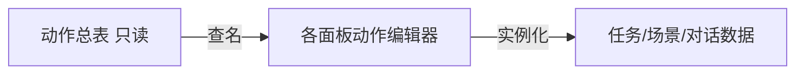

# 动作总表面板

「想让游戏播对白、给物品、切场景、发信号……」具体有哪些名、分什么类？**动作总表**是 **只读目录**：汇总工程里可用的动作类型，方便策划查词，**不能在这里新建或改一条动作实例**。

真正编排「接到任务时发生什么」去 [任务](./quest)；「热区点了发生什么」去 [场景](./scene)；编排语法见 [怎么编排动作](../concepts/actions)。

---

## 这块面板管什么

- **动作类型列表**：名称、简短说明（若有）。
- **分类/筛选**（视界面而定）：快速找「音频类」「场景类」「叙事类」。
- **无保存按钮**：没有 Apply；没有增删改。

---

## 怎么打开

1. `./dev.sh editor` → **注册 → 动作总表**（或「动作」导航项）。
2. 浏览、搜索；点某行可看详情（若面板提供）。
3. 记住动作名后，回业务面板用动作编辑器添加。

:::info[配图：动作总表列表]
截搜索框、列表中 开始图对话 / 给物品 / setFlag 等用户可读名（非代码名展示若有翻译）。
:::

---

## 和动作编辑器分工

| 动作总表 | 动作编辑器 |
|---|---|
| 查有哪些类型 | 在某任务里加一条 给物品 |
| 不能保存 | 填参数、嵌套子动作 |

---

## 怎么用（工作流）

1. 策划写方案：「接任务后开地图渡口」。
2. 打开动作总表搜「地图」「解锁」「旗标」相关项。
3. 打开 [任务](./quest) acceptActions / rewards，添加对应动作，下拉选类型。
4. 专用复杂动作（设化身、移实体、开图对话）会有**大表单**——总表只告诉你存在，参数仍在各面板编。

---

## 嵌套动作去哪查

总表列出类型；这些类型可当**子动作**塞进：

- `执行动作` 顺序包
- `chooseAction` 分支
- `randomBranch` 随机
- `enableRuleOffers` 规矩选项槽
- 延时事件等

嵌套规则见 [动作概念页](../concepts/actions)。**动作里没有内嵌条件**——条件在外层 [条件编辑器](../concepts/conditions)。

---

## 当心什么

| 当心 | 说明 |
|---|---|
| 在总表找「编辑」 | 没有——去业务面板 |
| DEBUG 专用动作 | 如硬设叙事状态——普通内容别用，总表可能标 DEBUG |
| 名字记错一字 | 下拉有，手输没有 |
| 与过场白名单 | 过场里逻辑步是动作子集，总表更全 |

---

## 雾津例子

1. 查「给物品」→ 去 [水域小游戏](./water-minigame) 捞起成功 编 给物品 湿鞋。
2. 查「开对话」→ 场景 NPC 进入时 或图对话 执行动作。
3. 查「激活位面」→ 优先 [叙事状态机](./narrative) 激活位面，而非逃生舱式动作（总表若有说明以检视器为准）。

:::info[配图：从总表到任务编辑器]
小流程图截图：总表查到 setFlag → 任务 rewards 里添加。
:::

---

## 和相关面板怎么配合

所有带 **动作编辑器** 的面板；常用：

| 面板 | 典型动作 |
|---|---|
| [场景](./scene) | 转场、inspect |
| [图对话](./dialogue-graph) | 执行动作 |
| [过场](./cutscene) | 逻辑步 |
| [信号 Cue](./cue-signal) | 表现包 |

---

---

## 实操检查清单

- [ ] 明确本面板只读，编辑去任务、场景、对话等业务面板
- [ ] 搜动作前先写清策划意图（给物、转场、开对话等）
- [ ] 嵌套动作查概念页规则，条件放外层不在动作内
- [ ] DEBUG 专用项勿用于正式内容
- [ ] 记住动作名与下拉一致，手输易错
- [ ] 复杂动作参数在大表单面板编，总表只确认存在
- [ ] 过场逻辑步是动作子集，总表更全
- [ ] 查完总表立刻去目标面板添加，避免隔太久忘参数
- [ ] 与条件编辑器分工：总表不管条件语法
- [ ] 定期浏览分类，了解新增动作类型

---

## 常见问题

| 现象 | 原因 | 怎么办 |
|---|---|---|
| 总表里找不到保存 | 本面板只读 | 去业务面板 Apply |
| 添加了没效果 | 动作名选错或参数空 | 回总表核对再填参 |
| 嵌套保存失败 | 违反危险区嵌套规则 | 读动作概念与危险区 |
| 过场步被拒 | 不在过场白名单 | 换过场支持的类型 |
| 条件写进动作里 | 架构不支持 | 条件放外层编辑器 |

---

## 预览验证

1. 在总表搜目标语义（如给物、开图、设旗标）。
2. 记下准确动作名与分类。
3. 打开任务、场景或对话的动作编辑器添加。
4. 填参并 Apply。
5. 运行预览触发该编排点。
6. 若失败，回总表确认是否选错类型或 DEBUG 项。

---

寻狗线给湿鞋前，你可在总表搜「给物」再去水域小游戏成功回调里添加——比凭记忆快。开地图渡口节点常用设旗标或解锁类动作，总表搜「旗标」「地图」可缩小范围。叙事推位面时优先查状态机 激活位面，总表若有同名动作也要读检视器说明，勿与状态机双写冲突。

---

## 相关概念

- [怎么编排动作](../concepts/actions)
- [怎么设条件](../concepts/conditions)
- [怎么写带引用的文本](../concepts/rich-text)
- [危险区](../concepts/danger-zone)
