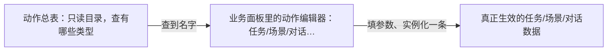

# 动作总表面板

「想让游戏播对白、给物品、切场景、发信号……」具体有哪些动作、分几类？**动作总表**是一份**只读目录**：汇总整个工程里可以使用的动作类型，方便你查词、对齐说法，**不能在这里新建或修改一条具体的动作**。读完这页你能知道去哪儿查动作、怎么把查到的动作真正编排进内容里，以及嵌套动作、DEBUG 专用动作这些容易踩的边界。

真正把「接到任务时发生什么」编排出来去[任务](./quest)；「热区点了发生什么」去[场景](./scene)；动作的编排语法本身看[怎么编排动作](../concepts/actions)。

---

## 这是什么（30 秒看懂）

把动作总表想成雾津衙门的一本**公文格式手册**：手册上列了「你能写哪些类型的公文——告示、拘票、批复……」，但手册本身不会替你写出一份具体的批文,那是各房各科自己的事。动作总表就是这样一本「所有可用动作类型」的目录，翻开它能查到「有给物品这个动作」「有开图对话这个动作」，但要真的让某个任务、某个热区在某个时刻执行这个动作，还是得去任务面板、场景面板这些**业务面板**里的动作编辑器里实际添加一条、填好参数。

工程里目前登记着上百种动作类型，覆盖对话、场景切换、旗标、位面、镜头等各个方面，而且很多动作还能互相**嵌套**——这也是这页要讲透的重点。

---

## 入门：手把手做第一次

以「接到任务后开地图渡口」这个常见需求为例，走一遍从查词到落地的完整流程。

1. 打开 `./dev.sh editor` → **注册 → 动作总表**（导航里可能显示为「动作」）。
2. 在搜索框里输入「地图」「解锁」这类关键词，浏览命中的动作类型，记下你觉得贴合需求的那个名字（比如某个和「解锁地图点」相关的动作，或者干脆是「设旗标」再配合[地图](./map)的解锁条件）。
3. 点开这一行（如果面板提供详情），看一眼简短说明，确认这个动作确实是你要的意思，而不是名字相近但用途不同的另一个。
4. 记住准确的动作名字后，去[任务面板](./quest)，找到对应任务的**接受时执行**区域，点添加，在动作类型下拉里选中刚才记下的那个名字——**这里靠下拉选择，不要凭记忆手打，手输容易和实际注册的名字差一个字**。
5. 按这个动作的参数表单填好细节（比如要解锁哪个地图点、要设哪个旗标为什么值）。
6. 点 Apply 保存。
7. 进入运行预览，接受这个任务，确认地图渡口按预期解锁。

---

## 进阶：每一项都讲透

### 这个面板本身能做什么、不能做什么

- **能做**：浏览全部动作类型的名字和简短说明；按分类/关键词筛选查找；帮你确认「这个动作到底存不存在、叫什么」。
- **不能做**：新建一条动作实例、编辑参数、删除、保存——这个面板**没有 Apply 按钮**，因为它压根不持有可编辑的数据，只是一份汇总视图。想找「编辑」按钮而找不到是正常的，因为这里本来就不提供。

### 动作总表和动作编辑器的分工

| 动作总表 | 各面板的动作编辑器 |
|---|---|
| 查「有哪些类型可以用」 | 在某个任务/场景/对话里**实例化**一条具体动作 |
| 只读，不能保存 | 填参数、挂条件的外层门槛、必要时嵌套子动作 |
| 全工程共享同一份目录 | 每个挂载点（任务奖励、热区交互、图对话结果等）各自维护自己的一串动作 |

动作编辑器本身会出现在很多地方：任务的接受动作/奖励、遭遇选项的结果动作、场景热区的交互动作、区域的进入/停留/离开动作、场景本身的进入动作、图对话的执行动作、档案条目的首次阅读动作、过场里的动作步骤、临场长按的完成/打断动作、信号的动作、各类小游戏的成功/失败回调——凡是「发生了某件事之后要触发什么」的地方，背后用的都是同一套动作编辑器，动作总表就是这套编辑器统一认识的类型库。

### 动作有多少种、怎么分类

工程里注册的动作类型数量相当可观（上百种），覆盖对话推进、场景切换、给予物品、设旗标、镜头运镜、位面切换、播放音效等各个方面。动作总表通常支持按分类筛选（比如「音频类」「场景类」「叙事类」），先想清楚你要做的事情属于哪个方向，再去对应分类里找，比从头翻到尾快得多。

### 参数简单的动作 vs 有专用大表单的动作

大部分动作填几个简单参数就够了（比如给物品只需要选物品 id、填数量），但有一批动作明显更复杂，**会打开一个专门的大表单**，比如：

- 设玩家化身
- 设某个实体的字段
- 设置场景里某实体的位置 / 移动某实体到某处
- 设置热区显示图片
- 显示/混合叠加图片
- 设置剧本阶段
- 开始图对话
- 播放脚本化对白

这些动作总表里只会告诉你「这个类型存在」，具体参数怎么填、有哪些下拉、坐标怎么定，还是要打开对应业务面板的动作编辑器里那个大表单去填。很多动作的参数本身就是**下拉选择器**——场景 id、物品 id、规矩 id、任务 id、遭遇 id、过场 id、音频 id、角色 id 等，都是从已经注册好的条目里选，不需要手输，选的时候直接用这些下拉，比自己回忆拼写准确得多。

### 嵌套动作——组合出更复杂的编排

动作总表列出的类型里，有几种本身的作用就是**装下别的动作**，可以嵌套很深：

- **执行动作**（顺序包）：把几条动作按顺序打包成一条，方便整体挂在一个触发点上。
- **选项分支**：给玩家一组选项，每个选项各自对应一串要执行的子动作。
- **随机分支**：按概率走到「上面」或「下面」两组子动作里的一组。
- **规矩选项槽**：每个槽位对应一串结果动作，通常和[规矩](./rule)配合，做「按规矩办事」这类分支。
- 延时事件类动作：过一段时间后再触发一串子动作。

这些容器动作理论上可以嵌套很多层，但**动作本身没有内嵌条件控件**——如果某条子动作需要「满足某个条件才执行」，条件永远是在外层单独的[条件编辑器](../concepts/conditions)里配置，而不是塞进动作内部。想清楚「这一步该不该发生」用条件门控，「发生了具体做什么」用动作编排，两者不要混着找。

### DEBUG 专用动作

动作总表里有极少数动作是**调试专用**的（比如直接硬设某个叙事状态），这类动作通常会被标注为 DEBUG，正式内容编排时**不要使用**——需要控制叙事进度，应该用[叙事状态机](./narrative)本身的图去推进，而不是找一个「走后门」的动作直接改状态。查到带 DEBUG 标注的动作，当它不存在就好。

### 过场里能用的动作是子集

[过场](./cutscene)里的「动作」步骤，能用的类型是全部动作类型里的一个**白名单子集**——不是所有在动作总表里查到的类型都能塞进过场步骤。如果在过场里添加某个动作被拒绝或者报错，先确认一下这个类型是不是压根不在过场支持的范围内，换一个过场支持的等效动作，或者把这段逻辑挪到别的挂载点（比如图对话的执行动作）去实现。

### 效率窍门

- 策划先把意图写清楚（「给物」「转场」「开对话」「设旗标」），再回动作总表按关键词搜，比对着几十上百个名字一个个看快得多。
- 记住准确名字后**立刻**去目标面板添加，别隔太久才动手，容易忘记刚才顺带想清楚的参数细节。
- 遇到嵌套需求（比如「先播一句对白，再随机二选一给不同奖励」），先想清楚外层用哪种容器动作（执行动作包一层、还是随机分支），再往里面填子动作，顺序想反了容易返工。

---

## 危险区与边界

- **本面板没有编辑能力**：不要在这里找「保存」「新建动作」，这些操作都要去各业务面板的动作编辑器。
- **手输动作名字容易出错**：正确做法永远是在动作编辑器的下拉里选，而不是凭记忆手打——差一个字下拉里就找不到对应项。
- **动作内没有条件**：任何「有条件才执行」的需求，条件都要放在外层的条件编辑器，不要试图在动作参数里塞判断逻辑。
- **过场支持的动作是白名单子集**：全量动作类型 ≠ 过场能用的类型，添加前留意过场是否支持。
- **DEBUG 专用动作不用于正式内容**：这类动作是给调试用的走后门，正式编排应该用对应系统本身的正规入口（比如叙事状态机推进状态）。
- 更系统的「各面板哪里改了会丢、哪里编辑器根本够不到」，参见[危险区](../concepts/danger-zone)和[可编辑面·危险区参考](/docs/reference/danger-zone)。

---

## 常见问题

| 现象 | 原因 | 怎么办 |
|---|---|---|
| 动作总表里找不到保存按钮 | 本面板只读，不持有可编辑数据 | 去对应的业务面板（任务、场景、对话等）里的动作编辑器 Apply |
| 添加了一条动作但没效果 | 动作类型选错，或者关键参数留空 | 回动作总表核对准确名字和用途，再回去检查参数是否都填了 |
| 嵌套动作保存失败或报错 | 违反了嵌套结构的限制，或者条件被错误地塞进了动作里 | 参考[怎么编排动作](../concepts/actions)和[危险区](../concepts/danger-zone)，把条件挪到外层 |
| 过场里这个动作步骤被拒绝 | 这个动作类型不在过场支持的白名单里 | 换一个过场支持的等效动作，或把逻辑挪到图对话等别处实现 |
| 条件判断逻辑写进了动作参数表单里但不生效 | 架构上动作不支持内嵌条件 | 把条件放到外层单独的条件编辑器里 |

---

## 相关

- [怎么编排动作](../concepts/actions)——动作的编排语法与嵌套规则
- [怎么设条件](../concepts/conditions)——条件永远在动作外层配置
- [任务面板](./quest)、[场景面板](./scene)、[图对话](./dialogue-graph)、[过场](./cutscene)、[信号](./cue-signal)——常见的动作编辑器挂载点
- [规矩面板](./rule)——规矩选项槽这类动作的配合对象
- [怎么写带引用的文本](../concepts/rich-text)
- [危险区](../concepts/danger-zone) / [可编辑面·危险区参考](/docs/reference/danger-zone)
