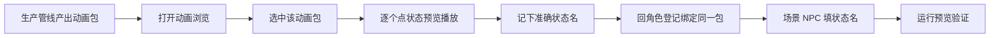

# 动画浏览面板

关二狗走路、庙祝作揖、纸人飘动——这些动画都是生产管线（比如视频转图集）产出的，**不是在这里手写出来的**。读完这页你能：在配一个新 NPC 之前，先确认某套动画包到底有哪些状态、看一遍预览效果，再放心去角色登记和场景里填状态名。

---

## 这是什么（30 秒看懂）

动画浏览就像雾津戏班的**戏服间点检室**：戏服（动画）是戏班后台（生产管线）做出来的，点检室本身不做戏服，只负责让你在正式上台前，把每一套戏服拿出来抖一抖、看看有没有破洞、认清楚每一套都有哪些"动作"可以做。

具体来说，它让你**查**已经产出的动画包：这个包里有哪些状态（比如 idle 待机、walk 走路）、点开某个状态能预览播放一遍。这些信息是给[角色登记](./character)和[场景](./scene)里的 NPC 选型用的——你先在这里确认清楚状态名和效果，再回到别的面板去正式绑定。

**注意边界**：场景里 NPC 身上的动画字段是只读引用；这个面板本身**不能改、不能删、不能新增动画**，想要新动画，走的是资产工作台的生产流程，不是这个面板。

---

## 入门：手把手做第一次

最常做的事：确认一套新动画包里的状态名，回角色登记完成绑定。

1. 打开主编辑器：`资源 → 动画浏览`。
2. 从列表里选中目标动画包（一般按角色或文件名归类）。
3. 逐个点选状态，看预览窗口播放一遍，确认站立、行走、以及剧情专用动作（比如作揖）是否都在。
4. 把每个状态的**准确名字**（大小写、拼写）记下来。
5. 去[角色登记](./character)，把这个角色绑定到刚才确认过的动画包上，保存。
6. 去[场景](./scene)里给这个 NPC 实体填初始状态（比如`idle_dock`）和巡逻移动状态（比如`walk`），务必和刚才记下的名字完全一致。
7. **验证**：运行预览，看这个 NPC 站立时是不是正常循环、巡逻走动时是不是流畅，而不是卡在第一帧或者一动不动。

雾津小例子：关二狗在渡口靠着缆桩待机时，应该有一套专属的"靠桩站立"循环动画；如果动画浏览里找不到这个状态，码头这场戏的氛围会弱很多——这正是要在配 NPC 之前先来这里确认的原因。

---

## 进阶：每一项都讲透

### 动画包列表

按角色或文件名组织的一份清单，列出了当前工程里已经产出、可以使用的所有动画资源包。这是你查找"某个角色有没有做好动画"的入口。

### 状态 / 片段预览

点选某个动画包下的具体状态（idle、walk，或者某个专属动作），能在预览窗口里实际播放看效果。这一步的价值在于：**在你把状态名填进场景之前，先确认这个状态真的存在、而且播放效果是你要的**，而不是凭记忆或猜测去场景里手填一个可能拼错、可能根本不存在的状态名。

### 只读——它不能做什么

这个面板**不能**：改动画曲线、导出文件、删除动画文件、新增动画。它纯粹是一个查看窗口。任何"这套动画不够用/缺一个状态/效果不对"的需求，都应该回到生产管线（视频转图集等工具）重新产出，而不是尝试在这个面板里硬改，因为这里根本没有编辑入口。

### 状态名的重要性

状态名（比如`idle_dock`、`walk`、`float`）是连接动画包和场景/角色登记的唯一纽带。这里最容易出问题的地方就是**大小写和拼写**：场景里的初始状态字段和巡逻移动状态字段，填的字符串必须跟动画浏览里看到的状态名一字不差，差一个字母就会导致 NPC 播放默认动画或者卡在第一帧不动。

### 动画与碰撞无关

需要特别澄清的一点：**动画的长短、快慢，不会自动影响场景里实体的交互范围或碰撞体积**。这两者是完全独立的系统——想改交互范围，去场景面板改对应的碰撞设置，不要指望换一套动画就能顺带改变判定范围。

### 与生产流程的边界

如果你在动画浏览里发现某个角色缺少需要的状态（比如庙祝没有完整的"作揖"动作），正确的做法是**回生产管线补充导出**，而不是在场景里直接手填一个动画包里其实不存在的状态名——那样填了也没用，只会在运行时表现为播放默认状态或者卡帧。同理，也不要绕开这个面板去别处手写动画相关的配置表，因为场景引用的终究是只读数据，下一次资产重新导出时，任何手写的东西都会被覆盖掉。

### 和别的面板怎么配合

- 和[角色登记](./character)配合：这里查完状态，回角色登记去正式绑定动画包。
- 和[场景](./scene)配合：场景里的 NPC 实体拿状态名去引用具体的初始动作和移动动作。
- 和视频转图集这类生产工作台配合：动画包本身是从那里产出的，动画浏览只是查看口。
- 和更大尺寸的动画预览专项工具配合：如果需要更细致地检查动画细节，可以用专项的动画预览工具做更大画面的查看。

### 老手技巧

- 新动画包入库之后，别急着去场景填状态名，先花两分钟在这里把每个状态都点一遍，尤其确认循环动作首尾衔接是否自然、有没有明显的跳帧或者闪一下。
- 非人角色（纸人、游魂）的飘浮、作揖类动作时长通常和人物角色不一样，预览时多留意节奏是否合理，别用人物动画的默认节奏去套。
- 如果两套角色共用同一个动画包（比如货郎和某个 NPC 用了相同素材），预览阶段要留意会不会"串脸"——同一套动画在不同角色身上表现是否都说得通。
- 遇到多个候选动画包时，直接在这里对比播放，选更贴合雾津阴湿、克制气质的那一套再正式登记，比事后返工省事得多。

---

## 危险区与边界

| 边界 | 说明 |
|---|---|
| **本面板只读** | 不能改、不能删、不能新增动画；改动画走生产管线重新导出 |
| **状态名必须精确一致** | 场景、角色登记里填的状态名字符串要跟这里看到的完全一致，差一个字都会出问题 |
| **动画与碰撞无关** | 动画时长、快慢不会自动影响交互范围，那是场景碰撞体系独立管的事 |
| **别绕过面板手写动画表** | 场景里是只读引用，下次资产重新导出会把手写内容覆盖掉 |
| **只浏览不等于完成配置** | 浏览确认完状态后，必须回角色登记和场景实际绑定，否则 NPC 下拉仍是空的 |

更完整的编辑器风险说明，见[危险区](../concepts/danger-zone)。

---

## 常见问题

| 现象 | 原因 | 怎么办 |
|---|---|---|
| NPC 站立卡在第一帧不动 | 场景里填的状态名在动画包里根本不存在 | 回动画浏览核对准确名称，改场景填法或去生产端补导出 |
| 预览里能播放，游戏里却不动 | 角色登记还没绑定这个动画包 | 先在角色登记选中并保存动画包，再检查场景 NPC 的身份关联 |
| 巡逻走动看着像滑步 | 步频动画和场景移动速度没对上 | 和场景策划对齐移动速度，必要时换一个状态或调整数值 |
| 列表里有这个包，但预览是黑屏 | 本地资源还没同步下来 | 拉取最新资产后重新打开面板 |
| 两套动画包状态名对不上 | 生产流程的命名习惯不统一 | 团队定一套命名标准，另一套对齐或者废弃不用 |

---

## 相关

- [怎么编排动作](../concepts/actions)
- [怎么设条件](../concepts/conditions)
- [怎么写带引用的文本](../concepts/rich-text)
- [危险区](../concepts/danger-zone)
- [角色登记](./character)
- [场景](./scene)
