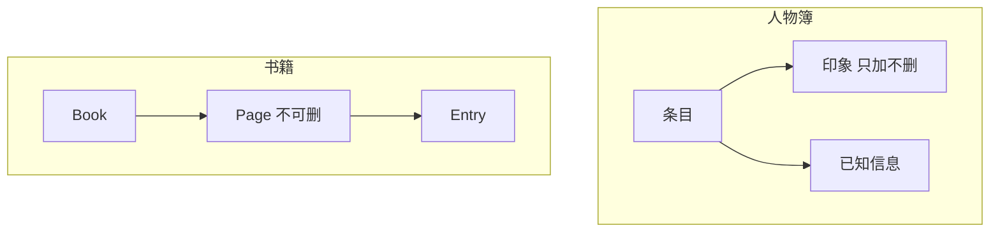

# 档案面板

玩家翻开**人物簿**、**见闻录**、**杂书匣**、线装**书籍**——文案在 **档案面板** 编。不同于普通对白：档案条目有 **解锁条件**、**首次阅读动作**、人物 **印象与已知信息**（分段条件+文），书籍是 **书→页→条** 三级结构。

**重要**：富文本里插 **插图** 的「插入引用」按钮，**只在档案编辑器出现**；别的面板富文本框只能手打插图短名（运行时可能认，但无引导）——长文配图请在档案里做。

---

## 这块面板管什么

### 人物簿 characters

- 名、头衔、解锁条件、首次阅读 [动作](../concepts/actions)。
- **印象条目**、**已知信息**：多条，条件+文；**印象只能加不能删单条**（与物品动态描述类似）。

### 见闻 lore / 文档 documents

- 标题、正文（可插图）、来源、分类。

### 书籍 books

- 三级：Book → Page → Entry；**page 不能删**（GUI 限制）。

### 通用

- 切换子 Tab 未 Apply 会丢——别乱点走。

---

## 怎么打开

1. `./dev.sh editor` → **资源 → 档案**。
2. 顶部分 Tab 选人物/见闻/文档/书籍。
3. 列表选条目；正文区用富文本，点 **插入引用** 插 `[名字]`/`[物品]`/**插图**。
4. Apply。

:::info[配图：档案插图按钮]
截见闻正文工具栏「插入引用」菜单含插图项；对比图对话无此按钮（可小字说明）。
:::

---

## 结构

---

## 怎么新建见闻

1. 见闻 Tab **添加**；title「渡口捞尸人闲话」。
2. content 写正文；工具栏 **插入插图** 选雾津水彩插图短名。
3. unlock 条件：旗标或任务。
4. 首次阅读动作：加阅读进度旗标、播纸页 cue。
5. category/source 方便玩家筛选。
6. Apply。

---

## 怎么新建人物簿

1. 添加「关二狗」；unlock 默认或后期。
2. 已知信息 分段：「外貌」「脾气」各带条件。
3. 印象 **添加** 行；写错只能再加不能删旧行——规划好再填。

---

## 怎么改 / 删

- 改正文、改解锁：常规 Apply。
- **删整条条目**：可以。
- **删 book page**：不行；**删单条 impression**：不行。

---

## 当心什么

| 当心 | 用户说法 |
|---|---|
| **插图按钮只有档案有** | 任务描述里想插图得手打或改在档案 |
| 印象只能加不能删 | 填错条目会永久占坑除非找程序支持 |
| book page 不能删 | 结构调整受限 |
| 未 Apply 切换 Tab | 编辑丢失 |
| 首次阅读 动作忘了 | 读了白读，进度没记 |

---

## 雾津例子

1. 见闻「湿鞋来历」插图 + 解锁要持有湿鞋。
2. 人物簿「庙祝」已知信息 在进庙后多一段。
3. 书籍《雾津方物略》Page1 Entry 三条短志怪。
4. [剧本](./scenarios) expose 后档案才亮。

:::info[配图：游戏内档案 UI]
预览打开见闻录见插图排版。
:::

---

## 和相关面板怎么配合

| 面板 | 关系 |
|---|---|
| [旗标](./flags) | 解锁与 首次阅读 |
| [文本库](./strings) | 短句引用 |
| [图对话](./dialogue-graph) | 对白 vs 档案分工 |
| [文档揭示](./doc-reveal) | 模糊图渐进 |

---

---

## 实操检查清单

- [ ] 长文配图在档案做，插图按钮只在此有
- [ ] 切换子 Tab 前 Apply，防丢编辑
- [ ] 印象、book page 知悉不能删单条，规划好再加
- [ ] 首次阅读动作 设阅读进度旗标，防读了白读
- [ ] unlock 条件与任务、旗标一致
- [ ] 人物 已知信息、印象 分段带条件
- [ ] 书籍三级结构：Book→Page→Entry，page 不可删
- [ ] 见闻与文档分类、source 便于玩家筛选
- [ ] 与文档揭示、规矩碎片分工：档案长文，揭示图证
- [ ] Apply 后游戏内开档案 UI 看排版与插图

---

## 常见问题

| 现象 | 原因 | 怎么办 |
|---|---|---|
| 插图插不进对话 | 按钮只有档案有 | 改在档案做或手打 tag |
| impression 填错删不掉 | 界面 只加不删 | 加新条盖或找程序 |
| 切换 Tab 丢字 | 未 Apply | 先保存 |
| 条目不解锁 | unlock 条件未满足 | 测旗标与任务 |
| 读了无进度 | 缺 首次阅读动作 | 补动作 |

---

## 预览验证

1. 新建或改条目，插图与 unlock、首次阅读，Apply。
2. 用未解锁存档确认看不到或灰显。
3. 满足 unlock 后首次打开，看 首次阅读 与插图。
4. 再开确认 impression 分段按条件显示。
5. 书籍测翻页与 Entry 三条短志怪可读。
6. 与剧本 expose 节奏对照，勿过早剧透。

---

湿鞋来历见闻要插图且 unlock 需持有湿鞋——玩家捞到鞋才该读。庙祝 已知信息 进庙后多一段，你在 preview 用进庙前后存档各开人物簿。雾津方物略 Page1 三条宜短志怪，与规矩碎片 source 一致可增沉浸。

---

## 相关概念

- [怎么编排动作](../concepts/actions)
- [怎么设条件](../concepts/conditions)
- [怎么写带引用的文本](../concepts/rich-text)
- [危险区](../concepts/danger-zone)
