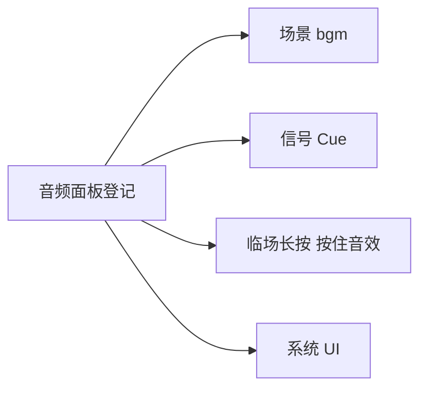

# 音频面板

雾津雨声、城隍庙钟、叫魂长按的按住音——在 **音频面板** 登记 **BGM**、**环境音**、**音效**，以及 **系统音效键** 到具体音效 id 的映射。场景 [选 BGM](./scene)、临场长按 [填按住音效](./pressure-hold)、过场与 cue [播音效](../concepts/actions) 都引用这里的 id。

---

## 这块面板管什么

- **bgm**：每条 id + 源文件选择。
- **ambient**：环境循环类。
- **sfx**：短音效 id + 源文件。
- **systemSfx**：系统键（如 UI 点击）→ sfx id。

---

## 怎么打开

1. `./dev.sh editor` → **资源 → 音频**。
2. 分 Tab 或分区编辑各表。
3. 文件选择器挑 `.ogg`/`.wav` 等资源（走工程资源管线）。
4. Apply。

:::info[配图：音频 sfx 表]
截三条 sfx：钟、雨、脚步；systemSfx 映射一行。
:::

---

## 引用链

---

## 怎么新建音效

1. sfx 表 **添加** id `sfx_temple_bell`。
2. src 选文件 `bell_distant.ogg`。
3. Apply。
4. [信号 Cue](./cue-signal) `temple_bell_ring` 动作播音效选此 id。

---

## 怎么改 / 删

- 换 src：换文件；id 尽量稳定以免百处引用断。
- 删行：确认 cue/过场/场景没还引用。

---

## 当心什么：音量与循环

| 风险 | 用户说法 |
|---|---|
| **保存只写音源路径** | 若你或旧数据里有 **音量**、**是否循环** 等额外项，在面板里 **Apply 保存后可能丢**——编辑器每条只认源文件 |
| 以为面板能调音量 | 要持久音量得走支持通道或接受默认值 |
| id 与文件名混 | 引用认 id |
| 资源没 pull | 选择器空或预览无声 |

必读 [危险区](../concepts/danger-zone) 音频条目。

---

## 雾津例子

1. bgm `bgm_mist_dock` 渡口黄昏。
2. ambient `amb_rain_light` 老街场景环境音叠层。
3. sfx `sfx_paper_flip` 档案 首次阅读。
4. systemSfx `ui_confirm` → 轻木鱼声贴合气质。

:::info[配图：场景绑 BGM]
场景检视器 bgm 下拉选 bgm_mist_dock。
:::

---

## 和相关面板怎么配合

| 面板 | 关系 |
|---|---|
| [场景](./scene) | bgm / ambientSounds |
| [过场](./cutscene) | 步骤播音 |
| [信号 Cue](./cue-signal) | 表现音 |
| [临场长按](./pressure-hold) | 按住音效 |

---

---

## 实操检查清单

- [ ] 每条 BGM、环境音、sfx 的 id 语义稳定，改文件不换 id
- [ ] 源文件已进工程资源管线，选择器里能选到
- [ ] 知悉面板保存可能只持久化源路径，音量循环等额外项会丢
- [ ] 改音频前读危险区音频条目，避免误依赖面板不支持的字段
- [ ] 系统 UI 映射键与 sfx id 一一对应，无悬空
- [ ] 场景 BGM、Cue 音效、长按 按住音效 引用前在本表核对 id
- [ ] 删行前先搜 Cue、过场、场景、临场长按引用
- [ ] 雾津气质：钟远、雨轻、脚步闷，避免现代电子感 unless 故意
- [ ] 同名 id 勿重复登记，防下拉歧义
- [ ] Apply 后在实际触发点各听一遍，不只编辑器内点预览

---

## 常见问题

| 现象 | 原因 | 怎么办 |
|---|---|---|
| 游戏里完全无声 | 资源未 pull 或 id 引用错 | 同步资源并核对 id |
| 改音量保存后恢复默认 | 面板不持久化 volume | 接受默认或走支持通道 |
| Cue 播音效没反应 | sfx id 与登记表不一致 | 回音频表查 id |
| 环境音与 BGM 打架 | 两路同时满音量 | 分场景试听并调素材响度 |
| 删 sfx 后 UI 静音 | systemSfx 仍指向旧 id | 改映射或恢复条目 |

---

## 预览验证

1. 在音频表登记或更新条目，Apply 保存。
2. 到绑定场景看 BGM、环境音是否按预期播放。
3. 触发引用此 sfx 的 Cue 或过场步骤，耳听一遍。
4. 若有临场长按，按住时 按住音效 应持续可闻。
5. 点 UI 确认取消，听 systemSfx 映射是否正确。
6. 再 Apply 一次，确认未丢你仍依赖的字段（对照危险区说明）。

---

渡口黄昏 BGM 应与 ambient 细雨可叠而不糊——你在码头 scene 静止十秒就能听出层次。档案 首次阅读 纸页声宜短、偏干，别与 UI 确认音同素材。鬼打墙低鸣环境建议在进位面 Cue 与场景环境音两处各测，防双播或断档。

---

## 相关概念

- [怎么编排动作](../concepts/actions)
- [怎么设条件](../concepts/conditions)
- [怎么写带引用的文本](../concepts/rich-text)
- [危险区](../concepts/danger-zone)
