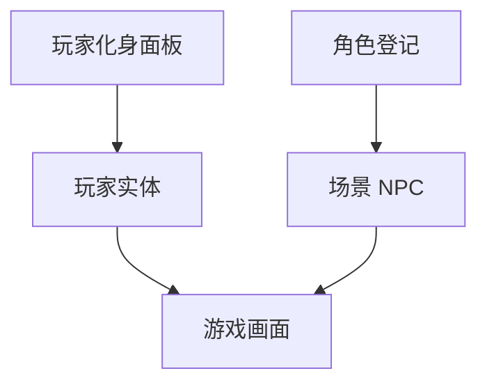

# 玩家化身面板

玩家控制的是**主角**，不是场景里 NPC 表里的某一项——这是新手最容易搞混的一点。读完这页你能：改主角的默认行走图、新建一套换装变体（比如庙祝赠的道袍）、并且清楚哪些主角相关的字段"全局配置"页面根本改不到，只能来这里改。

---

## 这是什么（30 秒看懂）

[角色登记](./character)管的是关二狗、庙祝这些**别人**；而**玩家化身**管的是**"你"**——那个由玩家操纵、在雾津街头走来走去的那个身影。可以把这两者理解成戏班的两本不同的花名册：一本记"配角演员"（角色登记），一本专记"主角本人"的行头（玩家化身），互不混用。

它管的内容包括：主角的**化身 id 与资源路径**、**行走/站立等多方向贴图或图集**、以及如果项目需要的话，**多套外观变体**（换装、术式附体、半透明形态等）。运行时想让主角临时换一套外观，走的是"切换玩家化身"这个动作。

还有一个容易踩的坑：全局配置里本该有个"初始用哪套化身"的设置项，但它是在**独立编辑器**里维护的，主配置页面碰不到这个字段——改主角相关的东西，优先来这个面板找，别在全局配置里干等。

---

## 入门：手把手做第一次

最常做的事：给主角新建一套换装变体，剧情触发时切换过去，剧情结束再切回来。

1. 打开主编辑器：`资源 → 玩家化身`。
2. 添加一套新变体，id 填「avatar_robe」，备注「道袍形态」。
3. 给这套变体绑上对应的新行走图集。
4. Apply 保存后，运行预览让主角走一段路，重点看**脚是否贴地、有没有滑步**的问题。
5. 去[过场](./cutscene)或叙事状态机的"进入时"动作里，加一条**切换玩家化身**的动作，指向刚才新建的变体 id。
6. 别忘了在剧情收尾的地方，再加一条切回默认化身的动作。
7. **验证**：运行预览，触发换装剧情，确认外观切换生效；剧情结束后再确认已经自动切回默认外观，不会带着道袍走进下一个场景。

雾津小例子：庙祝赠袍之后，你应该在过场或叙事状态机的"进入时"里切到道袍形态，并在离开城隍庙之前切回默认——否则玩家穿着道袍逛渡口，会削弱"还俗回归日常"的那种落差感。

---

## 进阶：每一项都讲透

### 化身 id 与资源路径

每一套外观（不管是默认还是变体）都有一个**id**，用于在动作、配置里被引用；以及背后指向的**资源路径**，也就是实际的贴图或图集文件。id 是给游戏系统认的名字，资源路径是真正显示出来的图。

### 行走 / 站立多向贴图或图集

主角需要支持多个朝向（比如上下左右四向）的行走和站立表现，这里管理的是这些方向对应的贴图或图集引用。填写时要保证**四个方向都齐全**，缺一个方向常见的后果是斜着走的时候会复用错误的朝向，看起来别扭。

### 变体（若项目有多套外观）

如果项目里有换装、术式附体这类需求，会用到"变体"这个 Tab——本质上是给主角多注册几套完整的外观配置（各自有自己的行走图集）。运行时通过"切换玩家化身"这个动作在默认外观和某个变体之间来回切换。

**成对纪律**：任何一次"切到某个变体"的剧情设计，都应该在设计层面同时想好"什么时候切回来"，别让某个临时形态一直挂在主角身上、串到不该出现的场景里去。

### 与全局配置的关系（盲区）

全局配置页面理论上有一个"初始使用哪套化身"的设置项，但实际维护它的是一个独立的编辑器，主配置界面碰不到这个字段——这时候不要在全局配置里死磕，直接来玩家化身面板本身操作，这里才是权威入口。类似地，如果项目里有"实体像素密度匹配"这类底层缩放参数，主配置页面同样是盲区，遇到缩放不对的问题要及时找程序确认，而不是自己瞎调别的字段去凑效果。

### 外观与碰撞、出生点无关

改主角的外观（不管是默认还是变体）**不会**顺带修改场景里的出生点或碰撞判定——主角具体从哪个点出生、走路时的碰撞体积，仍然是由场景那边的出生点配置和实体设置决定的。换装只是换了"看起来是什么样"，不影响"站在哪、能不能走过去"。

### 图集方向完整性

行走图集如果缺某个斜向，系统通常会复用一个相邻方向去凑，效果就是斜着走的时候贴图方向显得不对——检查新变体时，务必对照默认化身把每个方向都过一遍，尤其是斜向。

### 和别的面板怎么配合

- 和[全局配置](./config)配合：理论上的"初始化身"引用在那边，但那边是盲区，实际改动仍以本面板为准。
- 和[场景](./scene)配合：出生点、移动速度这些和"人在哪、走多快"相关的设置，仍归场景管，外观变化不影响这些。
- 和[过场](./cutscene)配合：过场里"显示角色"这类效果，和玩家化身是两套概念——一个是控制角色是否出现在画面里，一个是控制主角具体长什么样，注意区分。
- 和[动作总表](./actions)配合：切换玩家化身这个动作，就是运行时改变外观的唯一途径。

### 老手技巧

- 改默认化身之前，先想清楚这会影响**所有新开档**和**所有没有指定具体变体的场景**，属于影响面比较大的改动，最好提前和团队打招呼。
- 新变体的脚部锚点要和默认化身对齐，不然换装之后玩家会明显感觉到"滑步"违和感——这是最容易被忽略但最影响观感的细节。
- 半透明或者专用于险境（比如鬼打墙位面）的变体，建议单独在对应的位面场景里预览测试，因为这类特殊形态往往搭配特殊光效或状态，光靠默认场景预览容易漏掉问题。
- 主角的默认外观亮度不妨比场景里普通 NPC 稍高一档，方便玩家在雾津的阴雨、夜晚场景里也能一眼认出自己控制的是哪个身影。

---

## 危险区与边界

| 边界 | 说明 |
|---|---|
| **全局配置里的初始化身是盲区** | 主配置页面碰不到，以本面板为准，不要在配置页死磕 |
| **像素密度类底层参数也是盲区** | 缩放表现不对时，先确认是不是这一类字段导致，找程序核实 |
| **改默认化身影响面很大** | 影响所有新开档和未指定变体的场合，改前最好通知团队 |
| **外观不影响出生点与碰撞** | 换装不会顺带改变主角站位或判定范围，那是场景侧的事 |
| **变体切换要成对设计** | 有切换过去就要有切换回来，否则临时形态会串场 |

更完整的编辑器风险说明，见[危险区](../concepts/danger-zone)。

---

## 常见问题

| 现象 | 原因 | 怎么办 |
|---|---|---|
| 新开一局角色还是旧的行走图 | 改的是某个变体而不是默认化身 | 确认改的是默认化身，或者检查开局是否指定了别的变体 |
| 换装之后走路像在滑步 | 变体图集的脚部锚点和默认化身没对齐 | 对齐脚点，或者干脆换一套图集重新绑定 |
| 全局配置页面里怎么都改不动主角 | 初始化身这个字段在配置页是盲区 | 直接回本面板操作，不要在配置页硬找 |
| 剧情结束了，主角还穿着道袍 | 忘了在剧情收尾加"切回默认"的动作 | 补上一条切回默认变体的动作 |
| 斜着走贴图方向很奇怪 | 图集缺某个斜向，被系统复用错了方向 | 补全缺失的方向图，或修正映射关系 |

---

## 相关

- [怎么编排动作](../concepts/actions)
- [怎么设条件](../concepts/conditions)
- [怎么写带引用的文本](../concepts/rich-text)
- [危险区](../concepts/danger-zone)
- [全局配置](./config)
- [场景](./scene)
- [过场](./cutscene)
- [动作总表](./actions)
